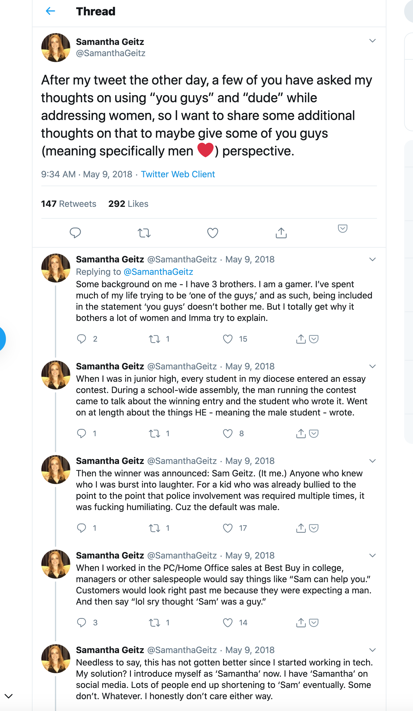
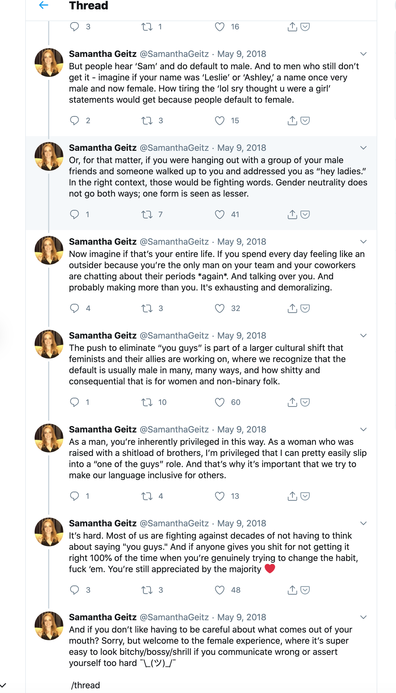
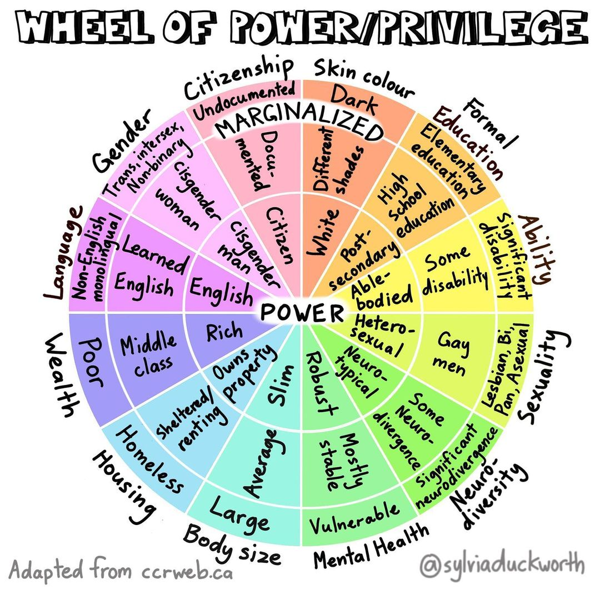
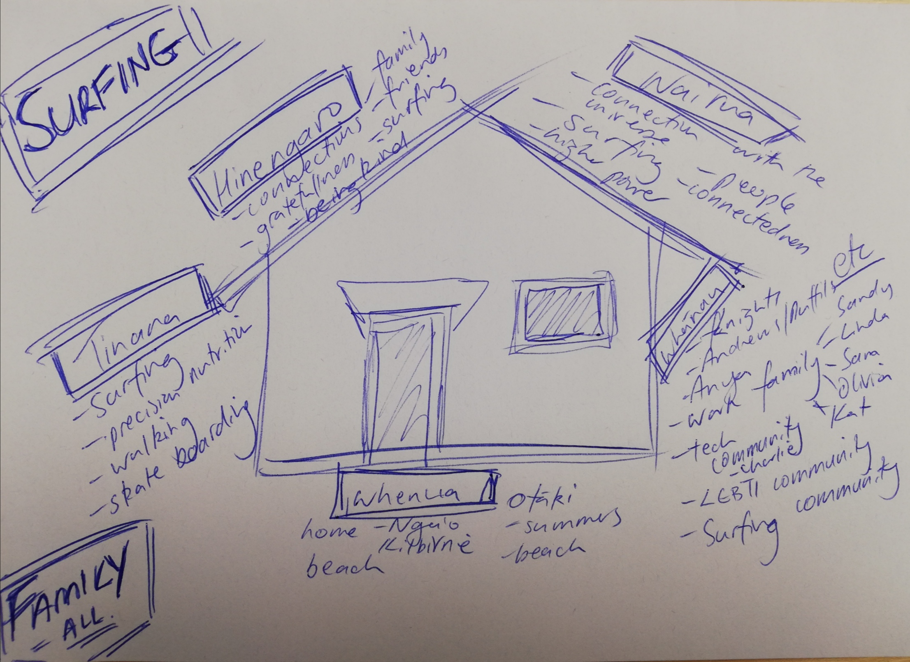
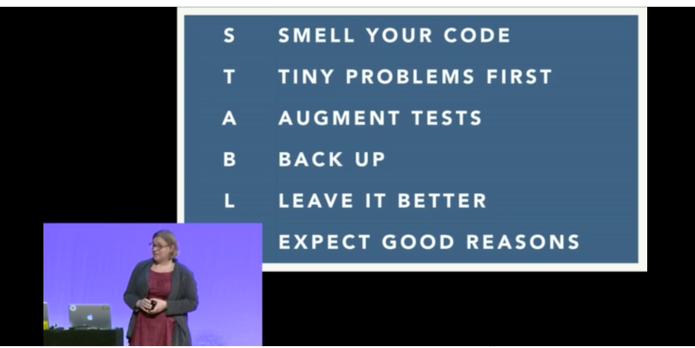

# Articles and Links

<!-- TODO:
split this file out into
  ## Core / People Stuff
  ## Technical / Coding Stuff
-->

📖 - still to read completely
✅ - have read and probably more tha once and/or kept coming back to!

## Culture / People / Team

[He Tangata](http://www.hetangata.com/what-he-tangata-about) ✅

> **_He aha te mea nui o te ao_**
>
> What is the most important thing in the world?
>
> **_He tangata, he tangata, he tangata_**
>
> It is the people, it is the people, it is the people
>
> Māori proverb

[The Essential Guide to Building Balanced Development Teams](https://medium.com/javascript-scene/the-essential-guide-to-building-balanced-development-teams-b051a62acc80) ✅

[How to Build a High Velocity Development Team](https://medium.com/javascript-scene/how-to-build-a-high-velocity-development-team-4b2360d34021) ✅

[Put your paddle in the air](https://blog.figure.nz/put-your-paddle-in-the-air-28eee39648ef) ✅

[Figure NZ - Our kaupapa: raise a paddle](http://tohu.figure.nz/internal/our_kaupapa/#raise-a-paddle) ✅

[Let Me Google That for You](http://bridgetkromhout.com/blog/2015/05/31/let-me-google-that-for-you/)

[One-on-one catchups with your team](https://medium.com/@mogest/one-on-one-catchups-with-your-team-4d84219d59ce) ✅

[Questions for our first 1:1](http://larahogan.me/blog/first-one-on-one-questions/) ✅

[Every One-on-One Meeting Should Ask This Question](https://www.startups.co/articles/one-question-ask-every-one-one-meeting) ✅

[Manager handoffs](http://larahogan.me/blog/manager-handoffs/) ✅

[Google Tried to Prove Managers Don't Matter. Instead, It Discovered 10 Traits of the Very Best Ones](https://www.inc.com/scott-mautz/google-tried-to-prove-managers-dont-matter-instead-they-discovered-10-traits-of-very-best-ones.html?fbclid=IwAR3hIJIhbPSi2Aj3XDdqjYfxlTuVXJXEe0Z65wdk0u7Y2nI_-sMhtL52eCk) ✅

[Things your manager might not know](https://jvns.ca/blog/things-your-manager-might-not-know/?s=09)

[The five keys to a successful Google team](https://rework.withgoogle.com/blog/five-keys-to-a-successful-google-team/) ✅

[Why psychological safety matters and what to do about it](https://rework.withgoogle.com/blog/how-to-foster-psychological-safety/) ✅

[Psychological safety: the secret weapon of awesome teams](https://medium.com/smells-like-team-spirit/safety-makes-awesome-possible-97acb601ff59) ✅

[ReWork - Google](https://rework.withgoogle.com/) ✅

[blog](https://rework.withgoogle.com/blog/)

[No, I have no side code projects to show you](https://www.codementor.io/ezekielbuchheit/no-i-have-no-side-code-projects-to-show-you-cz1tyhgdz?__s=3y8eajxoa2yag3smywqg)

[You are not your code - twitter storm](https://twitter.com/kerrizor/status/929051683249725440)

[Becoming a 10x Developer: 10 Ways to be a Better Teammate](https://kateheddleston.com/blog/becoming-a-10x-developer)

[Engineering Growth Framework](https://medium.com/s/engineering-growth-framework)

[More Growth Frameworks](#List-of-Growth-Frameworks)

[The Engineer’s Guide to Career Growth — Advice from My Time at Stripe and Facebook](https://firstround.com/review/the-engineers-guide-to-career-growth-advice-from-my-time-at-stripe-and-facebook/) 📖

[Diverse Teams Feel Less Comfortable — and That’s Why They Perform Better](https://hbr.org/2016/09/diverse-teams-feel-less-comfortable-and-thats-why-they-perform-better)

[Atlassian ditches ‘brilliant jerks’ in performance review overhaul](https://www.news.com.au/finance/work/at-work/atlassian-ditches-brilliant-jerks-in-performance-review-overhaul/news-story/82a5e2abba1939f51d68ae81db8f05bd)

[Letter to a Junior Engineer](https://builttoadapt.io/a-letter-to-a-junior-engineer-edec0e260b87)

[How Your Company Can Support Junior Engineers](https://www.eventbrite.com/engineering/how-to-support-junior-engineers/)

[Gender and sex](http://geekfeminism.wikia.com/wiki/Gender_and_sex)

[Use of "guys" - twitter thread](https://twitter.com/samanthageitz/status/993967503901646848)

[You Guys](https://www.xaprb.com/blog/you-guys/)

[A step we can all take towards gender equality — banish these two words](https://medium.com/@victoria.maclennan/a-step-we-can-all-take-towards-gender-equality-banish-these-two-words-e08ae2212eed)

[The art of developing resilience](https://medium.com/@victoria.maclennan/the-art-of-developing-resilience-12d643f100f7)

[Calling Grown Women ‘Girls’ Is Sexist As Hell – Here Are 4 Reasons Why](https://everydayfeminism.com/2015/06/grown-women-are-not-girls/)

["Girl" vs. “Woman": Why Language Matters || Mayim Bialik](https://www.youtube.com/watch?v=qHH3lhYwqcY&feature=youtu.be)

[Tweet with image of "mansplaning](https://twitter.com/kimgoodwin/status/1020029572266438657?s=19)

[How to Become a Better Software Developer: A Handbook on Personal Performance](https://www.7pace.com/blog/become-a-better-programmer-skills-development)

[Sharing the Data: How Technical Women Navigate Their Career](https://developer.wordpress.com/2019/08/28/sharing-the-data-how-technical-women-navigate-their-career/)

[Why women collaborating ‘isn’t a soft skill, it’s a superpower’](https://www.siliconrepublic.com/people/margaret-heffernan-women-business)

[IF IT'S ALL THE SAME TO YOU, I'D RATHER BE WORKING.](https://www.3percentmovement.com/article/if-its-all-same-you-id-rather-be-working-rene-huey-lipton)

[The Power Of A Grandmother | Hīria Te Rangi | TEDxWellington](https://www.youtube.com/watch?v=RHq1waE-qIY&feature=youtu.be&app=desktop) - video

[EMPATHY is the most important leadership skill needed today!](https://www.linkedin.com/pulse/empathy-most-important-leadership-skill-needed-today-hyacinth)

[Empathy: What it is (and isn’t) and how companies can put it to good use](https://www.linkedin.com/pulse/empathy-what-isnt-how-companies-can-put-good-use-jamil-zaki-1c)

[This Is What Impactful Engineering Leadership Looks Like](https://firstround.com/review/this-is-what-impactful-engineering-leadership-looks-like/)

[Developers mentoring other developers: practices I've seen work well](https://blog.pragmaticengineer.com/developers-mentoring-other-developers/)

[Bullying at work: Advice for workers](https://worksafe.govt.nz/topic-and-industry/bullying/bullying-at-work-advice-for-workers/)

[A Rubric for Evaluating Team Members’ Contributions to an Inclusive Culture](https://chelseatroy.com/2018/05/24/why-your-efforts-to-make-your-company-inclusive-arent-working/)

[THIS IS WHAT’S MISSING FROM YOUR TALENT STRATEGY](https://fierceinc.com/blog/this-is-what-s-missing-from-your-talent-strategy/)

### Company focused links

[Onboarding / Employee Handbooks](https://www.notion.so/Onboarding-Employee-Handbooks-138a98bd392a45da910d74b900300194)

### Privilege

[The Importance of Listening as a Privileged Person Fighting for Justice](https://everydayfeminism.com/2013/04/the-importance-of-listening-as-a-privileged-person-fighting-for-justice/)

[Swimming in Privilege](https://medium.com/@dunn/swimming-in-privilege-e517e4003b7c)

[Straight White Male: The Lowest Difficulty Setting There Is](https://whatever.scalzi.com/2012/05/15/straight-white-male-the-lowest-difficulty-setting-there-is/)

[Facts are Cool](http://www.jimchines.com/2012/05/facts-are-cool/)

[Power/Privilege Wheel](https://www.instagram.com/p/CEFiUShhpUT/?hl=en)

### Why personality tests can be useless / harmful in the workplace

[Goodbye to MBTI, the Fad That Won’t Die](https://www.psychologytoday.com/us/blog/give-and-take/201309/goodbye-mbti-the-fad-won-t-die)

[Personality Tests Don’t Work, Here’s Why and The Alternatives](https://academy.nobl.io/personality-tests-dont-work-heres-why-and-alternatives/)

[QUIZ: WHICH DISNEY PRINCESS ARE YOU?](https://ohmy.disney.com/quiz/2014/06/25/quiz-which-disney-princess-are-you/) - a good alternative? 😂

### Agile and Introverts

[Introverts in Agile](http://katrinatester.blogspot.com/2016/01/introverts-in-agile.html)

[Agile Introverts, an Oxymoron?](https://medium.com/@ChrisAndSeanAgile/agile-introverts-an-oxymoron-3182deab3813)

[Facilitating Introverts: Eliciting the Gifts of the Quiet Ones](http://www.janicethomson.net/facilitating-introverts-eliciting-the-gifts-of-the-quiet-ones/)

### Diversity & Inclusion

[The true face of diversity and inclusion isn’t just women](https://www.m2woman.co.nz/true-face-of-diversity-and-inclusion-isnt-just-women/)

[How do you define diversity](https://www.youtube.com/watch?v=a4YrQD0JpN0)

[8 Things Diversity&Inclusion Leaders Need Everyone to Know](https://medium.com/@emilybest/8-things-d-i-leaders-need-everyone-to-know-65a0a7674867)

[Inclusion has to be proactive](https://medium.com/@fox/inclusion-has-to-be-proactive-b01a37f85148)

[Conferences I won’t be speaking at](https://medium.com/@fox/conferences-i-wont-be-speaking-at-a60b9beed97b)

[How your Dudebros are Losing You Money: The Microcosmic Impact of Inclusion on your Bottom Line](https://chelseatroy.com/2017/06/12/how-your-dudebros-are-losing-you-money-the-microcosmic-impact-of-inclusion-on-your-bottom-line/)

["Well Actually..." Answers to Diversity and Inclusion FAQ Based on Data and Research](https://speakerdeck.com/jezhumble/well-actually-dot-dot-dot-answers-to-diversity-and-inclusion-faq-based-on-data-and-research)

[Eight Ways to Make Your D&I Efforts Less Talk and More Walk](http://firstround.com/review/eight-ways-to-make-your-dandi-efforts-less-talk-and-more-walk/?utm_campaign=new_article&utm_medium=email&utm_source=newsletter)

[Better Allies: Tech Privilege Walk](https://docs.google.com/document/u/1/d/1DTjj_4UxpkUjaf0FS_K5ZdjI8pUFs5r-356SMDlUmzA/mobilebasic?usp=gmail#heading=h.nrnw03t7conb)

[Tech’s Troubling New Trend: Diversity Is in Your Head](https://www.nytimes.com/2017/10/16/opinion/diversity-tech-women-silicon-valley.html)

[‘Diversity of Thought’ Is Just a Euphemism for ‘White Supremacy’](https://www.theroot.com/diversity-of-thought-is-just-a-euphemism-for-white-supr-1825191839)

Sarah Mei: Diversity of Thought tweets:

- <https://twitter.com/sarahmei/status/842036465324380160>
- <https://twitter.com/sarahmei/status/980587316199567360>
- <https://twitter.com/sarahmei/status/920311083264491520>

[FOR WOMEN JOB SEEKERS, NETWORKING LIKE A MAN ISN'T ENOUGH](https://www.wired.com/story/women-leadership-job-networking/)

[A step we can all take towards gender equality — banish these two words](https://medium.com/@victoria.maclennan/a-step-we-can-all-take-towards-gender-equality-banish-these-two-words-e08ae2212eed)

[No more excuses: Why your attempts to deny the gender pay gap just won’t wash](https://thespinoff.co.nz/society/08-03-2017/no-more-excuses-why-your-attempts-to-deny-the-gender-pay-gap-just-wont-wash/)

[The gender pay gap: a tale as old as time](https://www.brazen.world/2020/04/29/the-gender-pay-gap-a-tale-as-old-as-time/)

[The Damage of Gender Stereotypes At a Young Age](https://blog.storypark.com/2016/09/damage-gender-stereotypes-young-age/)

[How “Good Intent” Undermines Diversity and Inclusion](https://thebias.com/2017/09/26/how-good-intent-undermines-diversity-and-inclusion/)

[How to improve gender equality in the workplace](https://www.xero.com/nz/resources/small-business-guides/business-management/gender-equality-workplace/)

[How to Fix Your Tech Interview to Increase Diversity](https://www.diversifytech.co/blog/how-to-fix-tech-interview-to-increase-diversity)

[Hiring, Growth and Diversity](https://medium.com/flick-tech/hiring-growth-and-diversity-7fbe4809e498)

[What referrals tell us about how networks work for people of color — Black, Latinx and Asian candidates](https://medium.com/@Atipica/what-referrals-tell-us-about-how-networks-work-for-people-of-color-black-latinx-and-asian-fcf0c971288e)

[Women do well in referral programs overall, especially for smaller teams, but don’t fare well in the technical pipeline.](https://medium.com/@Atipica/women-do-well-in-referral-programs-overall-especially-on-smaller-teams-but-dont-fare-well-in-194c205e2aab)

[FAQs for Black, Queer, Female Software Engineers: And why you might think twice before you ask them](https://onezero.medium.com/faqs-for-black-queer-female-software-engineers-38b2d2b9450e)

[Gender Decoder for Job Ads](http://gender-decoder.katmatfield.com/)

[Self-Defined](https://www.selfdefined.app/)

> A modern dictionary about us. We define our words, but they don't define us.

[Enough Leaning In. Let’s Tell Men to Lean Out.](https://www.nytimes.com/2019/10/10/opinion/sunday/feminism-lean-in.html) 📖

[Equality Is Not Enough: What the Classroom Has Taught Me About Justice](https://everydayfeminism.com/2014/09/equality-is-not-enough/)

[The number one reason white men give for not getting involved with diversity and inclusion](https://qz.com/work/1889860/why-white-men-dont-get-involved-in-diversity-and-inclusion/)

[“I identify as an attack helicopter” and Other Fallacious Arguments](https://medium.com/@transphilosophr/i-identify-as-an-attack-helicopter-and-other-fallacious-arguments-561246b7151e)

### Spotify model

[Spotify engineering culture (part 1)](https://labs.spotify.com/2014/03/27/spotify-engineering-culture-part-1/)

[Spotify Squad framework — Part I](https://medium.com/project-management-learnings/spotify-squad-framework-part-i-8f74bcfcd761)

## Help yourself

[Being Glue](https://noidea.dog/glue)

[You Must Try, and then You Must Ask](https://blogs.akamai.com/2013/10/you-must-try-and-then-you-must-ask.html)

[Asking for help twitter thread](https://twitter.com/EvyKassirer/status/1220556930675904516)

- further to the "You must try and then you must ask", this thread has some great thoughts in it.

> A worry junior engineers and new hires frequently have is that they ask too many questions.
>
> The most common advice I've heard is to try to figure it out yourself for 30 min, and if you're still stuck, ask. This is reasonable advice, but I don't think it's actually very good.

> PSA: when you're building a diverse team, you're looking for culture _add_, not culture _fit_. Hire people who bring a perspective you don't yet have.
> Twitter thread - <https://twitter.com/sarahmei/status/973918468729798659>

[Learn faster! When and how to ask for help](https://codewithoutrules.com/2017/12/07/asking-for-help/)

[Shut Up, Imposter Syndrome: I Can Too Program](https://www.laserfiche.com/ecmblog/shut-up-imposter-syndrome-i-can-too-program/#)

[You don’t have Impostor Syndrome: And neither do I anymore](https://medium.com/counter-intuition/you-don-t-have-impostor-syndrome-126e4c4bdcc)

[Imposter Syndrome: Why You Have It and What You Can Do About It](https://zapier.com/blog/what-is-imposter-syndrome/)

[What is impostor syndrome and how you can combat it?](https://www.ted.com/talks/elizabeth_cox_what_is_imposter_syndrome_and_how_can_you_combat_it#t-12340)

> build confidence in some simple truths: you have talent, you are capable, and you belong.

[The Mistakes I Made As a Beginner Programmer: Learn to identify them, make habits to avoid them](https://edgecoders.com/the-mistakes-i-made-as-a-beginner-programmer-ac8b3e54c312)

[It is never too late to be who you might have been — becoming a developer at age 36](https://medium.freecodecamp.org/it-is-never-too-late-to-be-who-you-might-have-been-becoming-a-developer-at-age-36-7d186ad5702)

[Web Developer Roadmaps: All In One Place](https://medium.com/level-up-web/developer-roadmaps-all-in-one-place-75c0402db0e0)

[Learn to become a modern Frontend Developer in 2019](https://medium.com/tech-tajawal/modern-frontend-developer-in-2018-4c2072fa2b9c)

[The 2018 Web Developer Roadmap](https://codeburst.io/the-2018-web-developer-roadmap-826b1b806e8d)

[How to Feel Less Overwhelmed as a Developer](https://medium.com/@juliahaigh/how-to-feel-less-overwhelmed-as-a-developer-79bc816709de)

[On being overwhelmed with our fast paced industry](https://wesbos.com/overwhelmed-with-web-development/)

[An opinionated guide to writing developer resumes in 2017](https://www.freecodecamp.org/news/how-to-write-a-good-resume-in-2017-b8ea9dfdd3b9/#.ewsa7eqxj)

[Things I Learnt from a Senior Software Engineer](https://neilkakkar.com/things-I-learnt-from-a-senior-dev.html)

[toxic / finding a safe place to work](http://lowercaseopinions.com/safe-place)

[final questions / what to ask at the end of an interview](http://lowercaseopinions.com/final-questions/)

[Reducing Job Interview Anxiety, Part 1: Increasing Touch Points](https://chelseatroy.com/2019/05/30/reducing-job-interview-anxiety-part-1-increasing-touch-points/)

[Hire managers of one](https://signalvnoise.com/posts/1430-hire-managers-of-one)

[Starting Today, Stop These 6 Things to Become the Best Version of Yourself](https://www.lifehack.org/articles/communication/starting-today-stop-these-6-things-become-the-best-version-yourself.html)

[MENTAL HEALTH AWARENESS WEEK 2019: TE WHARE TAPA WHĀ](https://mhaw.nz/explore/te-whare-tapa-wha/#)

[20 questions to ask instead of “How are you doing right now?”](https://qz.com/work/1836105/20-great-questions-to-ask-instead-of-how-are-you-doing-right-now/)

My Wharenui

[A Woman’s Guide to Salary Negotiation](https://www.nytimes.com/guides/working-womans-handbook/salary-negotiation-woman?te=1&nl=in-her%20words&emc=edit_gn_20191004?campaign_id=10&instance_id=12847&segment_id=17597&user_id=d93c9ac7ff13ff81832a2bf33c5b8191&regi_id=85868229&utm_source=ACE+LADY+NETWORK%21&utm_campaign=b5b5644c44-EMAIL_CAMPAIGN_2019_10_05_04_19&utm_medium=email&utm_term=0_e0f0cedd61-b5b5644c44-521451461)

[Salary Negotiation: Make More Money, Be More Valued](https://www.kalzumeus.com/2012/01/23/salary-negotiation/)

[Time Management: A powerful tool to show us where to spend our time.](https://medium.com/@lindsay_jopson/a-powerful-tool-to-show-us-where-to-spend-our-time-a8e564656bdf)

[How to find joy and purpose in your work](https://medium.com/@hannah_73062/how-to-find-joy-and-purpose-in-your-work-376c366ddb00) 📖

[4 sources of endless content ideas 💡](https://changelog.com/posts/4-sources-of-endless-content-ideas) 📖

## More Stuff

[Calming Your Brain During Conflict](https://hbr.org/2015/12/calming-your-brain-during-conflict)

[Ikigai: The Japanese Secret to a Long and Happy Life Might Just Help You Live a More Fulfilling Life](https://medium.com/thrive-global/ikigai-the-japanese-secret-to-a-long-and-happy-life-might-just-help-you-live-a-more-fulfilling-9871d01992b7)

## Work Stuff

[How We Hire Developers](https://automattic.com/work-with-us/how-we-hire-developers/)

[Setting goals with your engineers that don’t completely suck](https://medium.com/@tsunamino/setting-goals-with-your-engineers-that-dont-completely-suck-cb76b87e4275)

[Software Engineer vs. Web Developer](http://blog.thefirehoseproject.com/posts/software-engineer-vs-web-developer/)

[Planning a career move in Tech](https://medium.com/swlh/planning-a-career-move-in-tech-a7c75d7569b)

[The 40 Best Questions to Ask in an Interview — How to Go Deeper Than “What’s the Culture Like?”](https://firstround.com/review/the-40-best-questions-to-ask-in-an-interview-how-to-go-deeper-than-whats-the-culture-like/)

<!--  -->

> The question to ask yourself here is…
>
> 1. Does the job that you are currently doing satisfy you?
> 2. Is the job you think you want going to satisfy you?

[Time Management: A powerful tool to show us where to spend our time.](https://medium.com/@lindsay_jopson/a-powerful-tool-to-show-us-where-to-spend-our-time-a8e564656bdf)

> I stumbled across a tool where I was presented with a simple grid. The grid was broken up into 4 quadrants.
> Hate & are bad at.
> Hate & are good at.
> Love & are good at.
> Love and are bad at.

### Working Remotely

[Working Remotely](https://medium.com/zynga-engineering/working-remotely-f19735c50cce)

[How to Improve Communication Frequency With Your Remote Team](https://medium.com/better-humans/how-to-improve-communication-frequency-with-your-remote-team-a446e15e5bb5)

## Coding Stuff

[Every Programmer Should Know 🤔](https://github.com/mr-mig/every-programmer-should-know)

[Awesome Falsehood](https://github.com/kdeldycke/awesome-falsehood)

[Sideways Dictionary](https://sidewaysdictionary.com/#/term/api)

[30 best practices for software development and testing](https://opensource.com/article/17/5/30-best-practices-software-development-and-testing)

[What is an API? In English, please.](https://medium.freecodecamp.org/what-is-an-api-in-english-please-b880a3214a82)

[awesome-aotearoa-tech](https://github.com/radsy/awesome-aotearoa-tech)

[decent-code](https://robatwilliams.github.io/decent-code/) 📖

[Technical Debt](https://www.productplan.com/glossary/technical-debt/) 📖

[Tiny helpers: A collection of free single-purpose online tools for web developers...](https://tiny-helpers.dev/)

### Phone numbers and addresses

[Awesome Falsehood](https://github.com/kdeldycke/awesome-falsehood)

- has phone numbers and addresses

<https://github.com/google/libphonenumber>

[AddressValidationMetadata](https://github.com/google/libaddressinput/wiki/AddressValidationMetadata)

[Handling Addresses from All Around the World](https://engineering.shopify.com/blogs/engineering/handling-addresses-from-all-around-the-world)

### Computer Science

[Teach Yourself Computer Science](https://teachyourselfcs.com/?__s=3y8eajxoa2yag3smywqg)

[Brilliant - Computer Science courses](https://brilliant.org/courses/#computer-science-advanced)

[Famous Laws Of Software Development](https://www.timsommer.be/famous-laws-of-software-development/)

[base cs - Exploring the basics of computer science, every Monday, for a year.](https://medium.com/basecs)

[THE IMPOSTER'S HANDBOOK](https://bigmachine.io/products/the-imposters-handbook/)

[CS Pub for Coders](https://compsci.pub/)

<https://en.wikipedia.org/wiki/SOLID>

[SOLID Object-Oriented Design Principles with Ruby Examples](https://rubygarage.org/blog/solid-principles-of-ood)

[SOLID Design Principles in Ruby](https://www.honeybadger.io/blog/ruby-solid-design-principles/ )

[WDCNZ 2015: Is your code too solid?](https://vimeo.com/showcase/3491863/video/136245794)

- video
- essentially...

  

### Programming / Coding

[The Wrong Abstraction](https://www.sandimetz.com/blog/2016/1/20/the-wrong-abstraction) 📖

[RailsConf 2014 - All the Little Things by Sandi Metz](https://www.youtube.com/watch?v=8bZh5LMaSmE&index=1&list=LLlt4ZSW8NUcXLWiB3NMnK_w&t=56s) 👀

[Rule of three (computer programming)](<https://en.wikipedia.org/wiki/Rule_of_three_(computer_programming)>)

[Small Functions considered Harmful](https://medium.com/@copyconstruct/small-functions-considered-harmful-91035d316c29)

[Sandi Metz' Rules For Developers](https://robots.thoughtbot.com/sandi-metz-rules-for-developers) 📖

[Please Don’t Write “Clever” Code](https://www.oop.wtf/dont-write-clever-code) 📖

#### Computer Hardware Stuff

[How Many Cores Does My CPU Have? A Guide For All OS](https://techwiser.com/how-many-cores-does-my-cpu-have/)

#### Younger

[Ruby Warrior](https://www.bloc.io/ruby-warrior#/)

### Ruby

[Idiomatic Ruby: writing beautiful code](https://www.freecodecamp.org/news/idiomatic-ruby-writing-beautiful-code-6845c830c664/)

[How to avoid inheritance in Ruby?](http://mjk.space/how-to-avoid-inheritance-in-ruby/)

[TZInfo - Ruby Timezone Library](https://github.com/tzinfo/tzinfo)

[How to Tame Time Zones in Ruby on Rails](http://quipper.github.io/2016/02/12/how-to-tame-time-zones-in-ruby-on-rails.html)

[101 Ruby Code Factoids](https://6ftdan.com/allyourdev/2016/01/13/101-ruby-code-factoids)

[Following the Path](https://robots.thoughtbot.com/following-the-path)

[Ruby’s Important Hook Methods](https://www.sitepoint.com/rubys-important-hook-methods/)

[Do. Or Do Not. There Is No Try - Object#try Considered Harmful](https://karolgalanciak.com/blog/2017/09/24/do-or-do-not-there-is-no-try-object-number-try-considered-harmful/)

[Understanding Scope in Ruby](https://www.sitepoint.com/understanding-scope-in-ruby/)

[Ruby Gem Basics](http://guides.rubygems.org/rubygems-basics/)

[RubyGems](http://sourabhbajaj.com/mac-setup/Ruby/RubyGems.html)

[Ruby String Methods (Ultimate Guide)](http://www.rubyguides.com/2018/01/ruby-string-methods/?utm_source=rubyweekly&utm_medium=email)

[5 Pry Features Every Ruby Developer Should Know](https://blog.cognitohq.com/five-pry-features-every-ruby-developer-should-know/)

[AWESOME RUBY](http://awesome-ruby.com/)

[https://www.dotnetperls.com/#ruby](https://www.dotnetperls.com/#ruby)

[The Ultimate Guide to HTTP Requests in Ruby](http://www.rubyguides.com/2018/08/ruby-http-request/)

[“!” and “?”: Understanding One of Ruby’s Coolest Naming Conventions](https://blog.codeminer42.com/and-understanding-one-of-rubys-coolest-naming-conventions-5a9300b75605)

[The simplicity and power of Ruby Struct](http://pdabrowski.com/blog/ruby/ruby-struct/)

[Hidden features of Ruby you may not know about](https://blog.arkency.com/2014/07/hidden-features-of-ruby-you-may-dont-know-about/)

#### Deeper Ruby stuff

[Metaprogramming Ruby](https://rubymonk.com/learning/books/2-metaprogramming-ruby)

[0.1 Yield](https://rubymonk.com/learning/books/4-ruby-primer-ascent/chapters/18-blocks/lessons/54-yield)

#### Time

[The Exhaustive Guide to Rails Time Zones](http://danilenko.org/2012/7/6/rails_timezones/)

[It's About Time (Zones)](https://robots.thoughtbot.com/its-about-time-zones)

- [A summary of do’s and don'ts with time zones](https://thoughtbot.com/blog/its-about-time-zones#a-summary-of-do39s-and-don39ts-with-time-zones)

[Working with dates on Ruby on Rails](https://nandovieira.com/working-with-dates-on-ruby-on-rails)

### YAML

[YAML Syntax](https://docs.ansible.com/ansible/latest/reference_appendices/YAMLSyntax.html)

[YAML SYNTAX](https://learn.getgrav.org/advanced/yaml)

[YAML for Ruby](http://yaml4r.sourceforge.net/doc/)

### Code Style / Structure / Reviews

[7 Patterns to Refactor Fat ActiveRecord Models](https://codeclimate.com/blog/7-ways-to-decompose-fat-activerecord-models/)

[acts_as_good_style](http://rubyglasses.blogspot.co.nz/2007/08/actsasgoodstyle.html?m=1)

[10 Ruby on Rails Best Practices](https://www.sitepoint.com/10-ruby-on-rails-best-practices-3/)

[Ubiquitous Language & the joy of naming](http://blog.carbonfive.com/2016/10/04/ubiquitous-language-the-joy-of-naming/)

[[Exercism - Behind the Scenes] Unhelpful, insulting, and rude—feedback antipatterns](https://tinyletter.com/exercism/letters/exercism-behind-the-scenes-unhelpful-insulting-and-rude-feedback-antipatterns)

[Stop Calling it Bad Code](https://blog.pragmaticengineer.com/bad-code/)

[What is idiomatic code?](https://stackoverflow.com/questions/84102/what-is-idiomatic-code)

Object Oriented design twitter threads:

- <https://twitter.com/betsythemuffin/status/1006292902333607936>
- <https://twitter.com/betsythemuffin/status/1006597377413795842>

[Code Reviews - page](/code_review_articles_ideas.md#Code-Reviews)

### Architecture Patterns

[Software Architecture is Overrated, Clear and Simple Design is Underrated](https://blog.pragmaticengineer.com/software-architecture-is-overrated/)

[REST API Design - Resource Modeling](https://www.thoughtworks.com/insights/blog/rest-api-design-resource-modeling)

[Micro Frontends: extending the microservice idea to frontend development](https://micro-frontends.org/)

[The Modular Monolith: Rails Architecture](https://medium.com/@dan_manges/the-modular-monolith-rails-architecture-fb1023826fc4)

### Security

[Introduction to Ruby on Rails security](https://www.youtube.com/watch?v=Hez1QYc9yo8)

[What is the difference between authentication and authorization?](https://serverfault.com/questions/57077/what-is-the-difference-between-authentication-and-authorization)

[Your Pa\$\$word doesn't matter](https://techcommunity.microsoft.com/t5/Azure-Active-Directory-Identity/Your-Pa-word-doesn-t-matter/ba-p/731984)

### Routing

[2.2 CRUD, Verbs

## Mac Stuff

[macOS Setup Guide](http://sourabhbajaj.com/mac-setup/)

[How to change where Mac screenshots are saved](https://www.macworld.co.uk/how-to/mac-software/change-where-mac-screenshots-saved-3682381/)

### Other Stuff

[Collections: Curated lists and insight into burgeoning industries, topics, and communities.](https://github.com/collections)

<http://www.pahu.maori.nz/>

## List of Growth Frameworks

Patreon: <https://levels.patreon.com/>

Buffer: <https://open.buffer.com/engineering-career-framework/>

Rent the Runway: <https://docs.google.com/document/d/1SxmQBrDZvj16veuc2OVO0wUX7a7vEKPM-57dNLXhuEk/edit>

Medium: <https://medium.com/s/engineering-growth-framework/engineering-growth-introduction-8ba7b78c8d6c>

Kickstarter: <https://gist.github.com/jamtur01/aef437a79fee5a9cefdc>

Glossier: <https://medium.com/glossier/building-an-engineering-ladder-at-glossier-e7fc3a390695>

SongKick: <https://www.songkick.com/downloads/growth-framework/sk-growth-framework.pdf>

Chartbeat: <http://engineering.chartbeat.com/2015/06/05/engineering-ladders/>

Fog Creek: <https://www.joelonsoftware.com/2009/02/13/fog-creek-professional-ladder/>

Artsy: <http://artsy.github.io/blog/2015/04/03/artsy-engineering-compensation-framework/>

Enova: <https://github.com/enova/career_ladders/blob/master/software_engineering/mobile_engineer.md>

Spotify: <https://labs.spotify.com/2016/02/15/spotify-technology-career-steps/>

CapGemini: <https://capgemini.github.io/culture/our-grade-ladder/>

Travis CI (kind of): <https://speakerdeck.com/rkh/how-we-replaced-salary-negotiations-with-a-sinatra-app>

Urban Airship: <https://github.com/urbanairship/techladder>

Gov .UK: <https://www.gov.uk/government/collections/digital-data-and-technology-profession-capability-framework>

Soundcloud: <https://developers.soundcloud.com/blog/engineering-levels>

Monzo: <https://eng-progression.monzo.com/>

Developer Growth Framework: <https://www.tamarabuckland.co.nz/blog/2018/5/6/developer-growth-framework>
