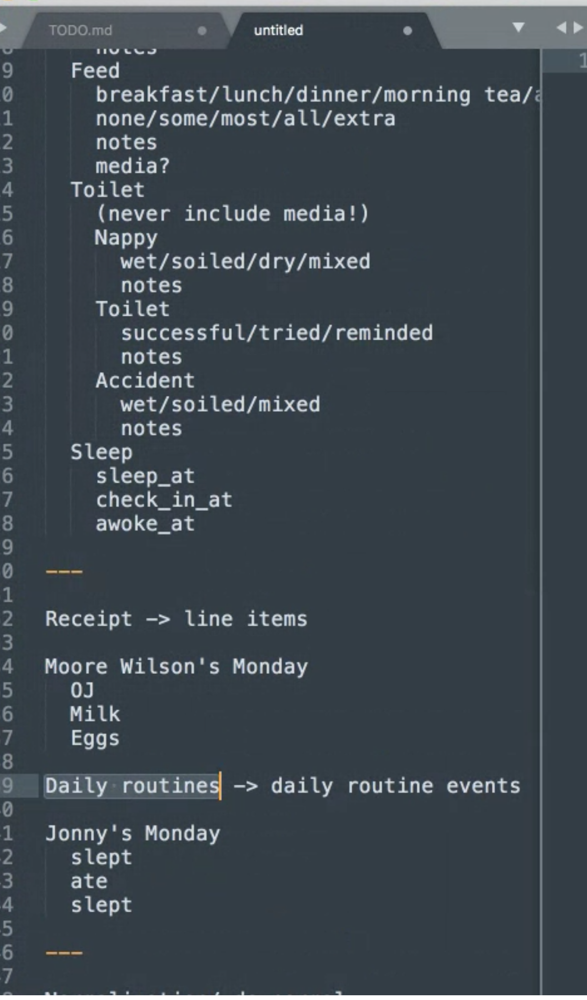
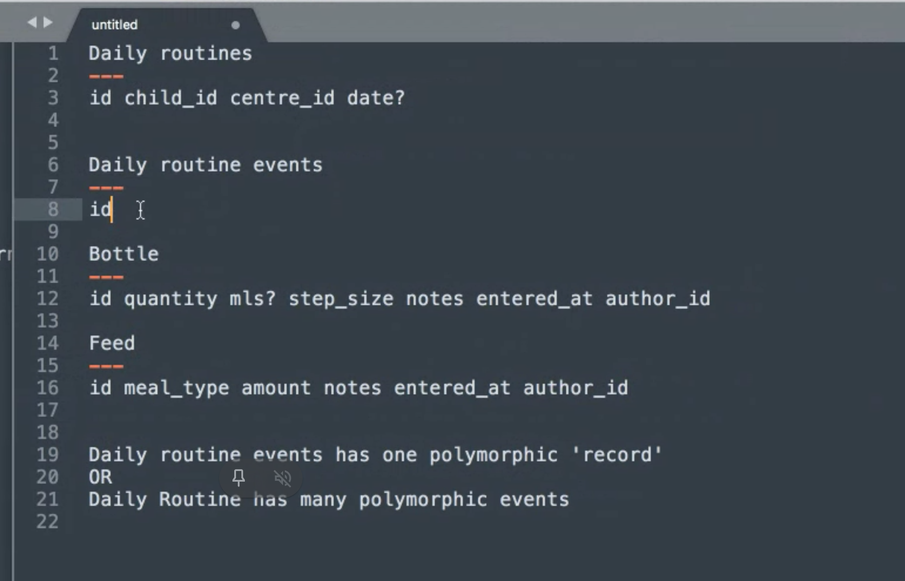
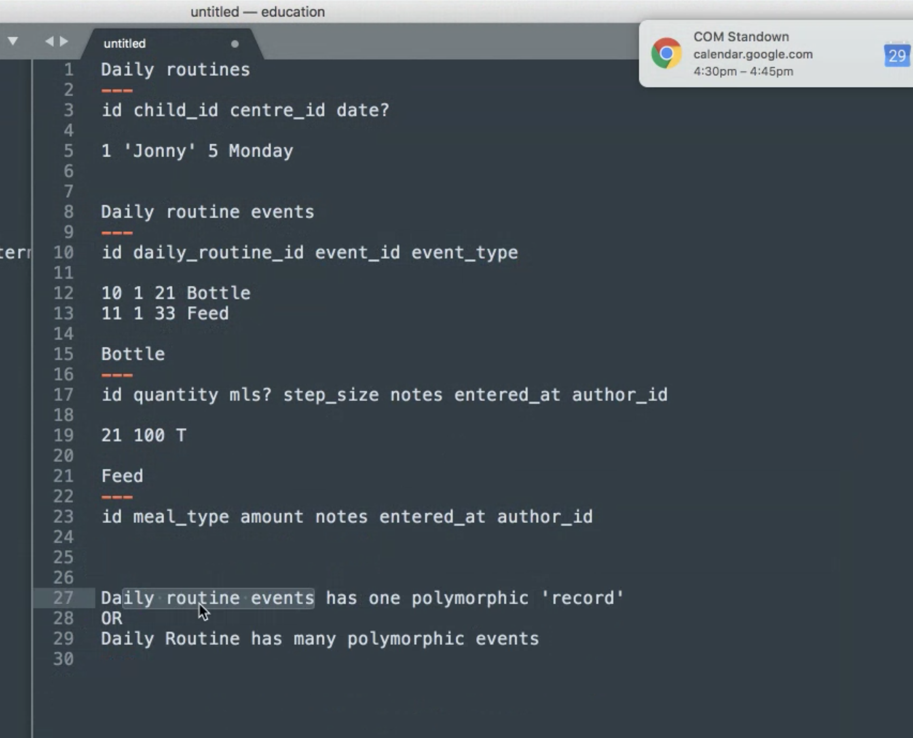
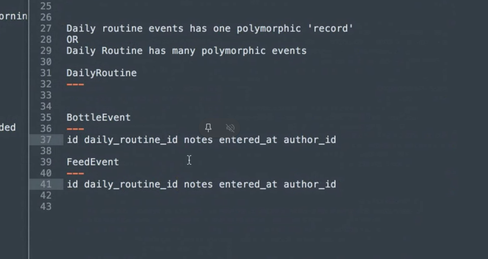
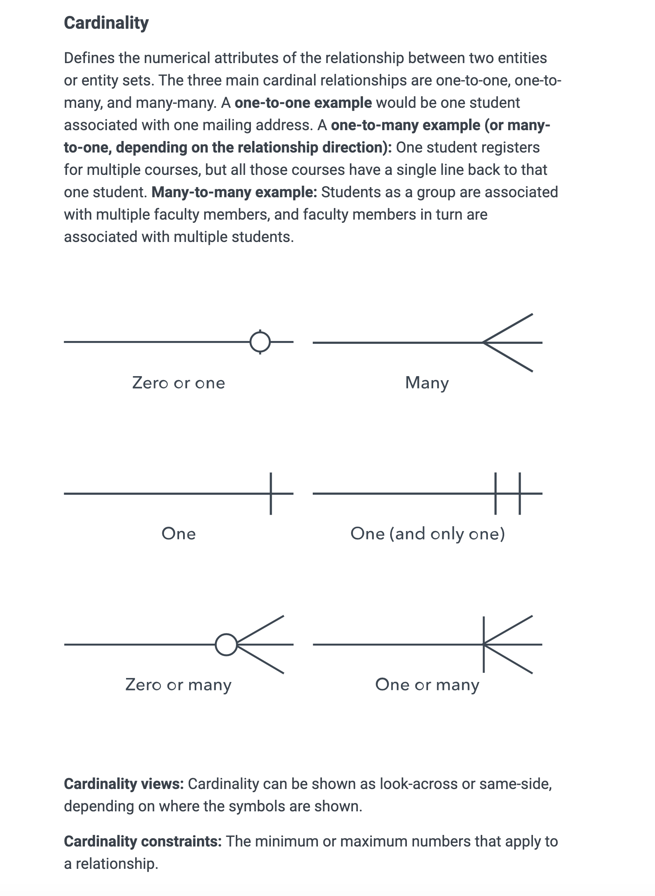
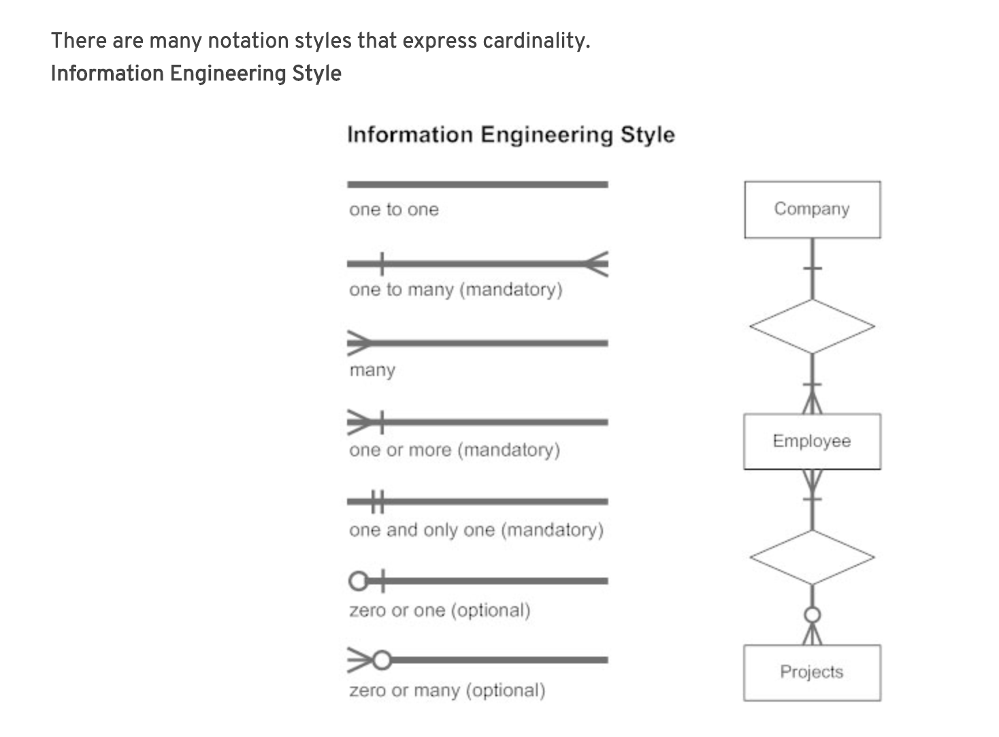

# Databases - general stuff

[DBMS Tutorial – Database Management System notes](https://beginnersbook.com/2015/04/dbms-tutorial/)

## Modelling

[Entity Relationship Diagram – ER Diagram in DBMS](https://beginnersbook.com/2015/04/e-r-model-in-dbms/)

[What is an Entity Relationship Diagram (ERD)?](https://www.lucidchart.com/pages/er-diagrams)

### One approach to start thinking about how to model something (shared by colleague)

First

- look at designs
- pull out core parts
- consider a common or generic example e.g. receipts
- could what we are looking to model fit a common pattern?
- create a spreadsheet
  - add ideas for tables
  - what column's etc



Table structure



Second

- come up with some dummy data
- start entering into spreadsheet tables



Third

- think about how would update this data
- look at what the UI is doing around updating

Other option for structure



### Relationship symbols

[ERD "Crow's Foot" Relationship Symbols Cheat Sheet](https://www.vivekmchawla.com/erd-crows-foot-relationship-symbols-cheat-sheet/)


[ERD "Crow's Foot" Relationship Symbols [Quick Reference] - pdf](ERD_Relationship_Symbols_Quick_Reference.pdf)

[ERD "Crow's Foot" Relationship Symbols [Quick Reference] - pdf](https://drive.google.com/file/d/1uHu60o8lYvdWRy1t25l_pwX_TQBoOthc/view?usp=sharing)





## Normalization

[Normalization in DBMS: 1NF, 2NF, 3NF and BCNF in Database](https://beginnersbook.com/2015/05/normalization-in-dbms/)

## Activerecord

[Active record pattern](https://en.wikipedia.org/wiki/Active_record_pattern)

>In software engineering, the active record pattern is an architectural pattern found in software that stores in-memory object data in relational databases. It was named by Martin Fowler in his 2003 book Patterns of Enterprise Application Architecture.[1] The interface of an object conforming to this pattern would include functions such as Insert, Update, and Delete, plus properties that correspond more or less directly to the columns in the underlying database table.

## Migrations

In regard to taking out a column from db, remove all reference to the column FIRST in your code. Once you have done that, then remove the column via a migration. In particular if you are doing this on a live production site.

## Where vs Find

So, when using...

```ruby
Models::Meal.find(ingredient: "beef")
```

will only return the first one.
When using:

```ruby
Models::Meal.where(ingredient: "beef")
```

...will return all.

(Example using [Sequel gem](http://sequel.jeremyevans.net/))

TODO: add example output???

## Using `.find` or creating find_by method on model

if doing this a lot in codebase

```ruby
Models::Cat.find(tag_id: "123")
```

could add a `find_by_tag_id` to the Cat model

```ruby
Models::Cat.find_by_tag_id("123")
```

```ruby
module Models
  class Cat

    many_to_one :home

    one_to_many :dogs

    def self.find_by_tag_id(tag_id)
      self.find(tag_id: tag_id)
    end

  end
end
```

This would be good if you are using `find` in a lot of places and then the column name you were using changed. Doing it like this would mean that you just need to change the column name in one place.

## Class name can be Implicit

```ruby
module Models
  class Event < Sequel::Model

    many_to_one :sports

    def self.new_running_event(params:,)
      Models::Event.create(sports_id: sports_id, type: "running", data: params)
    end

  end
end
```

Instead of having:

```ruby
Models::Event.create(sports_id: sports_id, type: "running", data: params)
```

you can just have:

```ruby
create(sports_id: sports_id, type: "running", data: params)
```

... as you are inside the `Event` model.

## Database Transaction

[What is a database transaction?](http://stackoverflow.com/questions/974596/what-is-a-database-transaction?answertab=votes#tab-top)
>A transaction is a unit of work that you want to treat as "a whole". It has to either happen in full, or not at all.
>A classical example is transferring money from one bank account to another. To do that you have to first withdraw the amount from the source account, and then deposit it to the destination account. The operation has to succeed in full. If you stop halfway, the money will be lost, and that is Very Bad.
>In modern databases transactions also do some other things - like ensure that you can't access data that another person has written halfway. But the basic idea is the same - transactions are there to ensure, that no matter what happens, the data you work with will be in a sensible state. They guarantee that there will NOT be a situation where money is withdrawn from one account, but not deposited to another.

[Transactions (Database Engine)](https://technet.microsoft.com/en-us/library/ms190612)

- ACID

>Atomicity
>
> A transaction must be an atomic unit of work; either all of its data modifications are performed, or none of them is performed.
>
>Consistency
>
> When completed, a transaction must leave all data in a consistent state. In a relational database, all rules must be applied to the transaction's modifications to maintain all data integrity. All internal data structures, such as B-tree indexes or doubly-linked lists, must be correct at the end of the transaction.
>
>Isolation
>
> Modifications made by concurrent transactions must be isolated from the modifications made by any other concurrent transactions. A transaction either recognizes data in the state it was in before another concurrent transaction modified it, or it recognizes the data after the second transaction has completed, but it does not recognize an intermediate state. This is referred to as serializability because it results in the ability to reload the starting data and replay a series of transactions to end up with the data in the same state it was in after the original transactions were performed.
>
>Durability
>
> After a transaction has completed, its effects are permanently in place in the system. The modifications persist even in the event of a system failure.

[ACID](https://en.wikipedia.org/wiki/ACID)

## Locking

>Record locking is the technique of preventing simultaneous access to data in a database, to prevent inconsistent results.
<https://en.wikipedia.org/wiki/Record_locking>

[Understanding Locking in Rails ActiveRecord](http://thelazylog.com/understanding-locking-in-rails-activerecord/)

[Differences between transactions and locking](https://makandracards.com/makandra/31937-differences-between-transactions-and-locking)

## Order

Wanted to find the first record and check what `start_date` it had. There are thousands of records, so didn't want to return all, hence use of limit`

```ruby
Consumer.active.activated.order(start_date: :asc).limit(10)
```

To check the dates can add `collect` method on end:

```ruby
Consumer.active.activated.order(start_date: :asc).limit(10).collect(&:start_date)

# [
#     [0] Thu, 06 Oct 2016,
#     [1] Fri, 14 Oct 2016,
#     [2] Tue, 08 Nov 2016,
#     [3] Tue, 08 Nov 2016,
#     [4] Fri, 11 Nov 2016,
#     [5] Mon, 14 Nov 2016,
#     [6] Mon, 14 Nov 2016,
#     [7] Fri, 02 Dec 2016,
#     [8] Fri, 02 Dec 2016,
#     [9] Thu, 08 Dec 2016
# ]
```
