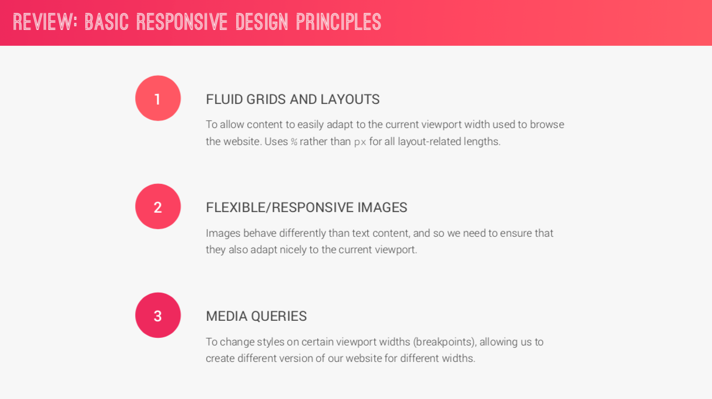
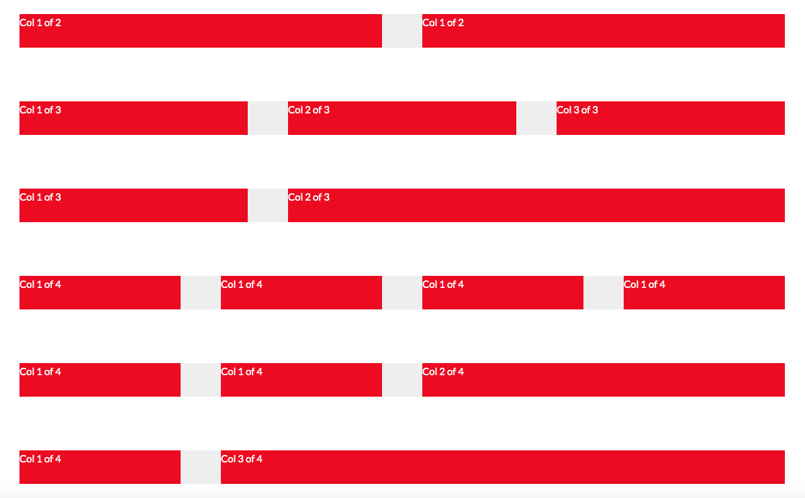

# [Advanced CSS and Sass: Flexbox, Grid, Animations and More!](https://www.udemy.com/advanced-css-and-sass.)

There is a section **HOW CSS WORKS: A LOOK BEHIND THE SCENES**, which covers from the basics the why and how behind CSS. So far I have found this really useful. Particiualry the *HOW CSS IS PARSED, PART 1: THE CASCADE AND SPECIFICITY* lecture.
I have known about specificity but never really understand it, and I think it is explained well in this lecture.


## Mixins / Extends / Functions
was a quick intro to mixins, extends and functions
see https://codepen.io/schuknight/pen/gERqXz


## SASS and NPM
Installing things

### node, nvm, etc etc!
Needed to update version of node, had v6.11.3, which is old.
Couldn't remember how I added installed Node.
Tried via npm first with:
```
npm cache clean -f
npm install -g n
n stable
```
which did this:

```
     install : node-v11.12.0
       mkdir : /usr/local/n/versions/node/11.12.0
mkdir: /usr/local/n/versions/node/11.12.0: Permission denied
```
but looking at it now, it obviously didn't work (read messages carefully!!)

I then did
```
 sudo n stable

# and got

     install : node-v11.12.0
       mkdir : /usr/local/n/versions/node/11.12.0
       fetch : https://nodejs.org/dist/v11.12.0/node-v11.12.0-darwin-x64.tar.gz
######################################################################## 100.0%
   installed : v6.11.3

```
but still no luck.

Thought about brew:

```
$ which node
/Users/SchuKnight/.nvm/versions/node/v6.11.3/bin/node

$ brew uninstall node
Error: Refusing to uninstall /usr/local/Cellar/node/8.6.0
because it is required by heroku 6.14.22, which is currently installed.
You can override this and force removal with:
  brew uninstall --ignore-dependencies node
```
Didn't want to uninstall it through brew.

So remembered about nvm. tried:

```
$nvm uninstall v6.11.3
nvm: Cannot uninstall currently-active node version, v6.11.3 (inferred from v6.11.3).
```
```
$nvm use v11.12.0
N/A: version "v11.12.0 -> N/A" is not yet installed.

You need to run "nvm install v11.12.0" to install it before using it.
```

```
$nvm install v11.12.0
Downloading and installing node v11.12.0...
Downloading https://nodejs.org/dist/v11.12.0/node-v11.12.0-darwin-x64.tar.xz...
######################################################################## 100.0%
Computing checksum with shasum -a 256
Checksums matched!
Now using node v11.12.0 (npm v6.7.0)
```

Looking better!

```
$node -v
v11.12.0
```
Yay!

Nope, more errors :(


Now trying this
https://gist.github.com/d2s/372b5943bce17b964a79
```
nvm install v10.15.3

nvm alias default v10.15.3

# and now got `v10.15.3`

# this is what `nvm ls` gives me

    v6.0.0
    v6.11.0
    v6.11.3
->     v10.15.3
    v11.12.0
      system
default -> v10.15.3
node -> stable (-> v11.12.0) (default)
stable -> 11.12 (-> v11.12.0) (default)
iojs -> N/A (default)
lts/* -> lts/dubnium (-> v10.15.3)
lts/argon -> v4.9.1 (-> N/A)
lts/boron -> v6.17.0 (-> N/A)
lts/carbon -> v8.15.1 (-> N/A)
lts/dubnium -> v10.15.3

# uninstalled
 v6.0.0
 v6.11.0
 v6.11.3

# now nvm ls give me

->     v10.15.3
       v11.12.0
         system
default -> v10.15.3
node -> stable (-> v11.12.0) (default)
stable -> 11.12 (-> v11.12.0) (default)
iojs -> N/A (default)
lts/* -> lts/dubnium (-> v10.15.3)
lts/argon -> v4.9.1 (-> N/A)
lts/boron -> v6.17.0 (-> N/A)
lts/carbon -> v8.15.1 (-> N/A)
lts/dubnium -> v10.15.3
```

Installed node-sass:

`npm install node-sass --save-dev`

Added a script in `package.json`
```json
"scripts": {
    "compile:sass": "node-sass sass/main.scss css/style.css -w"
  },
```

Installed `live-server` globally:

`npm install live-server -g`

Now can have one window that run the script in:

`npm run compile:sass`

And another with for the live-server:

`live-server`


## SASS - Syntactically Awesome Style Sheets
Diving into more SASS in the course

https://sass-lang.com/ - is a CSS preprocessor

[SASS Guidelines](https://sass-guidelin.es/)

[The Sass Ampersand](https://css-tricks.com/the-sass-ampersand/)


### CSS Architecture

https://sass-guidelin.es/#architecture

>Architecting a CSS project is probably one of the most difficult things you will have to do in a project's life. Keeping the architecture consistent and meaningful is even harder.
>Fortunately, one of the main benefits of using a CSS preprocessor is having the ability to split the codebase over several files without impacting performance (like the @import CSS directive would do). Thanks to Sass's overload of the @import directive, it is perfectly safe (and actually recommended) to use as many files as necessary in development, all compiled into a single stylesheet when going to production.

In the course, Jonas uses the 7–1 pattern.

7 folders:

- base/
- components/
- layout/
- pages/
- themes/
- abstracts/
- vendors/

and one file:

- main.scss


[The 7-1 Pattern](https://sass-guidelin.es/#the-7-1-pattern)

[sass-boilerplate](https://github.com/HugoGiraudel/sass-boilerplate)

[Aesthetic Sass 1: Architecture and Style Organization](https://scotch.io/tutorials/aesthetic-sass-1-architecture-and-style-organization)

Using this might be over the top for a small project, or one page but good for large projects. And a good habit to get use to.

## Basic Principles of Responsive Design and Layout Types

1. Fluid grid and layouts - %'s instead of px's for all layout related lengths
2. Flexible / responseive images
3. Media queries



Float layouts? Flexbox? Or CSS grid? Will go over all of them.

### Implementing a grid system
Things learnt along the way...

#### :not
[:not(s)](https://css-tricks.com/almanac/selectors/n/not/)

[:not() CSS pseudo-class](https://developer.mozilla.org/en-US/docs/Web/CSS/:not)

```css
/* Selects any element that is NOT a paragraph */
:not(p) {
  color: blue;
}
```

#### [attribute]
[Attribute selectors](https://developer.mozilla.org/en-US/docs/Web/CSS/Attribute_selectors)

https://css-tricks.com/almanac/selectors/a/attribute/

```css
[data-value] {
  /* Attribute exists */
}

[data-value="foo"] {
  /* Attribute has this exact value */
}

[data-value*="foo"] {
  /* Attribute value contains this value somewhere in it */
}

[data-value~="foo"] {
  /* Attribute has this value in a space-separated list somewhere */
}

[data-value^="foo"] {
  /* Attribute value starts with this */
}

[data-value|="foo"] {
  /* Attribute value starts with this in a dash-separated list */
}

[data-value$="foo"] {
  /* Attribute value ends with this */
}
```

Example in course, selectors all classes that start with `col-`

```css
[class^="col-"] {

}
```

Can also do the links of :

```css
/* <a> elements with a title attribute */
a[title] {
  color: purple;
}
```

Grid system:



Link to grid system - https://libbyschuknight.github.io/natours-site/grid.html
