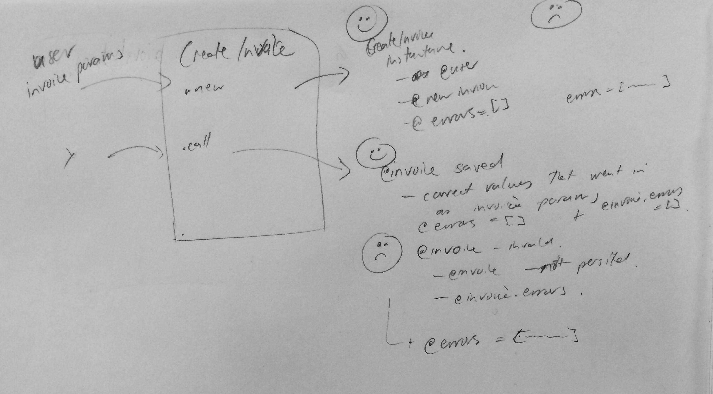

# January / February Mistakes, Improvements & Learnings

## scopes

If doe this as a scope:

```ruby
scope :first_read_taken, -> { order_by_taken_at.first }
```
can't chain another scope on it.
Could use a `limit(1)` instead but suggested is you would do a class method:

```ruby
def first_read_taken
  order_by_taken_at.first
end
```

## validations

[Skipping Validations in Ruby On Rails](https://richonrails.com/articles/skipping-validations-in-ruby-on-rails)


## Remind about things to think about when starting to test something like a service object

Draw it out:


Pseudocode it out:

```ruby
describe "#call" do
  # happy path
  #   creates / saves an invoice
  #      with correct values
  #   invoice has no errors

  # sad path
  #   invoice is not saved
  #   invoice has errors
  #   or
  #   invoice_creator has errors
end
```

## Test on a scope for number of customers

`scope :customers, -> { where(admin: false) }`

spec

```ruby
it "returns users that are customers" do
  expect(User.customers.first.admin).to be false
end
```

suggestion to change to:
> i think you could do something like expect(User.customers.pluck(:admin).compact).to eq [false] or something?

changed to
`expect(User.customers.pluck(:admin).compact.uniq).to eq([false])`


## Thinking on links vs buttons and making a link look like a button

Changing this

```html
<div class="back-to-overview"><%= link_to "Back to overview", {:controller => '/properties'}, :id => "back-to-overview-link" %></div>
```

```css
.back-to-overview {
  float: left;
  margin-left: 12px;
  padding-top: 8px;
}
```

Which looks just like a link to something that looks like a button but is not a button, as it does not submit anything.
It took me a little while to get my head around that, I had in my head that the design/er was wanting a button, so was thinking about using the styles already in the app for buttons. But its functionality is not that of a button, it is a link, so although it might end up looking like a button, it is not.


## Spring issue

Was trying to run a test with
`bundle exec spring rspec core/spec/models/customer_stored_mailer_spec.rb:52`

but it kept on hanging and showing now output.

Changed branches to see if it was an issue to do with the branch. But no.

Was trying to grep by ruby but that wasn't showing anything, then thought of trying spring

`ps aux | grep spring`

```bash
libby             5080   0.0  0.1  2479180   4828 s000  S     8:35am   0:00.54 spring server | powershop | started 3 hours ago
libby            10778   0.0  0.2  2474080  18372 s000  T    11:43am   0:00.48 /Users/libby/.rbenv/versions/2.3.5/bin/spring rspec core/spec/models/customer_stored_mailer_spec.rb:52
```

which showed the spec but also a server (which I don't actually remember starting

Killed off the server running

`kill -9 5080`

 and run spec again and it works! yay!


## RSpec `include`

https://relishapp.com/rspec/rspec-expectations/v/3-7/docs/built-in-matchers/include-matcher#string-usage

You can do this
```ruby
expect(mail.subject).to include("Your Powershop", "Account Invoice")
```

instead of

```ruby
expect(mail.subject).to include("Your Powershop")
expect(mail.subject).to include("Account Invoice")
```
or trying to do some sort of regex


## `to_partial_path`

Was trying to find a render using a path and couldn't because it was using a `to_partial_path` on a presenter

https://apidock.com/rails/ActiveModel/Conversion/to_partial_path

```ruby
class Customer::AddUtilityBannerPresenter
  attr_reader :customer

  def initialize(customer)
    @customer = customer
  end

  def to_partial_path
    'customer/this_path'
  end
end

Customer::AddUtilityBannerPresenter.new(customer).to_partial_path
# "customer/add_utility_banner"
```
