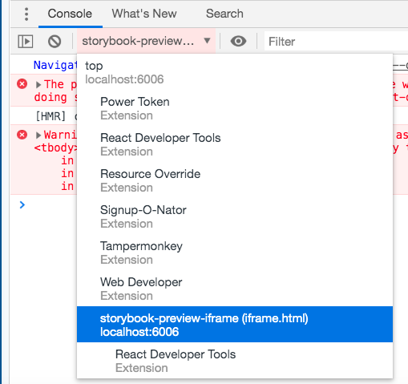

# July 2019 Mistakes, Improvements, Learning and Stuff

## FormBuilder methods and customising

For the work we are doing on the pattern library at work, we are customisting `ViewHelpers` and `FormBuilders`.
I will try and explain what we are doing.
We are adding a `text input` and wanting to have it for both a form helper tag (the basic helpers ending in `*_tag` - https://guides.rubyonrails.org/form_helpers.html#helpers-for-generating-form-elements)...

```html
<%= form_tag("/search", method: "get") do %>
  <%= label_tag(:q, "Search for:") %>
  <%= text_field_tag(:q) %>
  <%= submit_tag("Search") %>
<% end %>
```
and for forms dealing with model objects.

You can use the `*_tag` methods, but Rails makes things work with models and you drop the `_tag` of the method name:

>A particularly common task for a form is editing or creating a model object. While the *_tag helpers can certainly be used for this task they are somewhat verbose as for each tag you would have to ensure the correct parameter name is used and set the default value of the input appropriately. Rails provides helpers tailored to this task. These helpers lack the _tag suffix, for example text_field, text_area.

```html
<%= text_field(:person, :name) %>

<!-- instead of  -->

<%= text_field_tag(:query) %>
```

And then with the binding of a form to an object (https://guides.rubyonrails.org/form_helpers.html#binding-a-form-to-an-object), by using `form_with` or `form_for` you can use the form builder object - *"The form_for method yields a form builder object (the f variable)."*

```html
<%= form_for @article, url: {action: "create"}, html: {class: "nifty_form"} do |f| %>
  <%= f.text_field :title %>
  <%= f.text_area :body, size: "60x12" %>
  <%= f.submit "Create" %>
<% end %>
```

The way that we are building out out components at the moment is that we have:

- a `TextInput`
- a `Field`
- and then a `TextInputField`

this is so that we can have different levels of html around each part and then reuse them as well.

These means that for each of these we have to have custom methods for `ViewHelpers` and `FormBuilders`.
We have just been looking at the `Field` component and we hadn't actually added any methods for the `FormBuilder` but we do as we need to make sure that a label is added for an attribue on the model.

Before adding the implementation for the pattern library, for the `title` attribute (field) on the a model (`Promotion` model) we have the form builder:

```html
<%= f.label :title %>
<%= f.text_field :title, :class => "input" %>

<!-- generation this -->

<label for="promotion_title">Title</label>
<input class="input" type="text" name="promotion[title]" id="promotion_title">
```

With the current implementation of the `Field` component (which does not have any `FormBuilder` methods) we get:

```html
<%= f.apl_text_input_field_v1 :title %>

<!-- it just generates this -->
<div class="apl-field-v1_0 ">
  <input class="apl-text-input-v1_1 " aria-describedby="" type="text" name="promotion[title]" id="promotion_title">
</div>
```

But we want the component (`apl_text_input_field_v1`) to automatically add the label so that `<%= f.label :title %>` doesn't need to be added by the dev, plus we add more stuff like that `div` above.

The output should look similar to the output we get when using the `apl_text_input_field_tag_v1` `ViewHelper` method.

```html
<div class="apl-field-v1_0 extra-field-libby-name has-error">
  <label class="apl-field__label" for="apl-text-input-field-v1_0-2">APL Field tag test</label>
  <input type="text" name="test-field" id="apl-text-input-field-v1_0-2" value="Some text" class="apl-text-input-v1_1 input-class-name" aria-describedby="apl-text-input-field-v1_0-2-error-text apl-text-input-field-v1_0-2-help-text">
  <div class="apl-field__help-text" id="apl-text-input-field-v1_0-2-help-text">Enter your full name</div>
  <div role="alert" class="apl-field__error-text" id="apl-text-input-field-v1_0-2-error-text">wrong input</div>
</div>
```

This is useful when thinking/learning about the `form_builder` methods:

[ActionView::Helpers::FormBuilder < Object](https://api.rubyonrails.org/classes/ActionView/Helpers/FormBuilder.html)

And in particular in this case around the `label` method - https://api.rubyonrails.org/classes/ActionView/Helpers/FormBuilder.html#method-i-label


## Ruby Mine / doing `bundle open <gem>`

A couple of my colleagues use [RubyMine](https://www.jetbrains.com/ruby/) and it works in such a way that you can easily look at the methods etc of gems that are included in your Rails project.

I use [VSCode](https://code.visualstudio.com/) and it doesn't have this ability. (It actually might have this ability with this extension https://github.com/rubyide/vscode-ruby / https://marketplace.visualstudio.com/items?itemName=rebornix.Ruby)

But what you can do instead is `bundle open rails` for example and then you have access to all the rails gem code.

*Note:* further to this, I was able to do `bundle open rails` and see everything (all the gems) as we use a forked version at work. However, now `rails` is separeated out into gems - https://github.com/rails/rails#frameworks-and-libraries, so doing `bundle open rails` only opens up the readme for rails. For what I wanted to be looking at I need to do `bundle open actionview` if I was using a standard rails app where rails had not been forked (and had all the gems in it already)

I have just done this as I am working on adding methods to the `FormBuidler` and wanted to take a closer look at the `label` method

https://api.rubyonrails.org/classes/ActionView/Helpers/FormBuilder.html#method-i-label

And have also put a `binding.pry` in there so I can have a nosey around.

Actually dived into a bit of a rabbit hole by looking at more methods in Rails.

Started by searching for `label(method`, which took me to `actionview/lib/action_view/helpers/form_helper.rb:2025`, which is this code:

```ruby
def label(method, text = nil, options = {}, &block)
  @template.label(@object_name, method, text, objectify_options(options), &block)
end
```

Then used the "Go to definition" function in VScode to find the `label` method on `@template.label`, which took me to here `actionview/lib/action_view/helpers/form_helper.rb:1115` and this:

```ruby
def label(object_name, method, content_or_options = nil, options = nil, &block)
  Tags::Label.new(object_name, method, self, content_or_options, options).render(&block)
end
```

Then looked at `Label`, `actionview/lib/action_view/helpers/tags/label.rb`. Not that I figured anything out but really interesting looking at the Rails code. Think it is the first time I have done it and some of it has made sense.


## Using the `label` method on the `FormBuilder`

Further to the above, I paired with a colleague and we figured some stuff out and solved our problem. Our problem was that we have added a customised `FormBuilder`:

```ruby
class AplFormBuilder < ActionView::Helpers::FormBuilder
  include ::APL::DatePicker::FormBuilderMethods
  include ::APL::Field::FormBuilderMethods
  include ::APL::TextInput::FormBuilderMethods
  include ::APL::TextInputField::FormBuilderMethods
...
end
```

And have been including lots of form builder methods. One of which uses the `label(method, text = nil, options = {}, &block)` on the `FormBuilder`.

Because of stuft that we were doing and some other things were working, we needed a way that we could add a `span` inside of the `label` while still showing the correct value for the name of that label. And making sure that it would work if there were helper translations being used or activerecord translations being used.

Digging into the rails code we came up with doing this:

```ruby
label(method, nil, class: class_names_label) do |label_builder|
  if options[:label]
    @template.concat options[:label]
  else
    @template.concat label_builder.translation
  end

  @template.concat optional_label
end
```
It is basically because we want to be able to add this optional span within the label, previosuly the way we were doing it:

```ruby
label = options[:label] + optional_label
label(method, label, class: class_names_label)
```
And with this, the underlying code using `method` to create the text for the label was being overwritten by what we were passing into the second argument. So we needed a way that we could have the text from the `method` (e.g. if the method was `:first_name` then the text would be `First name`, that would do the translation stuff if needed AND pass in the optional `span`, within the label.

Hence the solution above which ends up outputting this HTML:

```html
<label class="apl-field__label" for="promotion_title">
  Title
  <span class="apl-field__optional-text">Optional</span>
</label>
```

## Fixing the `id` for our HTML output

For work we have been doing with our pattern library, we have been adding lots of html / css to build up components and we want both a view `tag` and a `form builder` method to return pretty much the same output.

For our pattern library, if we want to add a tag in an erb template:

```ruby
<%= apl_text_input_field_tag_v1(
  "test-field",
  "Some text",
  className: "field-class-name",
  label: "APL Field tag test",
  inputClassName: "input-class-name",
  helpText: "this is help text",
  errorText: "wrong input",
  optional: true
)%>
```

Then via the `text_field_tag` we get this output:

https://api.rubyonrails.org/classes/ActionView/Helpers/FormTagHelper.html#method-i-text_field_tag

```html
<div class="apl-field-v1_0 field-class-name has-error">
  <label class="apl-field__label" for="apl-text-input-field-v1_0-2">
    APL Field tag test
    <span class="apl-field__optional-text">Optional</span>
  </label>
  <input type="text"
    name="test-field"
    id="apl-text-input-field-v1_0-2"
    value="Some text"
    class="apl-text-input-v1_1 input-class-name"
    aria-describedby="apl-text-input-field-v1_0-2-error-text apl-text-input-field-v1_0-2-help-text"
  >
  <div role="alert" class="apl-field__error-text" id="apl-text-input-field-v1_0-2-error-text">
      wrong input
  </div>
  <div class="apl-field__help-text"id="apl-text-input-field-v1_0-2-help-text">
      this is help text
  </div>
</div>
```
Notice that the `id` (`apl-text-input-field-v1_0-2`) is reused in a number of places.

If we use the same underlying code for generating the `html` for a `form` that uses `text_field`:

```ruby
<%= apl_form_for(@person, url: '/') do |f| %>
  <%= f.apl_text_input_field_v1 :firstName,
    className: "field-class-name",
    placeholder: "text input with field should have label",
    inputClassName: "input-class-name",
    errorText: "wrong input",
    helpText: "this is help text",
    optional: true,
    label: "this is a title for the label"
  %>
<% end %>
```

We get this output:

```html
<div class="apl-field-v1_0 field-class-name has-error">
  <label class="apl-field__label" for="person_firstName">
    this is a title for the label
    <span class="apl-field__optional-text">Optional</span>
  </label>
  <input
    id="apl-text-input-field-v1_0-1"
    placeholder="text input with field should have label"
    class="apl-text-input-v1_1 input-class-name"
    aria-describedby="apl-text-input-field-v1_0-1-error-text apl-text-input-field-v1_0-1-help-text"
    type="text"
    name="person[firstName]">
  <div
    role="alert"
    class="apl-field__error-text"
    id="apl-text-input-field-v1_0-1-error-text">wrong input
  </div>
  <div
    class="apl-field__help-text"
    id="apl-text-input-field-v1_0-1-help-text">
      this is help text
  </div>
</div>
```

Which has a couple of things wrong with it. Firstly, within the `input` block, the `id` is `apl-text-input-field-v1_0-1` but it should be `person_firstName` as this is rendering a form for a model.

What I had initially done was actually remove the creation of the `apl-text-input-field-v1_0-1` `id`, so was getting `person_firstName` but where we have things like `apl-text-input-field-v1_0-1-help-text`, which uses the generated `id` as the start of the name, we were getting `-help-text`. These classes and ids etc are important for out error and help text and accessibility.

As I was figuring out what to do, I realised that the `text_field(method, options)` `FormBuilder` method we use to create the `input` block, takes `options` and if in that hash there is an `id`, it takes that and overwrites the `form id` that gets automatically created when using `form_for` and `text_field`.

So the fix was to remove the `id` from the `options` hash before it got passed into the method that calls `text_field`.

```ruby
def pl_text_input_field_v1_0(method, options = {})
  options[:id] = create_id_if_not_set(options)
  field_options = TextInputFieldHelpers.create_field_options(options)
  text_input_options = TextInputFieldHelpers.create_text_input_options(options, field_options)

  text_input_options.delete(:id)
  field_options[:control] = pl_text_input_v1(method, **text_input_options)

  pl_field_v1(method, **field_options)
end
```

I was pleased I was able to use my knowledge (recent understanding) of `text_field` and figure out what was happening and fix it. I think it was due to the work we had done previously (mentioned above) around  the `label` method.

https://api.rubyonrails.org/classes/ActionView/Helpers/FormHelper.html#method-i-text_field

https://api.rubyonrails.org/classes/ActionView/Helpers/FormBuilder.html#method-i-label


## [Storybook](https://storybook.js.org/)

>Build bulletproof UI components faster
>Storybook is an open source tool for developing UI components in isolation for React, Vue, and Angular. It makes building stunning UIs organized and efficient.

### `$r` when using Storybook

When wanting to access the use `$r` when using Storybook, you may need to change JavaScript context in Chrome Dev Tools to `top`.

See https://github.com/facebook/react-devtools/issues/366#issuecomment-212749794




## Spelling AGAIN!!!

Have been adding a stateless React component to our pattern library and had this set up for the `proptypes`:

```jsx
// prettier-ignore
Button.prototypes = {
  // React props
  onClick:    PropTypes.func,

  // HTMLInputElement props
  name:       PropTypes.string,
  title:      PropTypes.string,
  className:  PropTypes.string,
};
```

And with our linting, which uses [ESlint](https://eslint.org/) and with React, this plugin - [eslint-plugin-react](https://github.com/yannickcr/eslint-plugin-react), I was getting these errors:

```bash
$ run-s lint:*
$ eslint '**/*.{js,jsx}'

/Users/libby/flux/admin_pattern_library/src/components/button/v1_0/js/Button.jsx
  11:19  error  'name' is missing in props validation       react/prop-types
  11:25  error  'title' is missing in props validation      react/prop-types
  11:32  error  'className' is missing in props validation  react/prop-types
  11:43  error  'onClick' is missing in props validation    react/prop-types

✖ 4 problems (4 errors, 0 warnings)
```

So I am thinking I have missed something, as I have followed the format of the other components we already have.

Did some googling, trying different things out but nothing was working and was half way to writing a message to my team and I realised that I had `prototypes` not `propTypes` on the first line! Doh!

```jsx
Button.propTypes = {
  // React props
  ...
```

My brain can't cope with words that look similar in the same domain!!


## [Difference between <input type='button' /> and <input type='submit' />](https://stackoverflow.com/questions/290215/difference-between-input-type-button-and-input-type-submit)

https://stackoverflow.com/questions/290215/difference-between-input-type-button-and-input-type-submit/290221#290221

>`<input type="button" />` buttons will not submit a form - they don't do anything by default. They're generally used in conjunction with >JavaScript as part of an AJAX application.
>
>`<input type="submit">` buttons will submit the form they are in when the user clicks on them, unless you specify otherwise with >JavaScript.


## Top tip from colleague

If using `PropTypes`, ALWAYS define them straight away! Otherwise you get errors and I did not understand them!
