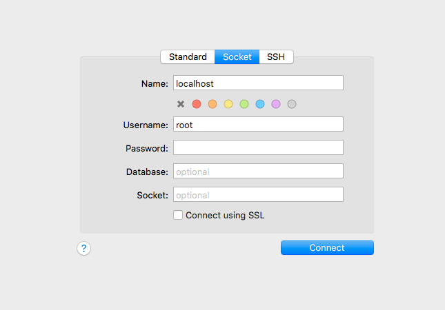

# October & November 2019 Mistakes, Improvements, Learning and Stuff

My mac at home needs to be updated. It is still on Sierra. I was doing some updating and upgrading of brew things and after when I tried to use irb, the arrow keys and using keys like `ctrl + a` had stopped working.

After some googling and trying to upgrade ruby-build and readline things, I searched in the work slack and got to this stack overflow post - <https://stackoverflow.com/questions/54261455/library-not-loaded-usr-local-opt-readline-lib-libreadline-7-dylib>.

Tried this:

```bash
cd /usr/local/opt/readline/lib
ln -s libreadline.8.dylib libreadline.7.dylib
```

And now keys are working when in irb! Yay!

## Gem versions

At work we have a core app which uses our admin pattern library gem. The APL gem has different versions.
I had everything working last week, so the page on the local server was working, and the integration test (using cucumbers and page object model) was working fine too!!

Come this week and the core app branch was out of date with master and the APL gem branch was out of date with master, so rebased them. Then I think I did something silly with the APL gem version in the core app.

We can do any of these:

```ruby
gem 'admin_pattern_library', :pgem => 'admin_pattern_library', :tag => 'v0.29.0' # point at a release, usually most recent
gem 'admin_pattern_library', :pgem => 'admin_pattern_library', :branch => 'deploy-apl-282' # point at a feature branch deploy branch
gem 'admin_pattern_library', :path => '../admin_pattern_library' # point at the gem locally, on computer
```

We think what happened was that I thought it was pointing to the gem that had a certain version that has `apl_fields_for` in it but it was actually not. Doh!

## [Sequel Pro](https://www.sequelpro.com/)

Good tool to use to figure out DB stuff.

Set it to local host, click connect, then choose a DB.


