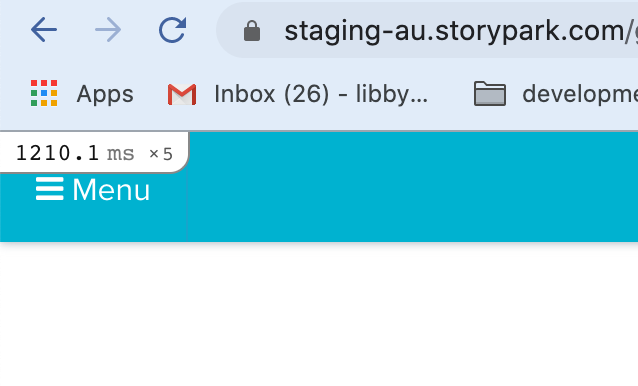
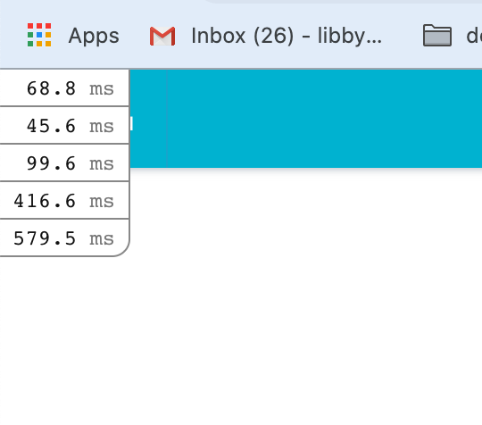
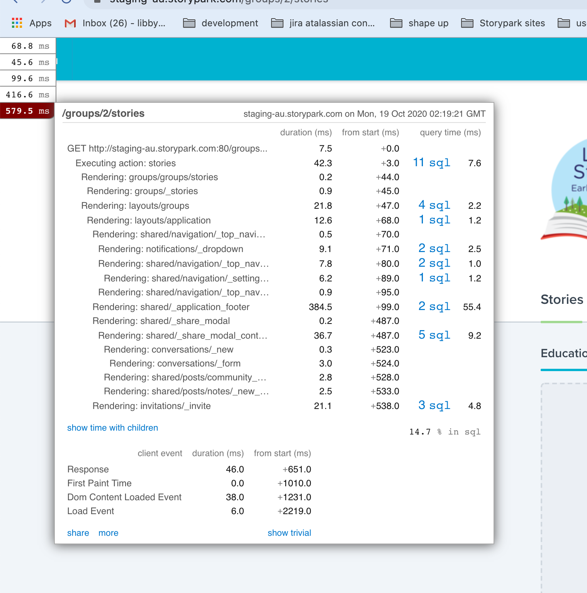
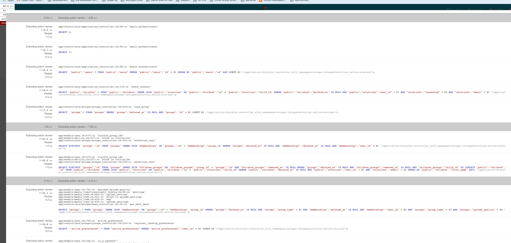

# October / November / December 2020 Mistakes, Improvements, Learning and Stuff

Mini profiler - <https://github.com/MiniProfiler/rack-mini-profiler>

You can drill down into the performance, sql queries, files where it is coming from.


<br>
<br>

<br>
<br>

<br>
<br>

<br>
<br>


## Trying Overmind

Questions asked on Ruby Slack

>I posted in here about Procfiles and local development and @rose and others suggested overmind, https://github.com/DarthSim/overmind
>I’ve finally got around to trying it out but am stuck. it errors. Will post the error in the thread.
>Note, I know nothing about tmux, which you have to install to get overmind working. Any help or tips on where to go look would be greatly appreciated. >:slightly_smiling_face:

```bash
overmind s
overmind s
system   | Tmux socket name: overmind-education-a9P07yVUORVz9ytz0MwxDd
system   | Tmux session ID: education
system   | Listening at ./.overmind.sock
web      | Started with pid 44134...
mail     | Started with pid 44135...
webpack  | Started with pid 44137...
zencoder | Started with pid 44138...
worker   | Started with pid 44136...
mail     | Exited
web      | Interrupting...
worker   | Interrupting...
webpack  | Interrupting...
zencoder | Interrupting...
worker   | Traceback (most recent call last):
worker   |  15: from /Users/libby/.gem/ruby/2.6.6/bin/bundle:23:in `<main>'
worker   |  14: from /Users/libby/.rubies/ruby-2.6.6/lib/ruby/2.6.0/rubygems.rb:303:in `activate_bin_path'
worker   |  13: from /Users/libby/.rubies/ruby-2.6.6/lib/ruby/2.6.0/rubygems.rb:303:in `synchronize'
worker   |  12: from /Users/libby/.rubies/ruby-2.6.6/lib/ruby/2.6.0/rubygems.rb:305:in `block in activate_bin_path'
worker   |  11: from /Users/libby/.rubies/ruby-2.6.6/lib/ruby/2.6.0/rubygems.rb:238:in `finish_resolve'
worker   |  10: from /Users/libby/.rubies/ruby-2.6.6/lib/ruby/2.6.0/rubygems/core_ext/kernel_require.rb:54:in `require'
worker   |   9: from /Users/libby/.rubies/ruby-2.6.6/lib/ruby/2.6.0/rubygems/core_ext/kernel_require.rb:54:in `require'
worker   |   8: from /Users/libby/.rubies/ruby-2.6.6/lib/ruby/2.6.0/rubygems/request_set.rb:478:in `<top (required)>'
worker   |   7: from /Users/libby/.rubies/ruby-2.6.6/lib/ruby/2.6.0/rubygems/core_ext/kernel_require.rb:54:in `require'
webpack  | Traceback (most recent call last):
webpack  |  14: from <internal:gem_prelude>:2:in `<internal:gem_prelude>'
webpack  |  13: from <internal:gem_prelude>:2:in `require'
webpack  |  12: from /Users/libby/.rubies/ruby-2.6.6/lib/ruby/2.6.0/rubygems.rb:116:in `<top (required)>'
webpack  |  11: from /Users/libby/.rubies/ruby-2.6.6/lib/ruby/2.6.0/rubygems.rb:1365:in `<module:Gem>'
webpack  |  10: from /Users/libby/.rubies/ruby-2.6.6/lib/ruby/2.6.0/rubygems.rb:1365:in `require'
webpack  |   9: from /Users/libby/.rubies/ruby-2.6.6/lib/ruby/2.6.0/rubygems/specification.rb:16:in `<top (required)>'
webpack  |   8: from /Users/libby/.rubies/ruby-2.6.6/lib/ruby/2.6.0/rubygems/specification.rb:16:in `require'
webpack  |   7: from /Users/libby/.rubies/ruby-2.6.6/lib/ruby/2.6.0/rubygems/specification_policy.rb:2:in `<top (required)>'
webpack  |   6: from /Users/libby/.rubies/ruby-2.6.6/lib/ruby/2.6.0/rubygems/specification_policy.rb:2:in `require'
webpack  |   5: from /Users/libby/.rubies/ruby-2.6.6/lib/ruby/2.6.0/uri.rb:100:in `<top (required)>'
web      | Traceback (most recent call last):
web      |  7: from /Users/libby/.gem/ruby/2.6.6/bin/bundle:23:in `<main>'
web      |  6: from /Users/libby/.gem/ruby/2.6.6/bin/bundle:23:in `load'
web      |  5: from /Users/libby/.gem/ruby/2.6.6/gems/bundler-2.1.4/exe/bundle:13:in `<top (required)>'
web      |  4: from /Users/libby/.gem/ruby/2.6.6/gems/bundler-2.1.4/exe/bundle:13:in `require_relative'
web      |  3: from /Users/libby/.gem/ruby/2.6.6/gems/bundler-2.1.4/lib/bundler.rb:4:in `<top (required)>'
web      |  2: from /Users/libby/.rubies/ruby-2.6.6/lib/ruby/2.6.0/rubygems/core_ext/kernel_require.rb:54:in `require'
web      |  1: from /Users/libby/.rubies/ruby-2.6.6/lib/ruby/2.6.0/rubygems/core_ext/kernel_require.rb:54:in `require'
web      | /Users/libby/.gem/ruby/2.6.6/gems/bundler-2.1.4/exe/bundle:6:in `block in <top (required)>': undefined method `ui' for Bundler:Module (NoMethodError)
worker   |   6: from /Users/libby/.rubies/ruby-2.6.6/lib/ruby/2.6.0/rubygems/core_ext/kernel_require.rb:54:in `require'
worker   |   5: from /Users/libby/.rubies/ruby-2.6.6/lib/ruby/2.6.0/rubygems/request_set/lockfile.rb:238:in `<top (required)>'
worker   |   4: from /Users/libby/.rubies/ruby-2.6.6/lib/ruby/2.6.0/rubygems/core_ext/kernel_require.rb:54:in `require'
worker   |   3: from /Users/libby/.rubies/ruby-2.6.6/lib/ruby/2.6.0/rubygems/core_ext/kernel_require.rb:54:in `require'
worker   |   2: from /Users/libby/.rubies/ruby-2.6.6/lib/ruby/2.6.0/rubygems/request_set/lockfile/tokenizer.rb:2:in `<top (required)>'
worker   |   1: from /Users/libby/.rubies/ruby-2.6.6/lib/ruby/2.6.0/rubygems/core_ext/kernel_require.rb:54:in `require'
worker   | /Users/libby/.rubies/ruby-2.6.6/lib/ruby/2.6.0/rubygems/core_ext/kernel_require.rb:54:in `require': Interrupt
webpack  |   4: from /Users/libby/.rubies/ruby-2.6.6/lib/ruby/2.6.0/uri.rb:100:in `require'
webpack  |   3: from /Users/libby/.rubies/ruby-2.6.6/lib/ruby/2.6.0/uri/common.rb:16:in `<top (required)>'
webpack  |   2: from /Users/libby/.rubies/ruby-2.6.6/lib/ruby/2.6.0/uri/common.rb:347:in `<module:URI>'
webpack  |   1: from /Users/libby/.rubies/ruby-2.6.6/lib/ruby/2.6.0/uri/common.rb:347:in `times'
webpack  | /Users/libby/.rubies/ruby-2.6.6/lib/ruby/2.6.0/uri/common.rb:353:in `block in <module:URI>': Interrupt
webpack  | Exited
zencoder | Exited
worker   | Exited
web      | Exited

```


>danbrooker  18 hours ago
>if you want to go without tmux, hivemind is the same as overmind minus tmux

>libby:surfer:  18 hours ago
>I feel like it can’t find ruby stuff, gem stuff. I wonder if its because it is running with tmux and there is something I need to do that I haven;t done?>?

>libby:surfer:  18 hours ago
>Yeah, tried hivemind and that works but I am specfically wanting to be able to do this https://github.com/DarthSim/overmind#connecting-to-a-process, as >I understand that then I will be able to use binding,pry s
>We currently use foreman but that doesn’t like pry. So what I do is have an iterm script that opens up new tabs and starts all the processes separaelty >and then I can nicely use pry for the web server. a bit of context.

>parndt  17 hours ago
>You can also make a Procfile.services and list everything except the web server so that you can start just web manually :smile: had the same issue with >pry (edited)

>libby:surfer:  17 hours ago
>Ohhh I'll try that tomorrow thanks

>parndt  17 hours ago
>apparently we can also use pry-remote and binding.remote_pry
>:+1:


>libby:surfer:  16 hours ago
>ohh, when using foreman?

>parndt  16 hours ago
>Apparently!

>libby:surfer:  16 hours ago
>Hmmm, I’ll report back tomorrow. thanks :slightly_smiling_face:

>psdavey  14 hours ago
>yeah, I use binding.pry_remote all the time.. very handy.
>:smile:
>1

>bkuhlmann  9 hours ago
>If it helps, being able to use Overmind yields more reliable results because you can reliably connect to a running service managed by Overmind, >especially when using Pry. Also Overmind processes are much easier to restart too: overmind restart <process>. :tada:
>Pry Remote works too but is not as reliable because once you exit Pry, the process can hang. This doesn't happen when using Overmind.

>libby:surfer:  3 hours ago
>Yeah, i reckon it would be great if I could get overmind working but not sure what the issue is and not sure if I have the time/head space to spend more >time on it at the moment.  :smile:

>libby:surfer:  3 hours ago
>Update: it was excited on the mailcatcher we have set in our dev procfile.
># mail: pkill -f mailcatcher; hash mailcatcher 2>/dev/null && mailcatcher -f -v || { echo >&2 "I require mailcatcher but it's not installed.  Please >install by typing 'gem install mailcatcher'."; exit 1; }
>so commented that out and seems to work. haven’t tried the pry yet with it though or connecting to a process.

## `brew bundle` stuff

Helping a collegue get web server / testing set up on her machine. She already had some stuff set up.

>For my own learning and understanding, thinking what a better approach would have been
>what we did was ran the brew bundle step in the storyjar readme and basically followed that readme and the education readme,
>and I think since Lou had some stuff already set up, it would have been better to have done:
>brew list - to see what was already installed
>double checked that against the brewfile and just installed the things that were missing
>or
>try to run things and just install stuff as we got errors
>Any tips David around good thigns to always remember about brew stuff? (edited)
>New

>David
>I reckon if we’re not talking about a clean setup and people don’t mind losing already installed brew packages, the >cleanest way would be to remove everything and then install the bundle
>`brew remove --force $(brew list)`
>The reason brew is so finicky is that the packages are user maintained and there are no real rules around dependency >management or upgrading
>
>Libby
>Ohh and go through the whole setup process again?

>David
>But the way you handled it by going through and installing stuff works too
>Probably faster fixing things on a case by case if you know how to fix them
