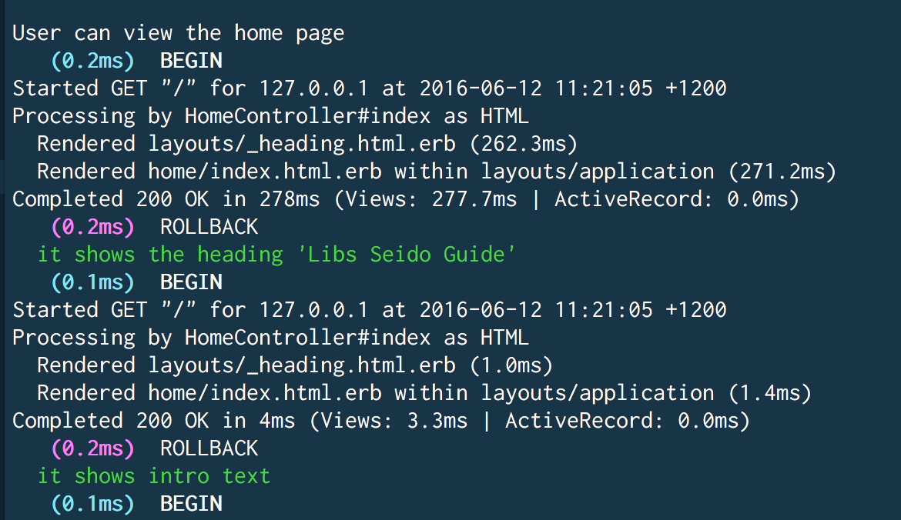
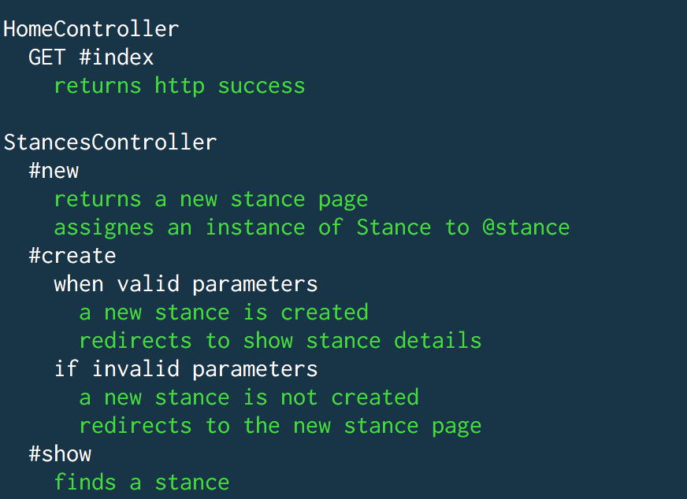

# Rails on Heroku

to add - how to set up rails app on Heroku


Rename heroku app via cli:
```bash
heroku rename <name-here>
```
this takes care of dealing with the git remotes, whereas if you renamed in the heroku dashboard you would then have to reset the git remotes yourself.

#### Database stuff being logged when running RSpec

When having added an app to Heroku using Puma, whenever I ran `rspec spec` on local terminal I would get db stuff being logged out:


A quick google search "how to get rid of db log in rspec" told me that it was most likely to do with the `rails_12factor` gem. You add this when you are getting your app up and running with Puma.
Suggested solution was to move this gem into a production group in the gemfile.
```ruby
group :production do
  gem 'rails_12factor'
end
```
My spec output now looks like this:



SSH in - kind of

```
heroku run bash
```
['SSH' into your Heroku App](https://coderwall.com/p/szhuig/ssh-into-your-heroku-app)


Can't do `rake db:drop` on hekoru so have to do:
[Reset heroku postgres database](https://coderwall.com/p/qbmhog/reset-heroku-postgres-database)


## Deploying

manually push from console:
`git push heroku master`

Run migrations:

`heroku run rake db:migrate`


Run seed task:

`heroku run rake db:seed`


###Seido site:

Pushes to production continually deploy to Heroku.

Run migrations:

`heroku run rake db:migrate`

Get into console heroku run rails console

Delete all records e.g Stance.destroy_all

Run seed task:

`heroku run rake db:seed`

This app is using: rake db:seed:dump To dump all data to seed file

https://devcenter.heroku.com/articles/getting-started-with-rails4

https://devcenter.heroku.com/articles/getting-started-with-rails5
