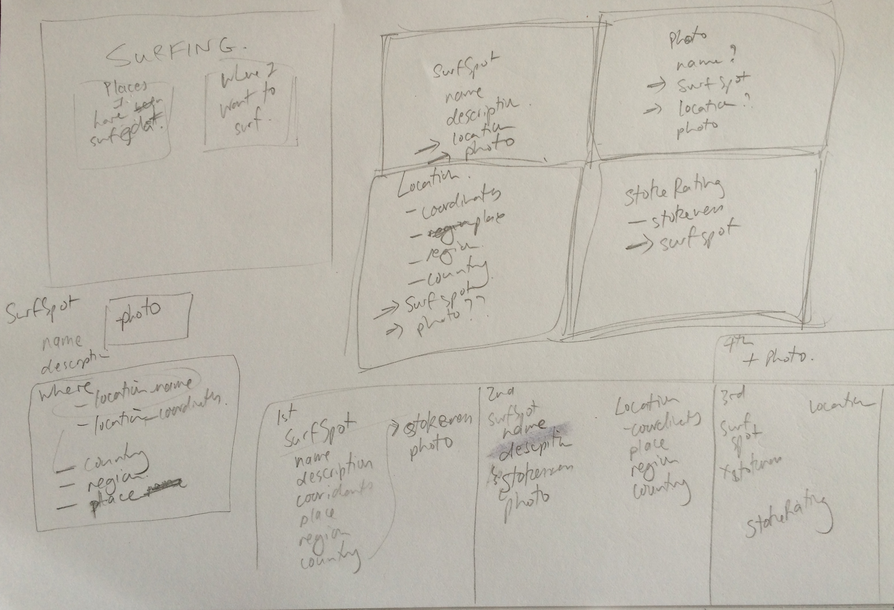
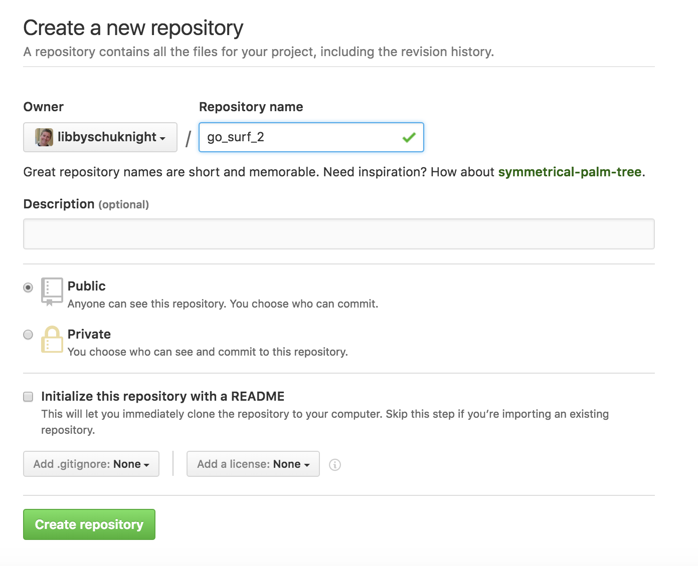
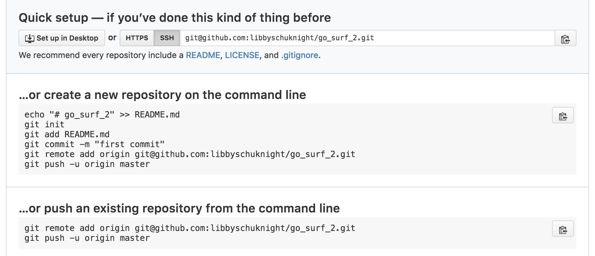
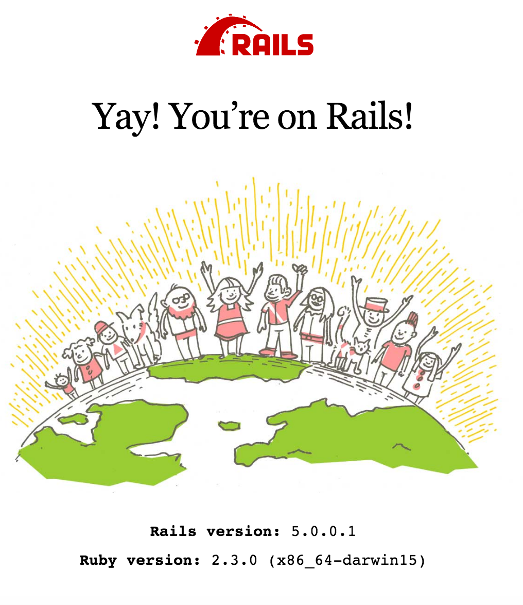

# Go Surf and Rails

### Aim - to create a Rails app and document what I do and why
---
## Part 1 - How to get started

This tutorial is using Rails 5 and Ruby 2.3.0

This is what I follow to set up a computer with Ruby, Rails and Git:
- [Setup Ruby On Rails on Mac OS X 10.11 El Capitan: A guide to setting up a Ruby on Rails development environment](https://gorails.com/setup/osx/10.11-el-capitan)
Note: as of 29 Aug 2016, it is still installing Rails 4.
It also has options for:
- [Windows 10](https://gorails.com/setup/windows/10)
- [Ubuntu](https://gorails.com/setup/ubuntu/16.04)

You may also find the RubyOnRails Guide useful:
- [Installing Rails - RubyOnRails Guides](http://guides.rubyonrails.org/getting_started.html#installing-rails)
- [In depth information on starting a Rails app](http://guides.rubyonrails.org/getting_started.html#creating-the-blog-application)
  - a lot of what I am doing (to start with) is similar to the guide, if you want to know more about how things work you will find the guide useful

### Step 1 - Plan
Make a rough plan of what you what to do.


This plan has a bit of sketch of what the home page might look like and then my thinking about what tables and fields I need.

My first iteration is going to be:
- Surf Spot
  - name
  - description
  - coordinates (latitude & longtitude)
  - place
  - region
  - country
  - stoke_rating
  - photo

I will make one model - `SurfSpot` with 8 fields/attributes.

### Step 2 - create a new Rails app

Create a new rails app:
```bash
rails new go_surf_5 --database=postgresql --skip-test-unit
```

`rails new <app_name>` creates the new app (you can choose a different name for your app if you want)

The other options:
- `--database=postgresql` make postgresql the dataebase used
- `--skip-test-unit` means that the default test framework is not installed

### Step 3 - set up as git repo

```bash
git init
git add -A
git commit -m "Initial commit message"
```

Create a repo with the same name as your app on Github.


Add the remote to you git repo.


Since you have done the three git commands above, just do these to finish setting up you git repo:
```bash
git remote add origin git@github.com:<git username>/<app_name>.git # replace username and app name

e.g.:   git remote add origin git@github.com:libbyschuknight/go_surf_5.git

git push -u origin master
```

### Step 4 - Install RSpec (testing framework)
(can skip if you don't care about testing!)
https://github.com/rspec/rspec-rails

Add the rspec-rails gem to your gemfile, under `development, test`:

```ruby
gem 'rspec-rails'
```
It should now look like this:
```ruby
group :development, :test do
  # Call 'byebug' anywhere in the code to stop execution and get a debugger console
  gem 'byebug', platform: :mri
  gem 'rspec-rails'  
end
```
(the byebug may already have been present, if not you don't need to add)


Run:
`bundle install`

Initialize spec/ dir:
`rails generate rspec:install`

Use rspec to run commands... `rspec` or `bundle exec rspec`

Everytime you add or change some code you should add, commit and push to GitHub:

```bash
git status  # shows what is to be added/committed
git add .   # add everything
git commit -m "message here"  # add a git commit message
git push origin <branch name> # push it all to github
```

### Step 4 - set up database/run server
Create database
`rake db:create`

Run server:
`rails s`

You will see this page:



You see this at the moment as no models have been created or migrations run and therefore no data is in the database to be able to show on the website.

### [Next - Part 2 - Creating models, views & controllers (MVC)](2_my_go_surf_project.md)
