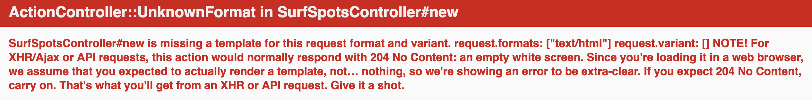

## Part 2 - Creating models, views & controllers (MVC)

### Step 1 - Create a resource

See [RAILS: GENERATE MODEL VS. RESOURCE VS. SCAFFOLD](http://www.korenlc.com/rails-generate-model-vs-resourse-vs-scaffold/) for a good explanation of the differences in the ways that you can create model, controllers and views.

```bash
rails generate resource SurfSpot
```

You can add on the fields if you want to, e.g.
```bash
rails generate resource SurfSpot name:string description:string coordinates:integer # etc
```

I'm going to add the fields/attributes in my migration file later.

Once you run:
```bash
rails generate resource SurfSpot
```
You will get an output something like this in your console:

```bash
Running via Spring preloader in process 22248
      invoke  active_record
      create    db/migrate/20160829075534_create_surf_spots.rb
      create    app/models/surf_spot.rb
      invoke    rspec
      create      spec/models/surf_spot_spec.rb
      invoke  controller
      create    app/controllers/surf_spots_controller.rb
      invoke    erb
      create      app/views/surf_spots
      invoke    rspec
      create      spec/controllers/surf_spots_controller_spec.rb
      invoke    helper
      create      app/helpers/surf_spots_helper.rb
      invoke      rspec
      create        spec/helpers/surf_spots_helper_spec.rb
      invoke    assets
      invoke      coffee
      create        app/assets/javascripts/surf_spots.coffee
      invoke      scss
      create        app/assets/stylesheets/surf_spots.scss
      invoke  resource_route
       route    resources :surf_spots
```

Using `resource` generates a lot of files, the ones we are interested in are migrations, models, controllers, routes and later on specs.

Migration
```ruby
class CreateSurfSpots < ActiveRecord::Migration
  def change
    create_table :surf_spots do |t|

      t.timestamps null: false
    end
  end
end
```
Model
```ruby
class SurfSpot < ApplicationRecord
end
```
Controller
```ruby
class SurfSpotsController < ApplicationController
end
```
Routes
```ruby
Rails.application.routes.draw do
  resources :surf_spots
  # For details on the DSL available within this file, see http://guides.rubyonrails.org/routing.html
end
```

### Step 2 - add to & run the migration

[Active Record Migrations](http://guides.rubyonrails.org/active_record_migrations.html)

If you load you server again:
`rails server` or `rails s`
you will get an error about migrations:
`ActiveRecord::PendingMigrationError`.

The attributes for the model (or columns for the database) need to be added to the migration file.

```ruby
class CreateSurfSpots < ActiveRecord::Migration
  def change
    create_table :surf_spots do |t|
      t.string  :name
      t.string  :description
      t.string  :place
      t.string  :region
      t.string  :country
      t.float   :latitude
      t.float   :longitude
      t.integer :stoke_rating

      t.timestamps null: false
    end
  end
end
```
I have added latitude and longitude for the coordinates and will add photos later using Paperclip.

Now run your migration:
`rake db:migrate`

Console output:
```bash
== 20160812220455 CreateSurfSpots: migrating ==================================
-- create_table(:surf_spots)
   -> 0.0428s
== 20160812220455 CreateSurfSpots: migrated (0.0428s) =========================
```
Even though you have run your migrations, your server will run but you will still see the "Welcome aboard" page. There is still some work to do.


### Step 3 - Updating Routes / Views
Set the root route for you app.
Run `rake routes` in your console

```bash
Prefix Verb     URI Pattern                           Controller#Action
surf_spots      GET    /surf_spots(.:format)          surf_spots#index
                POST   /surf_spots(.:format)          surf_spots#create
new_surf_spot   GET    /surf_spots/new(.:format)      surf_spots#new
edit_surf_spot  GET    /surf_spots/:id/edit(.:format) surf_spots#edit
surf_spot       GET    /surf_spots/:id(.:format)      surf_spots#show
                PATCH  /surf_spots/:id(.:format)      surf_spots#update
                PUT    /surf_spots/:id(.:format)      surf_spots#update
                DELETE /surf_spots/:id(.:format)      surf_spots#destroy
```
We want to set our root route to `surf_spots`

Add to your routes.rb file:
```ruby
root "surf_spots#index"
```

So it now looks like this:
```ruby
Rails.application.routes.draw do
  root "surf_spots#index"

  resources :surf_spots
  # For details on the DSL available within this file, see http://guides.rubyonrails.org/routing.html
end
```

Now run your sever:
`rails server`

You should see this:


We now need to add the `index` action to our  `SurfSportController`, but first we are going to add the `new`action so we can data into our database.


### Step 4 - add action to controller

New action

```ruby
def new
  @surf_spot = SurfSpot.new
end
```
Visit [http://localhost:3000/surf_spots/new](http://localhost:3000/surf_spots/new)

You should see this on the web page:


Now add a view.

### Step 5 - add a view (template)

Go to `app/view/surf_spots` folder and add a new file and name it:
```
new.html.erb
```

Now, you will see a blank page. Time to add html & erb.

### [Next](/3_my_go_surf_project.md)
