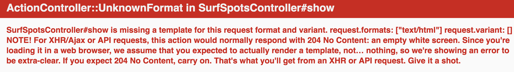

## Part 3 - Adding the view with HTML & ERB

### Step 1 - Add heading for adding a Surf Spot

```html
<h1>Add a New Surf Spot</h1>
```
Go to [http://localhost:3000/surf_spots/new](http://localhost:3000/surf_spots/new) and you will see the heading.

### Step 2 - add a form
We now want to add html so we can add a surf spot.

```html
<h1>New Surf Spot</h1>

<%= form_for :surf_spot, url: surf_spots_path do |f| %>
  <p>
    <%= f.label :name %><br>
    <%= f.text_field :name %>
  </p>

  <p>
    <%= f.label :description %><br>
    <%= f.text_area :description %>
  </p>

  <p>
    <%= f.label :place %><br>
    <%= f.text_field :place %>
  </p>

  <p>
    <%= f.label :region %><br>
    <%= f.text_field :region %>
  </p>

  <p>
    <%= f.label :country %><br>
    <%= f.text_field :country %>
  </p>

  <p>
    <%= f.label :latitude %><br>
    <%= f.number_field :latitude %>
  </p>

  <p>
    <%= f.label :longitude %><br>
    <%= f.number_field :longitude %>
  </p>

  <p>
    <%= f.label :stoke_rating %><br>
    <%= f.number_field :stoke_rating %>
  </p>

  <p>
    <%= f.submit %>
  </p>
<% end %>
```

You should see this now:


Add a surf spot:
```
Lyall Bay
Surf is great when it is on. The Airport End is where I surf the most and has a break of the wall. Other parts of the beach can be good at times.
Southerly swell, northerly wind.
Wellington
Wellington
New Zealand
-41.328778
174.803901
5
```

### Oh no! It doesn't except decimals (well, mine didn't)

I was getting an HTML5 validation error on the form as the number input did not want to accept decimals.
[HTML5 input type=number and decimals/floats in Chrome](https://www.isotoma.com/blog/2012/03/02/html5-input-typenumber-and-decimalsfloats-in-chrome/)

You can fix this by adding `step="any" to the html.
Add this to the number_field:
```ruby
step: :any

e.g.
<%= f.number_field :latitude, step: :any %>
```

Now, enter all the data and click `Save Surf spot`. We need to add another controller acton!


### Step 3 - Add the create action

```ruby
def create
  @surf_spot = SurfSpot.new(surf_spot_params)

  @surf_spot.save
  redirect_to @surf_spot
end
```

You will need to also add the method `surf_spot_params` to your controller.
```ruby
def surf_spot_params
  params.require(:surf_spot).permit(
    :name,
    :description,
    :place,
    :region,
    :country,
    :latitude,
    :longtitude,
    :stoke_rating
  )
end
```

This has to do with Rails `strong_params` see:
- [5.6 Saving data in the controller](http://guides.rubyonrails.org/getting_started.html#saving-data-in-the-controller)
- [Strong parameters: Dealing with mass assignment in the controller instead of the model](http://weblog.rubyonrails.org/2012/3/21/strong-parameters/)

Click save again or refresh the page and you should see:


### Step 4 - Add the show action and view

```ruby
def show
  @surf_spot = SurfSpot.find(params[:id])
end
```
Refresh your page and you will get a missing template message.


Create a new file under `app/view/surf_spots` called `show.html.erb`.

If you refresh your page now you will get an empty page as there is no html in the show page yet.

Add html to view the surf spot you have just created.

```html
<h1>
  <strong>Surf Spot</strong>
  <%= @surf_spot.name %>
</h1>

<p>
  <strong>Description:</strong>
  <%= @surf_spot.description %>
</p>

<p>
  <strong>Place</strong>
  <%= @surf_spot.place %>
</p>

<p>
  <strong>Region:</strong>
  <%= @surf_spot.region %>
</p>

<p>
  <strong>Country</strong>
  <%= @surf_spot.country %>
</p>

<p>
  <strong>Latitude:</strong>
  <%= @surf_spot.latitude %>
</p>

<p>
  <strong>Longtitude</strong>
  <%= @surf_spot.longitude %>
</p>

<p>
  <strong>Rating:</strong>
  <%= @surf_spot.stoke_rating %>
</p>
```

Refresh the page.

Now that you can create a new surf spot and see the one you have created, we want to be able to view all the surf spots that we have made.

### [Next](/4_my_go_surf_project.md)

#### Another surf spot

Surf Spot: Uretiti Beach

Description: This beach is in Bream Bay. Discovered while camping at the DOC campsite. Pretty cool surf beach for beginners, kind of where I first got into it. Oh and in summer it is nice and warm!!

Place: Bream Bay

Region: Northland

Country: New Zealand

Latitude: -35.93478

Longtitude: 174.457716

Rating: 4

### [Next](4_my_go_surf_project.md)
