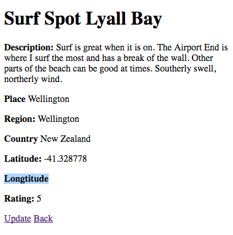

## Fixing an Problem

I was looking at one of the surf spots and noticed that there was no number for `Longtitude`. So I went about updating it.
And there was still no number showing!



So, I went to look at what was in the server (go to the terminal window that is running the server). I was looking for where the update of the surf spot was.
You can see below that is has `SurfSpotsController#update`.
And the `parameters` show all the data that gets passed through to the controller.
`longitude` is there! Yay!
But further down is has `Unpermitted parameter: longitude`, what?

```bash
Started PATCH "/surf_spots/3" for ::1 at 2016-09-10 10:02:31 +1200
Processing by SurfSpotsController#update as HTML
  Parameters: {"utf8"=>"✓", "authenticity_token"=>"4f/jwbJ8j3aDDt58gM+GCuTuRwPvaKe44RUiyZRRA1SjKAPpGqpVbt69BXenrok7FI9aFm1XGH0YkXcjP9+JEA==", "surf_spot"=>{"name"=>"Ngaranui Beach", "description"=>"The long flat sandy bottomed beach offers nice surfing options for beginners to expert surfers. All year long, the beach  provides the perfect environment for our beginners to intermediate lessons. It is Raglans’ main swimming beach, patrolled by lifeguards with surfing allowed all down the beach on either side of the safety flags. This the best options for most surfers with limited experience.", "place"=>"Raglan", "region"=>"Waikato", "country"=>"New Zealand", "latitude"=>"-37.818463", "longitude"=>"174.828386", "stoke_rating"=>"7"}, "commit"=>"Save Surf spot", "id"=>"3"}
  SurfSpot Load (0.3ms)  SELECT  "surf_spots".* FROM "surf_spots" WHERE "surf_spots"."id" = $1 LIMIT $2  [["id", 3], ["LIMIT", 1]]
Unpermitted parameter: longitude
   (6.0ms)  BEGIN
  SQL (26.9ms)  UPDATE "surf_spots" SET "latitude" = $1, "updated_at" = $2 WHERE "surf_spots"."id" = $3  [["latitude", -37.818463], ["updated_at", 2016-09-09 22:02:31 UTC], ["id", 3]]
   (83.3ms)  COMMIT
Redirected to http://localhost:3000/surf_spots/3
Completed 302 Found in 124ms (ActiveRecord: 116.5ms)
```

So, I went to look at the `SurfSpotsController` and the method `surf_spot_params`.

```ruby
def surf_spot_params
  params.require(:surf_spot).permit(
    :name,
    :description,
    :place,
    :region,
    :country,
    :latitude,
    :longtitude,
    :stoke_rating
  )
end
```
It's there! Oh no hang on, it is not.
This method has `longtitude` and everywhere else I have `longitude` (everywhere else being migration, schema and views).

So, by updating the `surf_spot_params` to have `longitude`, it will now save it!

Here is the server log after the correction:

```bash
Started PATCH "/surf_spots/3" for ::1 at 2016-09-10 10:22:42 +1200
Processing by SurfSpotsController#update as HTML
  Parameters: {"utf8"=>"✓", "authenticity_token"=>"lrwBEGMfEcHu1Hktc6eV3ClAoPmF6NrRkEbzCVkTeKnUa+E4y8nL2bNnoiZUxprt2SG97AfXZRRpwqbj8p3y7Q==", "surf_spot"=>{"name"=>"Ngaranui Beach", "description"=>"The long flat sandy bottomed beach offers nice surfing options for beginners to expert surfers. All year long, the beach  provides the perfect environment for our beginners to intermediate lessons. It is Raglans’ main swimming beach, patrolled by lifeguards with surfing allowed all down the beach on either side of the safety flags. This the best options for most surfers with limited experience.", "place"=>"Raglan", "region"=>"Waikato", "country"=>"New Zealand", "latitude"=>"-37.818446", "longitude"=>"174.828330", "stoke_rating"=>"7"}, "commit"=>"Save Surf spot", "id"=>"3"}
  SurfSpot Load (0.2ms)  SELECT  "surf_spots".* FROM "surf_spots" WHERE "surf_spots"."id" = $1 LIMIT $2  [["id", 3], ["LIMIT", 1]]
   (0.1ms)  BEGIN
  SQL (0.4ms)  UPDATE "surf_spots" SET "latitude" = $1, "longitude" = $2, "updated_at" = $3 WHERE "surf_spots"."id" = $4  [["latitude", -37.818446], ["longitude", 174.82833], ["updated_at", 2016-09-09 22:22:42 UTC], ["id", 3]]
   (0.8ms)  COMMIT
Redirected to http://localhost:3000/surf_spots/3
Completed 302 Found in 6ms (ActiveRecord: 1.4ms)
```
You can see that `longitude` has been passed through and updated - `["longitude", 174.82833]`.

If you have made the same mistake, go forth and up date the surf spots you have added.

```
Ngaranui Beach
Latitude: -37.818446
Longtitude 174.82833

Lyall Bay
Latitude: -41.328796
Longtitude 174.803866

Uretiti Beach
Latitude: -35.934883
Longtitude 174.462012
```

### [Next](6_my_go_surf_project.md)
