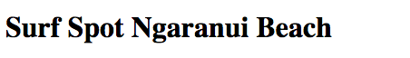

## Part 5 - Deleting a record

### Delete a record
The last part to the actions is being able to delete a record.

Add this to your controller:

```ruby
def destroy
  @surf_spot = SurfSpot.find(params[:id])
  @surf_spot.destroy

  redirect_to surf_spots_path
end
```

Now add a "Delete" link on your index page:

```
  <%= link_to "Delete", surf_spot_path(surf_spot), method: :delete, data: { confirm: "You really want to delete this surf spot??" } %>
```

How the link is done is different to the others, have a look here http://guides.rubyonrails.org/getting_started.html#deleting-articles for more information.

You should now people able to delete a surf spot and you will get a pop up window asking you if you really want to delete it.


### SurfSpotController - should now look like this

```ruby
class SurfSpotsController < ApplicationController

  def index
    @surf_spots = SurfSpot.all
  end

  def show
    @surf_spot = SurfSpot.find(params[:id])
  end

  def new
    @surf_spot = SurfSpot.new
  end

  def edit
    @surf_spot = SurfSpot.find(params[:id])
  end

  def create
    @surf_spot = SurfSpot.new(surf_spot_params)

    @surf_spot.save
    redirect_to @surf_spot
  end

  def update
    @surf_spot = SurfSpot.find(params[:id])

    if @surf_spot.update(surf_spot_params)
      redirect_to @surf_spot
    else
      render 'edit'
    end
  end

  def destroy
    @surf_spot = SurfSpot.find(params[:id])
    @surf_spot.destroy

    redirect_to surf_spots_path
  end

  def surf_spot_params
    params.require(:surf_spot).permit(
      :name,
      :description,
      :place,
      :region,
      :country,
      :latitude,
      :longitude,
      :stoke_rating
    )
  end

end
```

### Tidy up Show view
The next part is going to be having a crack at getting your site hosted on Heroku, but I want to tidy up one thing first.

In the `show`views at the top there is this:



I don't like it on one line like that. Go to the show view `app/views/surf_spots/show.html.erb`. I am going to take out this line:
`<strong>Surf Spot:</strong>` so that the heading is now this:

```
<h1>
  <%= @surf_spot.name %>
</h1>
```


### [Next](7_my_go_surf_project.md)
