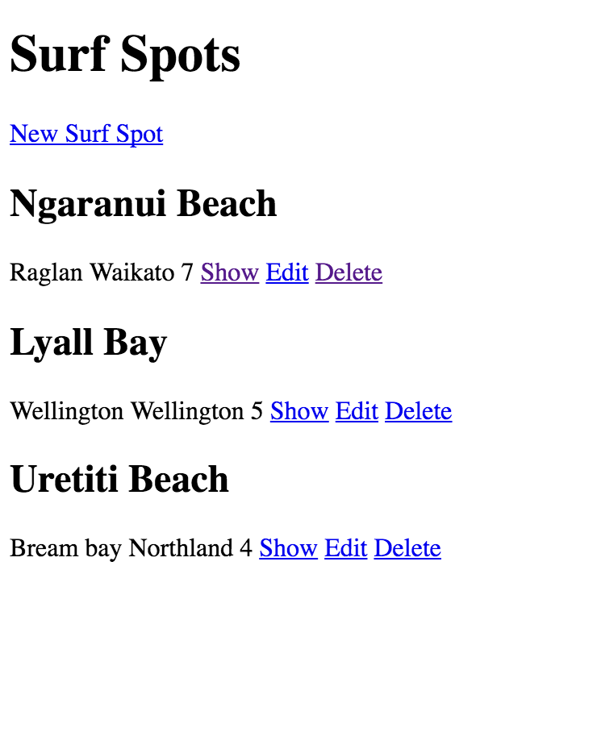

## Part 5 - Getting site set up on Heroku

This is what I am using: https://devcenter.heroku.com/articles/getting-started-with-rails5

Heroku is:
>Heroku is a cloud platform that lets companies build, deliver, monitor and scale apps — we're the fastest way to go from idea to URL, bypassing all those infrastructure headaches.

And you can have a [free account](https://signup.heroku.com/?c=70130000001x9jFAAQ)!

- Local workstation setup
- Write your app
  - this is a Rails 5 app (you can double check by doing `rails -v` in the console)
  - you should be in the root directory - `/go_surf`
- Database - this has already been set up and it is using `postgres` and the config file is correct
- Welcome page - we did this right at the start
- Heroku gems - this is a new app, so we are all good
- Specify Ruby version in app - you will want to do this, you will need to push changes to github
- Store your app in Git - we have git set up
- Deploy your application to Heroku
- Migrate your database
- Visit your application
  Here you should see your home page, with no surf spots as we haven't added those to our heroku db

#### Git Branches
Now that I have the basic app set up I am going to aim to create new branches in git for anything new I add.
This will be useful to play around with different things and also will mean that the master branch can stay "clean".
Which means that if I make a big mistake in a branch, I still have a nice clean, up to date, working branch and it will also make it nicer and easier to deploy.

### Adding Seed Dump gem
As this is going to be an app I am playing around with a lot, I don't want to have to keep entering data into the datebase.

There is this gem [`seed_dump`](https://rubygems.org/gems/seed_dump/versions/3.2.4), that:
>Dump (parts) of your database to db/seeds.rb to get a headstart creating a meaningful seeds.rb file

Add this to your gemfile - `gem 'seed_dump', '~> 3.2', '>= 3.2.4'`
Run `bundle install`
And as long as you have some data in your database, run:
`rake db:seed:dump`

Now you should have a `seed.rb` file in `../db`

If you add, commit and push this to your master branch and then push to heroku, you can then run `rake db:seed` in the Heroku console and seed data in your production database.

Run the migrations again:
`heroku run rake db:migrate`

Go to your site if you haven't got it open
`heroku open`

You should see something like this:

Run the seeds command:
`heroku run rake db:seed`

Refresh the web page, should see something like this now:

