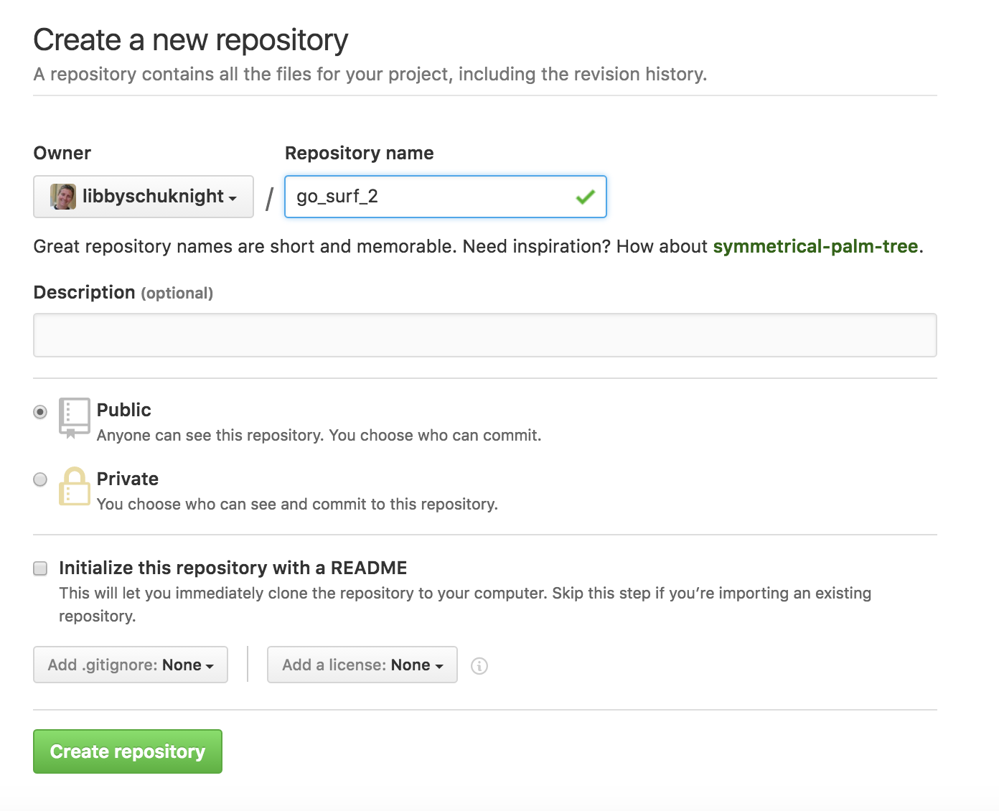
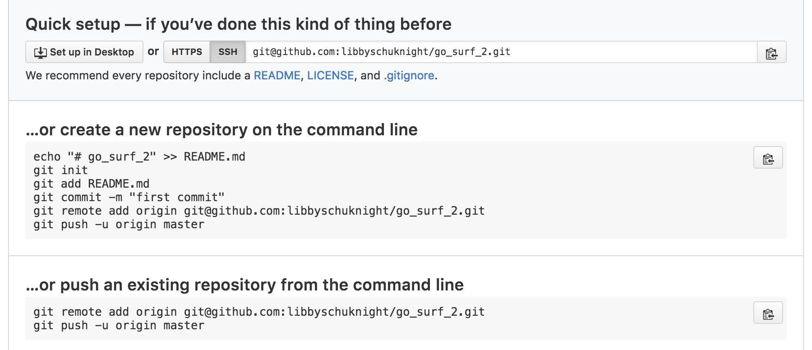

# Go Surf and Rails

### Aim - to create a Rails app and document what I do and why

## Step 1 - Plan
Make a rough plan of what you what to do.


This plan has a bit of sketch of what start of home page and then my thinking what tables and fields I need.

My first iteration is going to be:
- Surf Spot
  - name
  - description
  - coordinates
  - place
  - region
  - country
  - stoke_rating
  - photo

I will make one model - `SurfSpot` with 8 fields/attributes.

## Step 2 - create a new Rails app

Create a new rails app:
```bash
rails new go_surf_2 --database=postgresql --skip-test-unit --skip-turbolinks
```

`rails new <app_name>` creates the new app

The other options:
- `--database=postgresql` make postgresql the dataebase used
- `--skip-test-unit` means that the default test framework is not installed
- `--skip-turbolinks` doesn't install Turbolinks

## Step 3 - set up git repo

```bash
git init
git add -A
git commit -m "initial commit message"
```

Create a repo with the same name as your app on Github.


Add the remote to you git repo.


Since you have done the three git commands above, just do these to finish setting up you git repo:
```bash
git remote add origin git@github.com:libbyschuknight/go_surf_2.git
git push -u origin master
```

## Step 4 - Install RSpec (testing framework)
(can skip if you don't care about testing!)
https://github.com/rspec/rspec-rails

Add the rspec-rails gem to your gem file:

```ruby
  group :development, :test do
    gem 'rspec-rails'
  end
```
Run:
`bundle install`

Initialize spec/ dir...
`rails generate rspec:install`

Use rspec to run commands... `rspec` or `bundle exec rspec`


Everytime you add or change some code you should add, commit and push to GitHub:

```bash
git status  # shows what is to be added/committed
git add .   # add everything
git commit -m "message here"  # add a git commit message
git push origin <branch name> # push it all to github
```

## Step 4 - set up database
