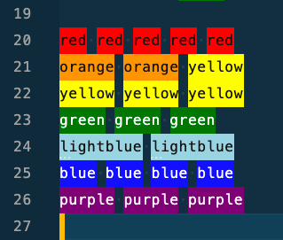

# Rainbow Colours

```colours
red red red red red
orange orange yellow
yellow yellow yellow
green green green
lightblue lightblue
blue blue blue blue
purple purple purple
```

The above works with this <https://marketplace.visualstudio.com/items?itemName=naumovs.color-highlight> plugin in vscode, it looks like this:


