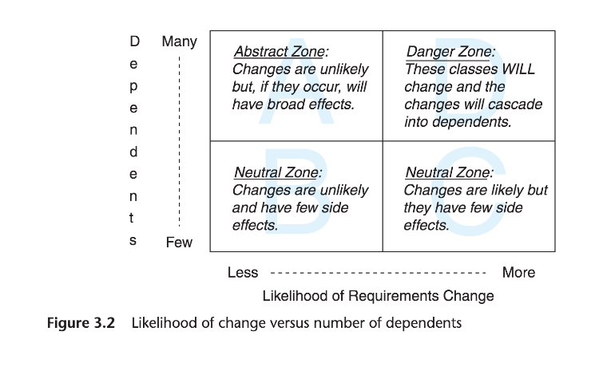

# Chapter 3 Managing Dependencies
Page 35

>Objects reflect qualities of a real-world problem and the interactions between those objects provide solutions.
>A single object cannot know everything, so inevitably it will have to talk to another object.

Desired behaviour - an object either
- knows it personally - chapter 2 - single responsibility
- inherits it - chapter 6
- Knows another object that knows it - chapter 3 - managing dependencies

This chapter - getting access to behaviour when that behaviour is implemented in other objects.

>Well designed objects have a single responsibility, their very nature requires that they collaborate to accomplish complex tasks.
>To collaborate, an object must know something about others. Knowing creates a dependency. If not managed careful, these dependencies will strangle your application.


### Understanding Dependencies
Page 36

>An object depends on another object if, when one object changes, the other might be forced to change in turn.

```ruby

############## Page 36 ##############
class Gear
  attr_reader :chainring, :cog, :rim, :tire
  def initialize(chainring, cog, rim, tire)
    @chainring = chainring
    @cog       = cog
    @rim       = rim
    @tire      = tire
  end

  def gear_inches
    ratio * Wheel.new(rim, tire).diameter
  end

  def ratio
    chainring / cog.to_f
  end
# ...
end

class Wheel
  attr_reader :rim, :tire
  def initialize(rim, tire)
    @rim       = rim
    @tire      = tire
  end

  def diameter
    rim + (tire * 2)
  end
# ...
end

Gear.new(52, 11, 26, 1.5).gear_inches
```

>Gear has at least four dependencies on Wheel.

#### Recognising dependencies
Page 37

>An object has a dependency when it knows:

- the name of another class. `Gear` expects a class named `Wheel` to exist.
- The name of a message that it intends to send to someone other than `self`. `Gear` expects a `Wheel` instance to respond to `diameter`.
- The arguments that a message requires. `Gear` knows that `Wheel.new` requires a `rim` and a `tire`.
- The order of those arguments. `Gear` knows the first argument to `Wheel.new` should be `rim`, the second `tire`.

> Most of these dependencies are unnecessary and make the code less reasonable.
These dependencies will probably force changes to the code throughout the application.

>Your design challenge is to manage dependencies so that each class has the fewest possible; a class should know just enough to do its job and not one thing more.

#### Coupling between objects (CBO)
`Gear` and `Wheel` are coupled. Are dependent on each other.
>The more `Gear` knows about `Wheel`, the more tightly coupled they are. The more they behave like a single entity.

#### Other dependencies
Page 38

A few other common dependencies:
Message chaining - creates a dependency between the original object and every object and message along the way to its ultimate target. This is a Law of Demeter violation, covered in chapter 4.

Test dependent on code - new programmers tend to write tests that are tightly coupled to code. Design of tests is covered in chapter 9.

>As long as you recognise dependencies, avoidance is quite simple.


### Writing Loosely Coupled Code
Page 39

>Reducing dependencies means recognising and removing the ones (dots - glue) that you don't need.

#### Inject dependencies
>Referring to another class by its name creates a major sticky spot.

>The code above exposes an unjustified attachment to static types. It is not the class of the object thats important, it's the message you plan to send to it.

>`Gear` does not care and should not know about the class of the object. It is not necessary for `Gear` to know about the existence of the `Wheel` class in order to calculate `gear_inches`. ... it just needs an object that responds to diameter.

`Gear` know expects to be initialised with an object that can respond to `diameter`

```ruby
############## Page 41 ##############
class Gear
  attr_reader :chainring, :cog, :wheel
  def initialize(chainring, cog, wheel)
    @chainring = chainring
    @cog       = cog
    @wheel     = wheel
  end

  def gear_inches
    ratio * wheel.diameter
  end
# ...
end

# Gear expects a 'Duck' that knows 'diameter'
Gear.new(52, 11, Wheel.new(26, 1.5)).gear_inches
```

>Moving the creation of the new `Wheel` instance outside of `Gear` decouples the two classes. `Gear` can now collaborate with any object that implements `diameter`.

>This technique is known as dependency injection.
>`Gear` is smarter because it knows less.

>Using dependency injection to shape code relies on your ability to recognise that the responsibility for knowing the name of a class and the responsibility for knowing the name of a message to send to that class may belong in different objects. Just because `Gear` needs to send `diameter` somewhere does not mean that `Gear` should know about `Wheel`.


#### Isolate dependencies
Page 42

>If prevented from achieving perfection, your goals should switch to improving the overall situation by leaving the code better than you found it.

>Think of every dependency as an alien bacterium that's trying to infect your class.
>...quarantine each dependency.

**Isolate instance creation**

>If you can't inject `Wheel`, you should isolate the creation of `Wheel` inside of `Gear`.
>The intent is to explicitly expose the dependency while reducing its reach into your class.

First, move new instance of `Wheel` into `Gear`'s initialisation method.
>Notice that this technique unconditionally creates a new `Wheel` each time a new `Gear` is created.

```ruby
############## Page 43 ##############
class Gear
  attr_reader :chainring, :cog, :rim, :tire, :wheel
  def initialize(chainring, cog, rim, tire)
    @chainring = chainring
    @cog       = cog
    @wheel     = Wheel.new(rim, tire)
  end

  def gear_inches
    ratio * wheel.diameter
  end
# ...
```

Another way is to isolate the creation of a new `Wheel` in its own explicitly defined `Wheel` method.
>This new method lazily creates a new instance of `Wheel`, using Ruby's `||=` operator.
The creation of a new wheel is deferred until `gear_inches` invokes the new `wheel` method.

```ruby
############## Page 43 ##############
class Gear
  attr_reader :chainring, :cog, :rim, :tire, :wheel
  def initialize(chainring, cog, rim, tire)
    @chainring = chainring
    @cog       = cog
    @rim       = rim
    @tire      = tire
  end

  def gear_inches
    ratio * wheel.diameter
  end

  def wheel
    @wheel ||= Wheel.new(rim, tire)
  end
# ...
```

In both examples, `Gear` stills knows too much, it is stuck to `Wheel`, but an improvement has been made.
The code style reduces the number of dependencies in `gear_inches` and exposes `Gear`'s dependency on `Wheel`.

>The way you manage dependencies on external class names has profound effects on your application. If you are mindful of dependencies and develop a habit of routinely injecting them, your classes will naturally be loosely coupled.


**Isolate vulnerable external messages**
Page 44

external message - a message that is "sent to someone other than `self`"
>eg the `gear_inches` method below sends `ratio` and `wheel` to `self`, but send `diameter` to `wheel`

```ruby
############## Page 44 ##############
def gear_inches
  ratio * wheel.diameter  # self.ratio, self.wheel, self.wheel.diameter
end
```

If `gear_inches` was a more complex method,

```ruby
############## Page 44 ##############
def gear_inches
  #... a few lines of scary math
  foo = some_intermediate_result * wheel.diameter
  #... more lines of scary math
end
```

>Now `wheel.diameter` is embedded deeply inside a complex method.
>Embedding this external dependency inside `gear_inches` method is unnecessary and increases its vulnerability.

>You can reduce your change of being forced to make a change to `gear_inches` by removing the external dependency and encapsulating it in a method of it own.

```ruby
############## Page 45 ##############
def gear_inches
  #... a few lines of scary math
  foo = some_intermediate_result * diameter
  #... more lines of scary math
end

def diameter
  wheel.diameter
end
```

>...method is created preemptively to remove the dependency from `gear_inches`
>After this change, `gear_inches` is more abstract. `Gear` now isolates `wheel.diameter` in a separate method and `gear_inches` can depend on a message sent to `self.`

#### Remove argument-order dependencies
Page 46

(possibly not so much of an issue now with keyword arguments? [Ruby 2 Keyword Arguments](https://robots.thoughtbot.com/ruby-2-keyword-arguments), [Keyword arguments in Ruby 2.0
](http://brainspec.com/blog/2012/10/08/keyword-arguments-ruby-2-0/))

>Many method signatures not only require arguments, but they also require that those arguments be passed in a specific, fixed order.

`Gear` takes 3 args, must be passed and must be passed in that order.

```ruby
############## Page 46 ##############
class Gear
  attr_reader :chainring, :cog, :wheel
  def initialize(chainring, cog, wheel)
    @chainring = chainring
    @cog       = cog
    @wheel     = wheel
  end
  ...
end

Gear.new(
  52,
  11,
  Wheel.new(26, 1.5)).gear_inches
```

>If the order changes, all the senders will be forced to change.

**User hashes for initialisation arguments**
Change code to take a hash of options

```ruby
class Gear
  attr_reader :chainring, :cog, :wheel
  def initialize(args)
    @chainring = args[:chainring]
    @cog       = args[:cog]
    @wheel     = args[:wheel]
  end
  ...
end

Gear.new(
  :chainring => 52,
  :cog       => 11,
  :wheel     => Wheel.new(26, 1.5)).gear_inches
```

>...it removes dependency on argument order.
>adds verbosity
>The key names in hash furnish explicit documentation about the arguments.

**Explicitly define defaults**
Page 48
>A method that requires a few very stable arguments and optionally permits a number of less stable ones.

>Simple non-boolean defaults using `||`

```ruby
############## Page 48 ##############
  # specifying defaults using ||
  def initialize(args)
    @chainring = args[:chainring] || 40
    @cog       = args[:cog]       || 18
    @wheel     = args[:wheel]
  end
```

>common technique but one you should use with caution, there are situations in which it might not do what you want.

Example sets `@chainring` default to `40`

```ruby
############## Page 49 ##############
  # specifying defaults using fetch
  def initialize(args)
    @chainring = args.fetch(:chainring, 40)
    @cog       = args.fetch(:cog, 18)
    @wheel     = args[:wheel]
  end
```

>...means that callers can actually cause `@chainring` to get set to `false or nil`, something that is not possible when using `||`.

>The `defaults` method below defines a second hash that is merged into the options hash during initialisation. In this case, merge has the same effect as fetch; the defaults will get merged only if their keys are on in the hash.

```ruby
############## Page 49 ##############
  # specifying defaults by merging a defaults hash
  def initialize(args)
    args = defaults.merge(args)
    @chainring = args[:chainring]
#   ...
  end

  def defaults
    {:chainring => 40, :cog => 18}
  end
```

>If your defaults are more than simple numbers of or strings, implement a `defaults` method.

**Isolate multi parameter initialisation**
Page 50

>Examples so far have been for situations where you control the signature of the method that needs to change.
>...sometimes you will be forced to depend on a methods that requires fixed-order arguments where you do not own and thus cannot control the method itself.

>Just as you would DRY out repetitive code inside of a class, DRY out the creation of new `Gear` instances by creating a single method to wrap the external interface. The classes in your application should depend on the code that you won; use a wrapping method to isolate external dependencies.

>The `GearWrapper` module was created to avoid having multiple dependencies on the order of those arguments. `GearWrapper` isolates all knowledge of the external interface in one place, and equally importantly. it provides an improved interface for you application.

```ruby
############## Page 50 ##############
# When Gear is part of an external interface
module SomeFramework
  class Gear
    attr_reader :chainring, :cog, :wheel
    def initialize(chainring, cog, wheel)
      @chainring = chainring
      @cog       = cog
      @wheel     = wheel
    end
  # ...
  end
end

# wrap the interface to protect yourself from changes
module GearWrapper
  def self.gear(args)
    SomeFramework::Gear.new(args[:chainring],
                            args[:cog],
                            args[:wheel])
  end
end

# Now you can create a new Gear using an arguments hash.
GearWrapper.gear(
  :chainring => 52,
  :cog       => 11,
  :wheel     => Wheel.new(26, 1.5)).gear_inches
```

`GearWrapper`
- it is a Ruby module, responsible for creating new instances of `SomeFramework::Gear`, "it is meant to directly respond to the `gear` message"
- "its sole purpose is to create instances of some other class" => it is a factory


### Managing dependency direction
Page 51

>Dependencies always have a direction.

#### Reversing dependencies

>Every example used this fur shows `Gear` depending on `Wheel` or `diameter`, but the code could easily have been written with the direction of the dependencies reversed. `Wheel` could instead depend on `Gear` or `ratio`.


```ruby
############## Page 52 ##############
class Gear
  attr_reader :chainring, :cog
  def initialize(chainring, cog)
    @chainring = chainring
    @cog       = cog
  end

  def gear_inches(diameter)
    ratio * diameter
  end

  def ratio
    chainring / cog.to_f
  end
#  ...
end

class Wheel
  attr_reader :rim, :tire, :gear
  def initialize(rim, tire, chainring, cog)
    @rim       = rim
    @tire      = tire
    @gear      = Gear.new(chainring, cog)
  end

  def diameter
    rim + (tire * 2)
  end

  def gear_inches
    gear.gear_inches(diameter)
  end
#  ...
end

Wheel.new(26, 1.5, 52, 11).gear_inches
```

>This reversal of dependencies does no apparent harm.
>The choices you make about the direction of dependencies have far reaching consequences that manifest themselves for the life of your application.

#### Choosing dependency direction
Page 53

>...how to behave you would tell them *to depend on things that changes less often than you do*.

>...based on three simple truths about code:
>- some classes are more likely to change than others to have changes in requirements.
>- concrete classes are more likely to change than abstract classes.
>- changing a class that has many dependencies will result in widespread consequences.

**Understanding likelihood of change**

Ruby base classes change less often then your own classes.
Framework classes in general will be more stable than your code.
Every class can be ranked of change.
>This ranking is one key piece of information to consider when choosing the direction of dependencies.

**Recognising concretions and abstractions**

>The term *abstract* is used here...defines it, as "disassociated from any specific instance", and, as so many things in Ruby, represents an idea about code as opposed to a specific technical restriction.

>This concept was illustrated earlier in the chapter during the section on injecting dependencies. There, when `Gear` depended on `Wheel` and on `Wheel.new` and on `Wheel.new(rim, tire)`, it depended on extremely concrete code. After the code was altered to inject `Wheel` into `Gear`, `Gear` suddenly began to depend on something far more abstract, that is, the fact that it has access to an object that could respond to the `diameter` message.

>In Ruby, when you inject `Wheel` into `Gear` such that `Gear` then depends on a `Duck` who responds to `diameter`, you are, however casually, defining an interface. This interface is an abstraction of the idea that a certain category of things will have a diameter. The abstraction was harvested from a concrete class; the idea is no "disassociated from any specific instance."

>The wonderful things about abstractions is that they represent common, stable qualities. They are less likely to change than are the concrete classes from which they were extracted. Depending on an abstraction is always safer than depending on a concretion because by its very nature, the abstraction is more stable.

**Avoiding dependent-laden classes**

>A class that, if changed, will cause changes to ripple through the application, will be under enormous pressure to never change. Ever. Your application may be permanently handicapped by your reluctance to pay the price required to make a change to this class.

**Finding the dependencies that matter**
Page 55

>Classes vary in their likelihood of change, their level of abstraction, and their number of dependents.




>*Depend on tings that change less often than you do* is a heuristic that stands in for all the ideas in this section.
>...Following this simple rule of thumb at every opportunity will cause your application to evolve in a healthy design.

### Summary

>Dependency management is core to creating future-proof applications.
>Injecting dependencies creates loosely coupled objects that can be reused in novel ways.
>Isolating dependencies allow objects to quickly adapt to unexpected changes.
>Depending on abstraction decreases the likelihood of facing these changes.

>The key to managing dependencies is to control their direction. The road to maintenance nirvana is paved with classes that depend on things that change less often than they do.
