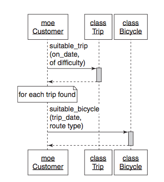

# Chapter 4 - Creating Flexible Interfaces
Page 59

>...but an object-oriented application is more than just classes. It is *made up of classes* but *defined* by messages. Classes control what's in your source code repository; messages reflect the living, animated application.
>Design, therefore, must be concerned with messages that pass between objects.
>The conversion between objects takes place using their interfaces.

## Understanding Interfaces


>In the first application, the messages have no apparent pattern. Every object may send any message to any other object. If the messages left visible trails, there trails would eventually draw a woven mat, with each object connected to every other.
>In the second application, the messages have a clearly defined pattern. Here the objects communicate in specific and well-defined ways. If these messages left rails, the trails would accumulate to create a set of islands with occasional bridges between them.

>The objects in the first application are difficult to reuse. Each one exposes too much of itself and knows too much about its neighbours. ... No object stands alone; to reuse any you need all, to change on thing you much change everything.

>The second application is composed of plug-able, component-like objects. Each reveals as little about itself, and knows as little about others, as possible.

>The roots of this new problem lie not in what each class does but with what it reveals. In the first application each class reveals all. Every method in any class is fair game to be invoked by any other object.

>In the second application, the message patterns are visibly constrained. This application has some agreement about which messages may pass between its objects. Each object has a clearly defined set of methods that it expects others to use. These exposed methods comprise the class's *public interface*.

>...first kind of interface, that is, methods within a class and how and what to expose to others.

## Defining Interfaces
Page 61

Restaurant kitchen example of a public interface

>Each of your classes is like a kitchen.
>The class exists to fulfil a single responsibility but implements many methods.
>Some of these methods represent the menu for your class and should be public; others deal with internal implementation details and are private.

### Public interfaces

>The methods that make up the pubic interface of your class comprise the face it presents to the world. They:
>- reveal its primary responsibility
>- are expected to be invoked by others
>- will not change on a whim
>- are safe for others to depend on
>- are thoroughly documented in the tests


### Private interfaces
>All other methods in the class are part of its private interface. They:
>- handle implementation details
>- are not expected to be sent by other objects
>- can change for any reason whatsoever
>- are unsafe for others to depend on
>- may not even be referenced in tests

### Responsibilities, Dependencies, and Interfaces

>single responsibility...There is a correspondence between the statements you might make about these more specific responsibilities and the classes' public methods. Indeed, public methods should read like a description of responsibilities. The public interface is a contract that articulates the responsibilities of your class.
>managing dependencies...Now that you are dividing every class into a public part and a private part, this idea of depending on less changeable things also applies to the methods within a class. The public parts of a class are stable parts; the private parts are the changeable parts. When you mark methods as public or private you tell users of your class upon which methods they may safely depend.

## Finding the Public Interface
Page 63

### An Example application: Bicycle touring company

### Constructing an intention

>You probably expect to have Customer, Trip, Route, Bike, Mechanic classes.
Classes spring to mind, represent nouns that have data and behaviour => domain objects
are obvious because are persistent, stand for big visible real world things

domain objects are easy to find but are not at the centre of design, they are a trap, can led you to coerce behaviour into them

>Design experts notice domain objects without concentrating on them; they focus not on these objects but on the messages that pass between them. These messages are guides that lead you to discover other objects, ones that are just as necessary but far less obvious.

>Before you sit at the keyboard and start typing you should form an intention about the objects and the messages needed to satisfy this use case.

### Using sequence diagrams

UML - unified modelling language


page 66
example sequence diagram - figure 4.3

to add

>...read as follows: `Customer Moe` sends the `suitable_trips` message to the `Trip` class, which is activated to process it and then, when finished, returns a response.

>... the design that it implies should give you pause.
Moe expects `Trip` to find him a trip and a bike.

>...the diagram exposes the message passing between the `Customer Moe` and the `Trip` class and prompts you to ask the question: "Should `Trip` be responsible for figuring out if an appropriate bicycle is available for each suitable trip?" or "Should this receiver be responsible for responding to this message?"

>...the conversation has changed; it is not revolving around messages. Instead of deciding on a class and then figuring out its responsibilities, you are now deciding on a message and figuring out where to send it.

**Message based design**

Changing the fundamental design question from "I know I need this class, what should I do?" => "I need to send this message, who should respond to it?"


>You don't send messages because you have objects, you have objects because you send messages.

reasonable for `Customer` to send the `suitable_trips` message, problem isn't that `Customer` should not send it, problem is that `Trip` should not receive it




### Asking for "What" instead of telling "How"
Page 69

>difference between a message that asks for what the sender wants and a message that tells the receiver how to behave
>understanding the difference is key part of writing reusable classes with well-defined public interfaces


A `Trip` tells a `Mechanic` how to prepare each `Bicycle`

In this example `Trip` knows too much about `Mechanic` and directs `Mechanic` in what to do. Which means that if `Mechanic` changes, then `Trip` must change as well. e.g if `Mechanic` adds a new bike prep process.


A `Trip` asks a `Mechanic` to prepare each `Bicycle`

`Trip` has given up lots of responsibility to `Mechanic`. It only cares about each `Bicycle` being prepared.

>Because the responsibility for knowing *how* has been ceded to `Mechanic`, `Trip` will always get the correct behaviour regardless of future improvements to `Mechanic`

The public interface of `Mechanic` has also been reduced. There is now one method, `prepare_bicycle`.


### Seeking context independence

>The things that `Trip` knows another other objects make up its *context*

You can't use `Trip` without providing a `Mechanic`-like object that can respond to `prepare_bicycle`

>Objects that have a single context are easy to use and easy to test; they expect few things from their surroundings.
>Objects that have a complicated context are hard to use and hard to test; they require complicated setup before they can do anything.

>`Trip` wants to collaborate with `Mechanic` while maintaining context independence.


A `Trip` asks a `Mechanic` to prepare the `Trip`

>- the public interface for `Trip` includes `bicycles`
>- the public interface for `Mechanic` includes `prepare_trip` and perhaps `prepare_bicycle`
>- `Trip` expects to be holding onto an object that can respond to `prepare_trip`
>- `Mechanic` expects the argument passed along with `prepare_trip` to respond to `bicycles`

>All of the knowledge about how mechanics prepare trips is now isolated inside of `Mechanic` and the context of `Trip` has been reduced. Both of the objects are now easier to change, to test and to reuse.

### Trusting other objects

figures 4.5-4.7 moving more towards OO, stages of development for a novice designer

Figure 7 - "I know what I want and *I trust you to do your part*"

>This blind trust is keystone of OO design. It allows objects to collaborate without binding themselves to context and it necessary in any application that expects to grow and change.

### Using messages to discover objects
Page 74

original design problem - A customer, in order to choose a trip, would like to see a list of available trips of appropriate difficulties, on a specific date, where rental bicycles are available.

figures 4.3 and 4.4


In both above, `Trip` and `Customer` know too much

In both `Customer` and `Trip` there is the `suitable_trips` method.
>You have not yet identified an object whose responsibility it is to implement this method.

Fig 4.8 - `TripFinder`


>`TripFinder` contains all knowledge of what makes a trip suitable.
>Now that this behaviour has been extracted from `Customer`, it can be used, in isolation, by any other object.


### Creating a message-based application

Sequence diagrams are a useful tool. Can help focus on the messages rather then the objects.
>...concentrate on designing an application built upon public interfaces.


## Writing code that puts its best (inter)face forward

>*Think* about interfaces. Create them intentionally.
>... rules of thumb for creating interfaces.

#### Create explicit interfaces

>Every time you create a class, declare its interfaces. Methods in the *public* interface should:
>- be explicitly identified as such
>- be more about *what* than how
>- have names that, insofar as you can anticipate, will not change
>-take a hash an an options parameter (? could use keyword args)

>Be just as intentional about the private interface.

>Public, protected and private keywords
Indication of which methods are stable or unstable AND how visible a method is other parts of the application.


#### Honour the public interfaces of others

>Do your best to interact with other classes using only their public interfaces.
>A dependency on a private method of an external framework is a form of technical debt. Avoid these dependencies.

#### Exercise caution when depending on private interfaces

>Depending on a private interface increases risk; keep this risk to a minimum by isolating the dependency.

#### Minimise context

>Construct public interfaces with an eye toward minimising the context they require from others. Keep the *what* versus *how* distinction in mind; create public method that allow senders to get what they want without knowing how your class implements its behaviour.


## The Law of Demeter

>The Law of Demeter is a set of coding rules that results in loosely coupled objects.
>Some Demeter violations are harmless but others expose a failure to correctly identity and define public interfaces.

### Defining Demeter

>Demeter restricts the set of objects to which a method may *send* messages; it prohibits routing a message to a third object via a second object of a different type.

> "only talk to your immediate neighbour" or "use only one dot"

```
  customer.bicycle.wheel.tire
  customer.bicycle.wheel.rotate
  hash.keys.sort.join(', ')
```

- each chain are referred to as *train wreaks*, each method name is a train car and each dot is a connection
- it is an indication that the Law of Demeter might be being violated
