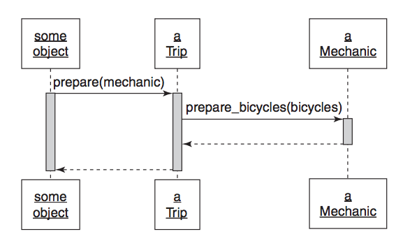
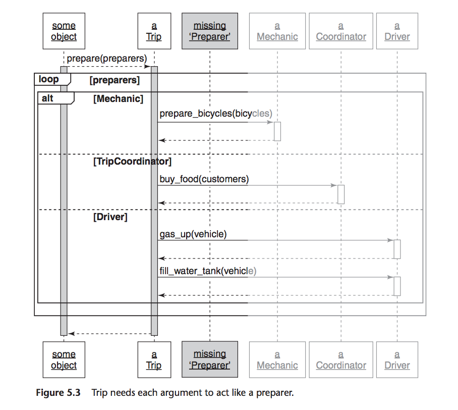
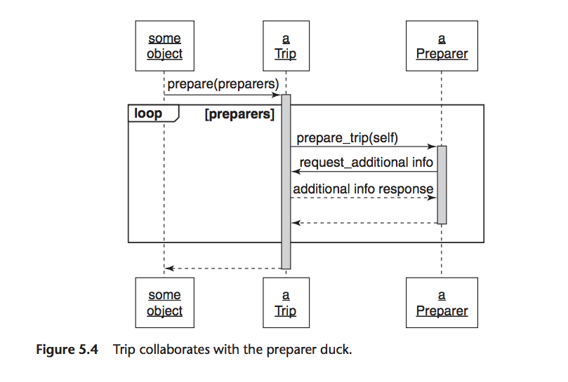

# Chapter 5 - Reducing Costs with Duck Typing
Page 85

Messages are at the design centre of an application & rigorously defined public interfaces
>You can combine these two ideas into a powerful design technique to further reduces costs - *duck typing*.

>Duck types are public interfaces that are not tied to any specific class. There across-class interfaces add enormous flexibility to your application by replacing cost dependencies on class with more forgiving dependencies messages.

>if an object quacks like a duck and walks like a duck, then it class is immaterial, it's a duck.

## Understanding duck typing

Prog languages - type -> describes the category of contents of a variable e.g. defines types to hold strings, numbers, arrays etc.
Knowledge of the category of the contents of a var or its type, means an application can have an expectation about how those contents will behave.

>In Ruby, there expectations about the behaviour of an object come in the form of beliefs about its public interface. If one objects knows another's type, it knows to which messages that object can respond.

The class `Mechanic` contains the public interface for itself. Any object holding onto an instance of `Mechanic` can treat it as it is a `Mechanic`.
You are not limited to an object responding to one interface.
A Ruby object can implement many different interfaces.

>Users of an object should need not, and should not, be concerned about its class. Class is just one way for an object to acquire a public interface.
There maybe public interfaces that cut across classes in an application.
>It's not what an object *is* that matters, it's what it *does*.

### Overlooking the duck
Page 87

`Trip` `prepare` method send message `prepare_bicycles` to something referenced as `mechanic`

```ruby
############## Page 87 ##############
class Trip
  attr_reader :bicycles, :customers, :vehicle

  # this 'mechanic' argument could be of any class
  def prepare(mechanic)
    mechanic.prepare_bicycles(bicycles)
  end

  # ...
end

# if you happen to pass an instance of *this* class,
# it works
class Mechanic
  def prepare_bicycles(bicycles)
    bicycles.each {|bicycle| prepare_bicycle(bicycle)}
  end

  def prepare_bicycle(bicycle)
    #...
  end
end
```



Page 88

### Compounding the problem

Adding trip coordinator and driver classes

>`TripCoordinator` and `Driver` classes are simple and inoffensive but `Trip's prepare` method is now a cause for alarm.
>It refers to 3 different classes by name and knows specific methods implemented in each.
Risks have gone up.

```ruby
############## Page 88 ##############
# Trip preparation becomes more complicated
class Trip
  attr_reader :bicycles, :customers, :vehicle

  def prepare(preparers)
    preparers.each {|preparer|
      case preparer
      when Mechanic
        preparer.prepare_bicycles(bicycles)
      when TripCoordinator
        preparer.buy_food(customers)
      when Driver
        preparer.gas_up(vehicle)
        preparer.fill_water_tank(vehicle)
      end
    }
  end
end

# when you introduce TripCoordinator and Driver
class TripCoordinator
  def buy_food(customers)
    # ...
  end
end

class Driver
  def gas_up(vehicle)
    #...
  end

  def fill_water_tank(vehicle)
    #...
  end
end
```

This code is first step in painting you into a corner. Code like this gets written when people follow existing classes blindly and neglect to notice they have overlooked important messages.

This new diagram is very complicated, this complexity is a warning.

>Sequence diagrams should always be simpler than the code they represent then they are not, something is wrong with the design.


### Finding the duck
Page 90

The key is that `Trip`'s `prepare` method serves a single purpose, arguments want to achieve a single goal.

Think about what `prepare` needs. Then the problem is straightforward.

>The `prepare` method wants to prepare the trip. Its arguments arrive ready to collaborate in trip preparation. The design would be simpler if `prepare` just trusted them to do so.




The `prepare` method expects each class to be a `Preparer`.

>This expectation neatly turns the tables. You've picked yourself loose from existing classes and invented a duck type.
What message can the `prepare` method send each `Preparer`? -> `prepare_trip`




>`Trip`'s `prepare` method now expects its arguments to be `Preparers` that can respond to `prepare_trip`.

What is `Preparer`? An abstraction at this point.
>Objects that implement `prepare_trip` *are* `Preparers` and objects that interact with `Preparers` only need to trust them to implement the `Preparer` interface. Once you see this abstraction, it's easy to fix the code. `Mechanic`, `TripCoordinator`, `Driver` should behave like `Preparers`; they should implement `prepare_trip`.


```ruby
############## Page 93 ##############
# Trip preparation becomes easier
class Trip
  attr_reader :bicycles, :customers, :vehicle

  def prepare(preparers)
    preparers.each {|preparer|
      preparer.prepare_trip(self)}
  end
end

# when every preparer is a Duck
# that responds to 'prepare_trip'
class Mechanic
  def prepare_trip(trip)
    trip.bicycles.each {|bicycle|
      prepare_bicycle(bicycle)}
  end

  # ...
end

class TripCoordinator
  def prepare_trip(trip)
    buy_food(trip.customers)
  end

  # ...
end

class Driver
  def prepare_trip(trip)
    vehicle = trip.vehicle
    gas_up(vehicle)
    fill_water_tank(vehicle)
  end
  # ...
end
```

Can easily create additional `Preparers` as the `prepare` method can now accept new `Preparers`.

### Consequences of Duck Typing

Tension between costs of concretion and costs of abstraction is fundamental to OOD.

>Concrete code is easy to understand but costly to extend. Abstract code may initially seem more obscure but, once understood, is far easier to change.

Treat objects as if they are defined by their behaviour rather than by their class.


**Polymorphism**
- state of having many forms
In OOP - the ability of many different objects to respond to the same message. Senders of the message need not car about the class of the receiver; receivers supply their own specific version of the behaviour.

>A single message this has many (poly) forms (morphs).

Many ways to achieve Polymorphism duck typing, inheritance, behaviour sharing.

## Writing code that relies on ducks
Ppage 95

Patterns that reveal paths to follow to discover ducks.

### Recognising hidden ducks

>You can replace the following with ducks:
  - case statements that switch on class
  - `kind_of?` and `is_a?`
  - `responds_to?`


#### Case statements that switch on class
Page 96

```ruby
############## Page 96 ##############
class Trip
  attr_reader :bicycles, :customers, :vehicle

  def prepare(preparers)
    preparers.each {|preparer|
      case preparer
      when Mechanic
        preparer.prepare_bicycles(bicycles)
      when TripCoordinator
        preparer.buy_food(customers)
      when Driver
        preparer.gas_up(vehicle)
        preparer.fill_water_tank(vehicle)
      end
    }
  end
end
```

>When you see this pattern you know that all of the `preparers` must share something in common.
>"What is it that `prepare` wants from each of its arguments?"
>The answer to that question suggests the message you should send; this message begins to define the underlying duck type.
>Here the `prepare` method wants it arguments to prepare the trip. Thus, `prepare_trip` becomes a method in the public interface of the new `Preparer` duck.


#### kind_of and is_a?
Page 97

These also check the class of an object.

This does nothing to improve the code:
```ruby
############## Page 97 ##############
  if preparer.kind_of?(Mechanic)
    preparer.prepare_bicycles(bicycle)
  elsif preparer.kind_of?(TripCoordinator)
    preparer.buy_food(customers)
  elsif preparer.kind_of?(Driver)
    preparer.gas_up(vehicle)
    preparer.fill_water_tank(vehicle)
  end
```

`kind_of?` / `is_a?` is no different to using a case statement. Should be fixed in the same way.


#### responds_to?

eg.
```ruby
############## Page 97 ##############
  if preparer.responds_to?(:prepare_bicycles)
    preparer.prepare_bicycles(bicycle)
  elsif preparer.responds_to?(:buy_food)
    preparer.buy_food(customers)
  elsif preparer.responds_to?(:gas_up)
    preparer.gas_up(vehicle)
    preparer.fill_water_tank(vehicle)
  end
```

This decreases a bit the number of dependencies, but still has too many.
Code is still very bound to class.
>This example still expects very specific classes.
>...it controls rather than trusts other objects.


### Placing trust in your ducks

The use of the above indicate the presence of an unidentified duck.
It is an indication that you are missing an object, with a public interface you haven't discovered yet.

>The fact that the missing object is a duck type instead of a concrete class matters not at all; it's the interface that matters, not the class of the object that implements it.

>Flexible applications are built on objects that operate on trust.


### Documenting duck types

>Simplest kind of duck type is one the exists as an agreement about its public interface. Code in this chapter implements that kind of duck, where several different classes implement `prepare_trip` and can thus be treated like `Preparers`.

>When you create duck types you must both document and test their public interfaces.

### Sharing code between ducks
Page 99

In this chapters code, the `Preparer` ducks only share an interface. Others will share behaviour - chap 7

### Choosing your ducks wisely

Ruby on Rails example - first


## Conquering a fear of duck typing

dynamic vs static typed languages

### Subverting duck types with static typing

type - category of the contents of a variable
prog languages are either static of dynamic typing
most static type languages require that you explicitly declare the type of each var and method params
dynamic type -  don't need to do

People who are use to static typed languages check classes, when they fail they add more checks.

>Duck typing provides a way out of this trap.


### Static vs Dynamic Typing
pros and cons

### Embracing Dynamic Typing
Page 102
