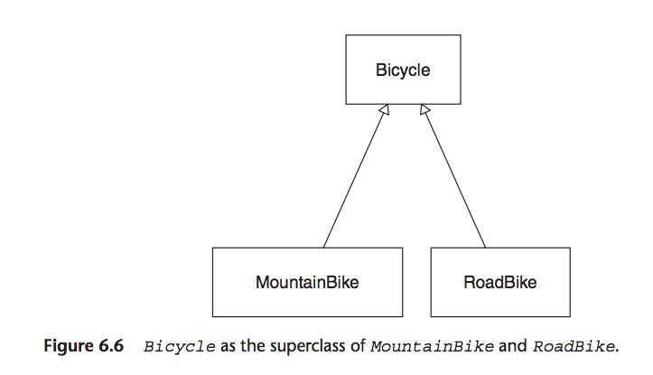

# Chapter 6 - Acquiring Behaviour through Inheritance
Page 105

## Understanding Classical Inheritance

At its code, inheritance, is a mechanism for *automatic message delegation*.

>It creates relationships such that, if one object cannot respond to a received message, it delegates that message to another. You don't have to write code to explicitly delegate the message, instead you define an inheritance relationship between two objects and the forwarding happens automatically.

classical inheritance -> relationships defined by creating subclasses
classical -> class (not archaic)
messages forwarded from subclass -> superclass, shared cod define in class hierarchy

## Recognising where to use inheritance
Page 106

### Starting with a concrete class

`Bicycle` class, each road bike going on trip is represented by instance of `Bicycle`

```ruby

############## Page 107 ##############
class Bicycle
  attr_reader :size, :tape_color

  def initialize(args)
    @size       = args[:size]
    @tape_color = args[:tape_color]
  end

  # every bike has the same defaults for
  # tire and chain size
  def spares
    { chain:        '10-speed',
      tire_size:    '23',
      tape_color:   tape_color }
  end

  # Many other methods...
end

bike = Bicycle.new(
        size:       'M',
        tape_color: 'red' )

bike.size     # -> 'M'
bike.spares
# -> {:tire_size   => "23",
#     :chain       => "10-speed",
#     :tape_color  => "red"}
```

This class works until something changes.

Mountain bikes!

### Embedding multiple types
Page 109

>When a pre-existing concrete class contains most of the behaviour you need, it is tempting to solve this problem by adding code to that class.

```ruby
############## Page 110 ##############
class Bicycle
  attr_reader :style, :size, :tape_color,
              :front_shock, :rear_shock

  def initialize(args)
    @style       = args[:style]
    @size        = args[:size]
    @tape_color  = args[:tape_color]
    @front_shock = args[:front_shock]
    @rear_shock  = args[:rear_shock]
  end

  # checking 'style' starts down a slippery slope
  def spares
    if style == :road
      { chain:        '10-speed',
        tire_size:    '23',       # milimeters
        tape_color:   tape_color }
    else
      { chain:        '10-speed',
        tire_size:    '2.1',      # inches
        rear_shock:   rear_shock }
    end
  end
end

bike = Bicycle.new(
        style:        :mountain,
        size:         'S',
        front_shock:  'Manitou',
        rear_shock:   'Fox')

bike.spares
# -> {:tire_size   => "2.1",
#     :chain       => "10-speed",
#     :rear_shock  => 'Fox'}
```
>This example is simply a detour that illustrates an *anti-pattern*, that is, a common pattern that appears to be beneficial but is actually detrimental, and for which there is a well-known alternative.

These changes have made `Bicycle` worse. It now has more responsibility, contains things that may change for different reasons and can't be reused.

>This code contains an if statement that checks *an attribute that holds the category self* to determine what message to send to self.

This pattern indicates a missing subtype -> subclass.

### Finding the Embedded Types

In `if` statement, var is called `style` that the method switches on but you have easily been called `type` or `category`. Vars named like this are a queue to notice the underlying pattern.

`type & category` similar to those you would use to describe a class.

Inheritance solves where highly related types that share common behaviour but differ along some dimension - in this case `style`.

### Choosing inheritance

>Objects receive messages. It handles a message in one of two ways - either responds directly or it passes the message onto some other object for a response.

>Inheritance provides a way to define two objects as having a relationship such the when the first receives a message that it does not understand, it *automatically* forwards, or delegates, the message to the second.

Ruby - single inheritance
A superclass may have many subclasses but each subclass can have only one superclass.

>Message forwarding via classical inheritance takes place between *classes*.
>Duck types share code via Ruby modules.

### Drawing inheritance relationships
Page 114


## Misapplying inheritance

Examples of common difficulties encountered by novices.

```ruby
############## Page 107 ##############
class Bicycle
  attr_reader :size, :tape_color

  def initialize(args)
    @size       = args[:size]
    @tape_color = args[:tape_color]
  end

  # every bike has the same defaults for
  # tire and chain size
  def spares
    { chain:        '10-speed',
      tire_size:    '23',
      tape_color:   tape_color}
  end

  # Many other methods...
end

bike = Bicycle.new(
        size:       'M',
        tape_color: 'red' )

bike.size     # -> 'M'
bike.spares
# -> {:tire_size   => "23",
#     :chain       => "10-speed",
#     :tape_color  => "red"}
```

`MountainBike` is a direct descendent of `Bicycle`
two method - `initialize` & `spares`, which are already implemented in `Bicycle`, they are *overridden* by `MountainBike`
>Sending `super` in any method passes that message up the superclass chain.

```ruby
############## Page 115 ##############
class MountainBike < Bicycle
  attr_reader :front_shock, :rear_shock

  def initialize(args)
    @front_shock = args[:front_shock]
    @rear_shock  = args[:rear_shock]
    super(args)
  end

  def spares
    super.merge(rear_shock: rear_shock)
  end
end


############## Page 115 ##############
mountain_bike = MountainBike.new(
                  size:         'S',
                  front_shock:  'Manitou',
                  rear_shock:   'Fox')

mountain_bike.size # -> 'S'

mountain_bike.spares
# -> {:tire_size   => "23",       <- wrong!
#     :chain       => "10-speed",
#     :tape_color  => nil,        <- not applicable
#     :front_shock => 'Manitou',
#     :rear_shock  => "Fox"}
```
Above code shows what happens when jam a subclass under a superclass.

>The `Bicycle` class is a concrete class that was not written to be subclassed.
It has behaviour for bicycles in general but also specifically for a road bike as well.

## Finding the abstraction

The `Bicycle` class does't just represent any kind of bike, is represents a road bike.

Once `MountainBike` exists, `Bicycle`'s name is misleading.
Inheritance is implied but it is wrong.

>Subclasses are specialisations of their superclass. A `MountainBike` should be everything a `Bicycle` is plus more. Any object that expects a `Bicycle` should be able to interact with a `MountainBike` in blissful ignorance of its actual class.


>For inheritance to work, two things must always be true. First, the objects that you are modelling must truly have a generalisation-specialisation relationship. Second, you must the the correct coding techniques.

For this example, it is time to move the road bike code out of `Bicycle` into its own class.


### Creating an abstract superclass
Page 117



The above is your goal.

`Bicycle` will contain the common behaviour, and `MountainBike` and `RoadBike` will add specialisations.


`Bicycle`'s public interface will include `spares`, `sizes` and the subclasses interfaces will add own individual parts.

>`Bicycle` now represents an abstract class.
>...abstract as being disassociated from any specific instance...

>This new version of `Bicycle` will not define a complete bike, just the bits that all bicycles share.
Will expect to create instances of `MountainBike & RoadBike` but not of `Bicycle`.
`Bicycle` is not a class where the new message would ever be sent.

Some languages allow you to declare classes as abstract. Ruby does not and enforces no restriction.

>Abstract classes exist to be subclassed.
Never makes sense to create an abstract super class with only one subclass. Do not do this from the beginning.
Until you need to deal with other bikes, is better just to have the one class, and the current `Bicycle` is good enough.

Even when there are requirements for 2 kinds of bikes, it still might not be the right time to use inheritance, as it has costs.
>If you could put off this decision until FastFeet asked for a third kind of bike, your odds of finding the right abstraction would improve dramatically.

Assuming have good reason to create a `Bicycle` hierarchy, want to mirror figure 6.6.

```ruby
############## Page 119 ##############
class Bicycle
  # This class is now empty.
  # All code has been moved to RoadBike.
end

class RoadBike < Bicycle
  # Now a subclass of Bicycle.
  # Contains all code from the old Bicycle class.
end

class MountainBike < Bicycle
  # Still a subclass of Bicycle (which is now empty).
  # Code has not changed.
end
```

>This rearrangement improves your lot because its easier to promote code up to a superclass than to demote it down to a subclass.


```ruby
############## Page 120 ##############
road_bike = RoadBike.new(
              size:       'M',
              tape_color: 'red' )

road_bike.size  # => "M"

mountain_bike = MountainBike.new(
                  size:         'S',
                  front_shock:  'Manitou',
                  rear_shock:   'Fox')

mountain_bike.size
# NoMethodError: undefined method `size'
```
Because `Bicycle` is empty. And above does not have `.size`.

### Promoting abstract behaviour

Moving `size` up to the superclass.
```ruby
############## Page 121 ##############
class Bicycle
  attr_reader :size     # <- promoted from RoadBike

  def initialize(args={})
    @size = args[:size] # <- promoted from RoadBike
  end
end

class RoadBike < Bicycle
  attr_reader :tape_color

  def initialize(args)
    @tape_color = args[:tape_color]
    super(args)  # <- RoadBike now MUST send 'super'
  end
  # ...
end
```


`MountainBike`'s current code state
```ruby
############## Page 115 ##############
class MountainBike < Bicycle
  attr_reader :front_shock, :rear_shock

  def initialize(args)
    @front_shock = args[:front_shock]
    @rear_shock  = args[:rear_shock]
    super(args)
  end

  def spares
    super.merge(rear_shock: rear_shock)
  end
end
```

Now that `size` has been moved into `Bicycle`, both `RoadBike & MountainBike` respond correctly to `size`.
```ruby
############## Page 122 ##############
road_bike = RoadBike.new(
              size:       'M',
              tape_color: 'red' )

road_bike.size  # -> "M"

mountain_bike = MountainBike.new(
                  size:         'S',
                  front_shock:  'Manitou',
                  rear_shock:   'Fox')

mountain_bike.size # -> 'S'
```
