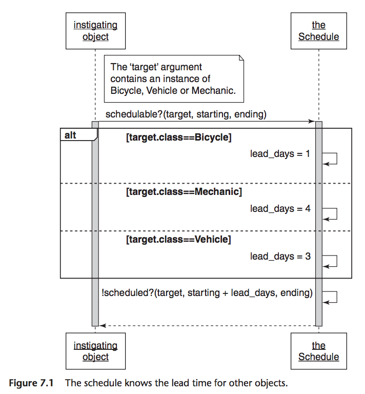
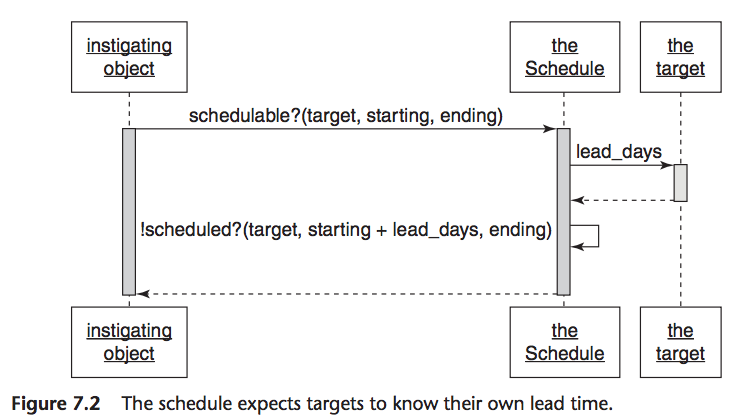
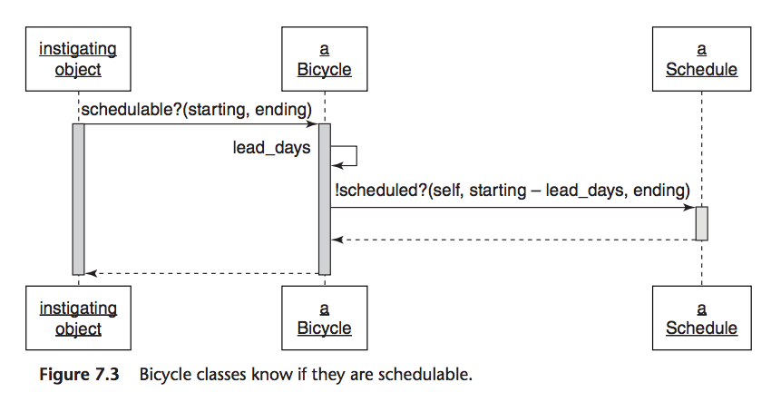
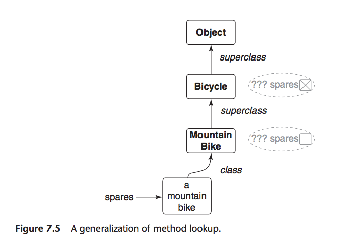
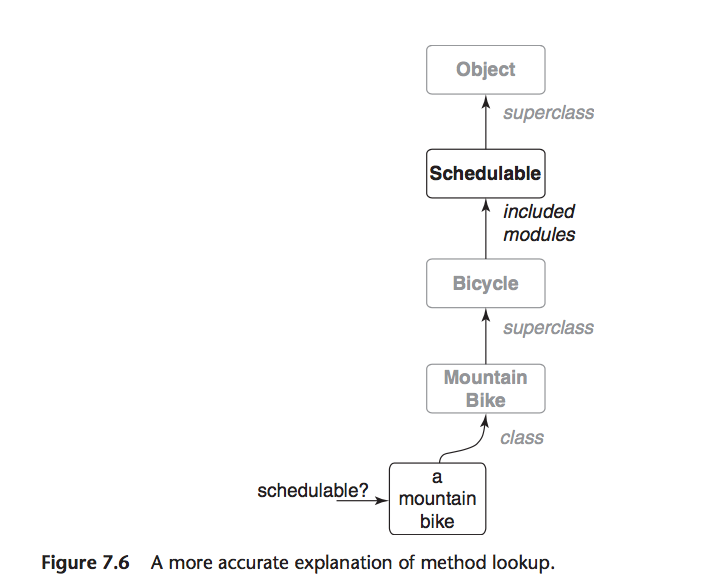
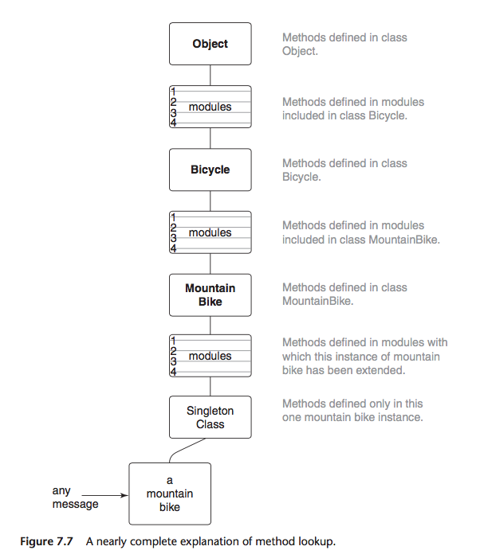
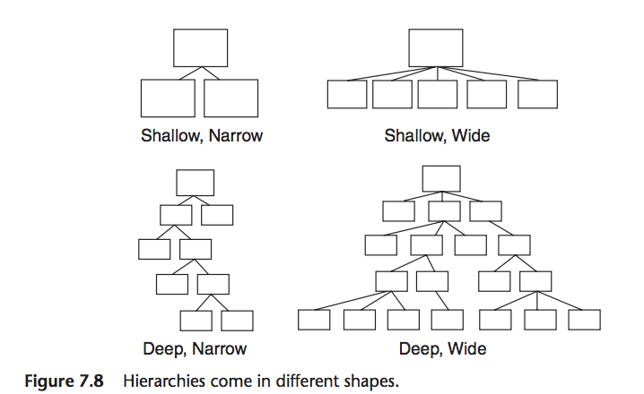

# Chapter 7 - Sharing Role Behaviour with Modules
Page 141

Alternative to classical inheritance, use of techniques of inheritance to share a *role*.

## Understanding Roles

>Some problems require sharing behaviour among otherwise unrelated objects.

Using roles creates dependencies and these introduce risks.

### Finding roles

>The `Preparer` duck type from Chap 5, is a role. Objects that implement `Preparers` interface play this role. `Mechanic, TripCoordinator and Driver` each implement `prepare_trip`; therefore, other objects can interact with them as if they are `Preparers` without concern for their underlying class.

>The existence of a `Preparer` role suggests that theres also a parallel `Preparable` role (these often come in pairs). The `Trip` class acts as a `Preparable` in Chap 5, it implements the `Preparable` interface.

>To play the `Preparer` role, all an object needs to do is implement its own version of `prepare_trip`.

Many OO languages have a way to define a named group of methods that are independent of class and can be mixed in to any objects.
In Ruby they are *modules*.

>Methods can be defined in a module and then the module can be added to any object. Modules thus provide a perfect way to allow objects of different classes to play a common role using a single set of code.

>When an object includes a module, method become available via automatic delegation.

>The total set of messages to which an object can respond includes:
- those it implements
- those implemented in all objects above it in the hierarchy
- those implemented in any module that has been added to it
- those implemented in all modules added to any object above it in the hierarchy


### Organising responsibilities



>The knowledge about what values to use does not belong in `Schedule`, it belongs in the classes whose names `Schedule` is checking.
>Instead of knowing details about other classes, the `Schedule` should send them messages.


### Removing unnecessary dependencies
Page 145

>The fact that the `Schedule` checks many class names to determine what value to place in one var suggests that the var name should be turned into a message, which in turn should be sent to each incoming object.

#### Discovering the schedulable duck type



This removes the check on class, changes method `schedulable?` to send the `lead_days` messages to its incoming target argument.

This change moves the responsibility for knowing lead days into the last object.

>The `Schedule` expects its `target` to behave like something that understands `lead_days`, that is, like something that is "schedulable". You have discovered a duck type.

#### Letting objects speak for themselves
Page 147
e.g `StringUtils.empty?(some_string)`

>This specific example illustrates the general idea that objects should manage themselves; they should contain their own behaviour. If your interest is in object B, you should not be forced to know about object A if your only use of it is to find things out about B.

>Just as strings respond to `empty?` and can speck for themselves, targets should respond to `schedulable?`. The `schedulable?` method should be added to the interface of the `Schedulable` role.


### Writing the concrete code
Page 147

`Schedulable` role only has an interface, need to add `schedulable?` method to it, must decide what the code should do and where the code should go.



Easiest is to separate the two decisions. Add method to concrete class e.g. `Bicycle` and implement directly. Once working, can refactor to allow `Schedulables` to share the behaviour.

Code example (simple version)

```ruby
############## Page 148 ##############
class Schedule
  def scheduled?(schedulable, start_date, end_date)
    puts "This #{schedulable.class} " +
         "is not scheduled\n" +
         "  between #{start_date} and #{end_date}"
    false
  end
end
```

```ruby
############## Page 149 ##############
class Bicycle
  attr_reader :schedule, :size, :chain, :tire_size

  # Inject the Schedule and provide a default
  def initialize(args={})
    @schedule = args[:schedule] || Schedule.new
    # ...
  end

  # Return true if this bicycle is available
  # during this (now Bicycle specific) interval.
  def schedulable?(start_date, end_date)
    !scheduled?(start_date - lead_days, end_date)
  end

  # Return the schedule's answer
  def scheduled?(start_date, end_date)
    schedule.scheduled?(self, start_date, end_date)
  end

  # Return the number of lead_days before a bicycle
  # can be scheduled.
  def lead_days
    1
  end

  # ...
end

require 'date'
starting = Date.parse("2015/09/04")
ending   = Date.parse("2015/09/10")

b = Bicycle.new
b.schedulable?(starting, ending)
# This Bicycle is not scheduled
#   between 2015-09-03 and 2015-09-10
#  => true
```

This hides `Schedule` and what it does inside of `Bicycle`.

### Extracting the Abstraction
Page 150

Above code solves first part of problem, has decided what `schedulable?` should do. `Bicycle` is not the right place for it though, as other things are `schedulable`. Need to rearrange so can be used by objects of different classes.

Example new `Schedulable` module.

```ruby
############## Page 150 ##############
module Schedulable
  attr_writer :schedule

  def schedule
    @schedule ||= ::Schedule.new
  end

  def schedulable?(start_date, end_date)
    !scheduled?(start_date - lead_days, end_date)
  end

  def scheduled?(start_date, end_date)
    schedule.scheduled?(self, start_date, end_date)
  end

  # includers may override
  def lead_days
    0
  end

end
```

`Bicycle` using `Schedulable`

```ruby
############## Page 151 ##############
class Bicycle
  include Schedulable

  def lead_days
    1
  end

  # ...
end

require 'date'
starting = Date.parse("2015/09/04")
ending   = Date.parse("2015/09/10")

b = Bicycle.new
b.schedulable?(starting, ending)
# This Bicycle is not scheduled
#    between 2015-09-03 and 2015-09-10
#  => true
```

Now that have created this module, other objects can make use of it to become `Schedulable` themselves.
>They can play this role without duplicating code.

>Once you include the module in all the classes that can be scheduled, pattern looks a lot like inheritance.

```ruby
############## Page 152 ##############
class Vehicle
  include Schedulable

  def lead_days
    3
  end

  # ...
end

class Mechanic
  include Schedulable

  def lead_days
    4
  end

  # ...
end

v = Vehicle.new
v.schedulable?(starting, ending)
# This Vehicle is not scheduled
#   between 2015-09-01 and 2015-09-10
#  => true

m = Mechanic.new
m.schedulable?(starting, ending)
# This Mechanic is not scheduled
#   between 2015-08-31 and 2015-09-10
#  => true
```

>The code in `Schedulable` is the *abstraction* and it uses the template method pattern to invite objects to provide specialisations to the algorithm it supplies.
>When `schedulable?` arrives at any `Schedulable`, the message is automatically delegated to the method defined in the module.

This technique is similar to classical inheritance but there is a  *is-a versus behaves-like-a* difference and it matters. But coding techniques are similar because they reply on automatic message delegation.


### Looking up methods
Page 154

>Understanding similarities between classical inheritance and module inclusion is easier of you understand how OO languages find the method implementation that matches a message send.

#### A gross oversimplification

>When an objects receives a message, the OO language first looks in that object's *class* for a matching method. Otherwise method definition would need to be duplicated within every instance of every class. Storing the methods known to an object inside of its class means that all instances of a class can share the same set of method definitions; definitions that need then exist in only one place.

>If the class does not implement the message, the search proceeds to its superclass. From here on only superclasses matter, the search proceeds up the superclass chain, looking in one superclass after another, until it reaches the top of the hierarchy.



>If all attempts to find a suitable method fail, you might expect the search to stop, but many languages make a second attempt to resolve the message.
>Ruby gives the original receiver a second chance by sending it a new message, `method_missing`, and passing `:spares` as an argument. Attempts to resolve this new message restart the search along the same path, except now the search is for `method_missing` rather than `spares`

^^ Classical inheritance

#### A more accurate explanation
Page 155

Methods defined in a Ruby module



>Adds the `Schedulable` module to the method lookup path

>When `Bicycle` includes `Schedulable`, all of the methods defined in the module becomd part of `Bicycle`'s response set.
>Any message received by an instance of `MountainBike` now stands a chance of being satisfied by a method defined in the `Schedulable` module.
>This has enormous implications.


#### A very nearly complete explanation

>Its entirely possible for a hierarchy to contain a long chain of superclasses, each of which includes many modules.

As well as including modules in classes, an object can also be added to with `extend`, if added to a class, creates class methods, if added to an instance of a class creates instance methods.

Fig 7.7 - complete list of possibilities - but not the complete story.




### Inheriting role behaviour

Write properly inheritable code.

## Writing inheritable code

The use and maintenance of inheritance hierarchies and modules depends on the quality of the code.

### Recognise the anti-patterns
Page 158

Two anti-patterns that might show that your code could benefit from inheritance.

>First, an object that uses a variable with a name like `type`, `category` to determine what message to send to `self` contains two highly related but slightly different types.

Can be rearranged to use classical inheritance, put common code in superclass, create subclasses for different types.

>Second, when a sending object checks the class of a receiving object to determine what message to send, you have overlooked a duck type.
Code into a duck type, received should implement the duck type's interface.

### Insist on the abstraction

>All of the code in an abstract superclass should apply to every class that inherits it. Superclasses should not contain code that applies to some, but not all, subclasses. This restriction also applies to modules: the code in a module must apply to all who use it.

>If you cannot correctly identity the abstraction there may not be one, and if no common abstraction exists then inheritance is not the solution to your design problem.

### Honour the contract

>Subclasses agree to a *contract*; they promise to substitutable for their superclasses.
This is only possible when objects behave as expected and subclasses are *expected* to conform to their superclasses's interfaces.
>Subclasses that fail to honour their contract are difficult to use.
Honouring the contract means you are following the Liskov Substitution Principle (LSP)
>- in order for a type systems to be sane, subtypes must be substitutable for their super types.

### Use the template method pattern

>The fundamental coding technique for creating inheritable code is the template method pattern.
>Allows you to separate the abstract from the concrete.
>The abstract code defines the algorithms, and the concrete inheritors of the abstraction contribute specialisations by overriding these template methods.

### Preemptively decouple classes

>Avoid writing code that requires its inheritors so send `super`; instead use hook messages.

### Create shallow hierarchies

>The limitations of hook methods are just one of the many reasons to create shallow hierarchies.

hierarchy -> pyramid -> depth and breadth
depth - number of superclasses between object and the top
breadth - number of its direct subclasses



shallow, narrow - easy to understand
shallow, wide - slightly more complicated
deep, narrow - bit more challenging, tendency to get wider
deep, wide - difficult to understand, costly to maintain, avoid

## Summary

objects that play a common role need to share behaviour, do via Ruby module
code in a module can be added to any object, instance of a class, a class or another module

class includes a module, methods are in same lookup path as methods acquired via inheritance
coding techniques for modules mirror those of inheritance, therefore modules should use the template method pattern and use hook methods to avoid forcing `includers` to send `super`

>When an object acquires behaviour that was defined elsewhere, the acquiring object makes a commitment to honouring an implied contract.
Liskov Substitution Principle
