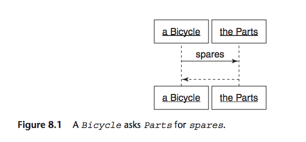
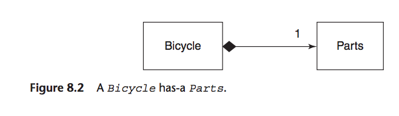
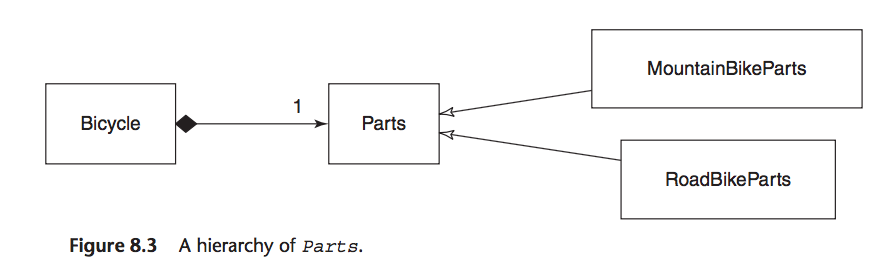

# Chapter 8 - Combing Objects with Composition
Page 163

>Composition is the act of combing distinct parts into a complex whole, such that the whole becomes more than the sum of its parts.

Software, OO composition, the larger object is connected to its part via a *has-a* relationship. A bicycle has parts and it communicates with them from an interface. Part is a role.

## Composing a Bicycle of Parts

Starts of with code at end of Chap 6.

### Updating the Bicycle Class

>`Bicycle` class is an abstract super class in an inheritance hierarchy, to convert to composition, first ignore existing code and think about how a bike should be composed.

`Bicycle` - responsible for `spares` message, this should return a list of spare parts
bicycle has parts, this bicycle-parts relationship feels like composition
>If you created an object to hold all of a bicycle's parts, you could delegate the spares message to that new object.

new class `Parts`, this object will be responsible for holding a list of the bike's parts and which ones needs spares
is a collection





>the black diamond shows composition, it means that a `Bicycle` is composed of `Parts`, the `Parts` side of the line has the number 1, this means there's just one `Parts` object per `Bicycle`

New `Bicycle` class

```ruby
############## Page 165 ##############
class Bicycle
  attr_reader :size, :parts

  def initialize(args={})
    @size       = args[:size]
    @parts      = args[:parts]
  end

  def spares
    parts.spares
  end
end
```

### Creating a Parts Hierarchy

Easy thing to do now is put all spare parts code into new hierarchy of `Parts`:

```ruby
############## Page 165 ##############
class Parts
  attr_reader :chain, :tire_size

  def initialize(args={})
    @chain      = args[:chain]     || default_chain
    @tire_size  = args[:tire_size] || default_tire_size
    post_initialize(args)
  end

  def spares
    { tire_size: tire_size,
      chain:     chain}.merge(local_spares)
  end

  def default_tire_size
    raise NotImplementedError
  end

  # subclasses may override
  def post_initialize(args)
    nil
  end

  def local_spares
    {}
  end

  def default_chain
    '10-speed'
  end
end

class RoadBikeParts < Parts
  attr_reader :tape_color

  def post_initialize(args)
    @tape_color = args[:tape_color]
  end

  def local_spares
    {tape_color: tape_color}
  end

  def default_tire_size
    '23'
  end
end

class MountainBikeParts < Parts
  attr_reader :front_shock, :rear_shock

  def post_initialize(args)
    @front_shock = args[:front_shock]
    @rear_shock =  args[:rear_shock]
  end

  def local_spares
    {rear_shock:  rear_shock}
  end

  def default_tire_size
    '2.1'
  end
end
```



>There is now an abstract `Parts` class. `Bicycle` is composed of `Parts`. `Parts` has two subclasses, `RoadBikeParts` and `MountainBikeParts`.

Everything still works

```ruby
############## Page 167 ##############
road_bike =
  Bicycle.new(
    size:  'L',
    parts: RoadBikeParts.new(tape_color: 'red'))

road_bike.size    # -> 'L'

road_bike.spares
# -> {:tire_size=>"23",
#     :chain=>"10-speed",
#     :tape_color=>"red"}

mountain_bike =
  Bicycle.new(
    size:  'L',
    parts: MountainBikeParts.new(rear_shock: 'Fox'))

mountain_bike.size   # -> 'L'

mountain_bike.spares
# -> {:tire_size=>"2.1",
#     :chain=>"10-speed",
#     :rear_shock=>"Fox"}
```

Not a bug change, not a big improvement, has revealed one thing, how little specific `Bicycle` code there was.
