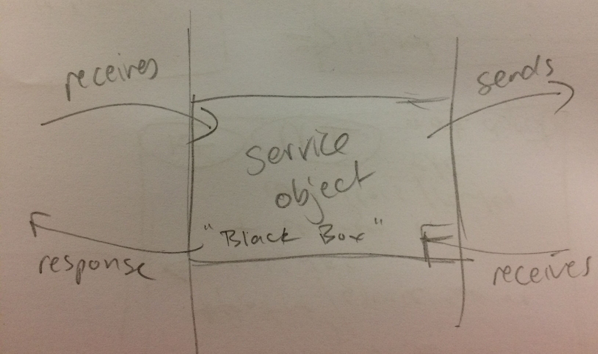

# Testing - general

[Tips to improve speed of your test suite](https://medium.com/appaloosa-store-engineering/tips-to-improve-speed-of-your-test-suite-8418b485205c)

## Four Phase Test Pattern

Reminded about from here https://designcode.commandrun.com/testing-rails-simple-guide-part-2-17d629645187

First came across here https://robots.thoughtbot.com/four-phase-test

```
test do  
  # setup - Prepare object for this test
  # exercise - Execute the functionality we are testing  
  # verify - Verify the exercise's result against our expectation  
  # teardown - Resetting all data to pre-test state
end  
```

An example of when I have used:
pseudocode

```
describe "#processing?" do
  context "when payments are being processing" do
    # setup - Prepare object for this test
      # payment_schedule

      # payments, that belong to payment_schedule
        # all in processing - pipeline_processing_status == processing

    # exercise - Execute the functionality we are testing
      # payment_schedule.processing?

    # verify - Verify the exercise's result against our expectation
      # expect payment_schedule to eq processing

  end
end
```


#### Try to remember to read the Rspec errors really carefully!!
Just had a number of fails but was due to not coding the factories properly rather then any error a test itself.

#### Rails Conf 2013 The Magic Tricks of Testing by Sandi Metz
A must watch and re-watch - [Rails Conf 2013 The Magic Tricks of Testing by Sandi Metz]https://www.youtube.com/watch?v=URSWYvyc42M

#### Using OpenStructs
When using OpenStruct in tests, need to look at the things that are being passed into the object you are wanting to recreate.

e.g.
module representer for api
```ruby
    module Role
      include ::Representers::Base

      property :id

      property :kind

      property :role

      property :identifiers, class: OpenStruct do
        property :something_id
      end

      property :party, embedded: true, extend: Representers::Party, class: ::Party

      link :self do
        "/party_roles/#{id}"
      end

      link :party do
        "/parties/#{party_id}"
      end
    end
  end
end
```

creating objects to use in spec
```ruby
let(:st_id) do
  OpenStruct.new(something_id: "FLCK")
end

let(:party) do
  OpenStruct.new(
    id: "e4e5300b-600c-4335-a139-2050edbed254",
    kind: "party",
    name: "The Part Party"
  )
end

let(:object) do
  OpenStruct.new(
    id: "999ec5a8-4037-45ba-bbf0-1dc9db8f9fcc",
    kind: "party_role",
    role: "entertainer",
    identifiers: st_id,
    party: party,
    party_id: party.id
  )
end
```
My point being, make sure that what the properties are in the OpenStruct object, are the same as what is in the Role. For example, `party_id` needs to be `party.id`.

#### Params
If you change the columns on your table, remember to change the 'strong params' that are allowed to pass through.

#### TIME
##### Stub out in RSpec
```ruby
allow(Time).to receive(:now).and_return(Time.parse('2016-03-02'))
```
Needed to use `Time.utc(2016, 8, 1, 14, 34, 56)`, otherwise was failing on Travis due to different timezones.


#### Using Doubles

```ruby
let(:role) do
    double( "animal_role",
      identifiers: double("identifiers", animal_code: "DOG"),
      participant: double("animal",
        name: "Rover",
        links: { self: double(
          "href", href: "/animals/1234"
          )
        }
      )
    )
  end

  let(:animals_roles_search_results_mock) do
    double("animals_roles_search", animal_roles: [role])
  end
```

#### Test if something changes number of records

```ruby
params = { "address" => "31 Te Whiti Street, Kilbirnie, Wellington 6003" }
expect{ post :create, params }.to change{ Application.count }.by(1)
```


# RSpec

## let

[RSpec: What is the difference between let and a before block?](http://stackoverflow.com/questions/5974360/rspec-what-is-the-difference-between-let-and-a-before-block?answertab=active#tab-top)
[When to use RSpec let()?](http://stackoverflow.com/questions/5359558/when-to-use-rspec-let)

## Autoloading Error

```bash
LoadError:
  Unable to autoload constant Billing::Resources::PaymentSchedule, expected /Users/libby/Code/payments/app/services/billing/resources/payment_schedule.rb to define it
```

Had three specs that were randomly failing - two would fail and one would pass, and it would change when had order as random.
The issue was this:
```ruby
let(:schedules_resource)  { Resources::Schedule.new.from_json(schedule_response_json) }
```

After having a think and remembering that with `lets` there is lazy loading, so added a  ! to the let  - `let!(:schedule_resource)`
and specs passed.

From rspec:
>Note that let is lazy-evaluated: it is not evaluated until the first time the method it defines is invoked. You can use let! to force the method's invocation before each example.
[https://relishapp.com/rspec/rspec-core/v/3-4/docs/helper-methods/let-and-let]

Then were running this pass other devs, got from @Ootoovak

> This came across my Twitter feed a few days ago (by one of the RSpec core team members)

>https://twitter.com/samphippen/status/767850685329203200 Extraordinary Alien @samphippen

> RSpec advice:

  > don't use let!

  > use let and evaluate it in a before.

So have done this:
```ruby
before do
  payment_schedules_resource
  # other code...
end
```
And the specs are passing! Yay!

## RSpec Formatting

Repo is set with `--format documentation`, which will output all the documentation strings. In an app that has a lot of specs this can be slow.
Can set when you run `rspec` to run as the default, which is no strings, just dots, F's and P's.

```ruby
rspec -f p

or

rspec --format progress
```


## Stubbing vs Using VCR

Discussion at Flick about using doubles / allows to stub versus

With the specs, for the `SupplyNodeDeprovisioner` spec, I used the `Claimer` and `Remover` specs as a guide.
Those were all stubbed.
This then led me to stub in the `DeprovisioningApi` spec as well.

Not too sure about stubbing. I guess though that as long as the Network assignment_suspension endpoint is tested well in Network then it is okay to stub?? Rather then use VCR??
       @ootoovak
ootoovak 4 hours ago
Yeah, I think that is fine, like if you are thinking as servers as objects (just at a different level) then stubbing out calls to other servers is like a unit test. This does leave the problem of how we write "integration" level tests between our services. @mermop started the test suite for this but we have not come to a consensus about maintaining it and adding to it. One thing we have to overcome is how we manage state changes between servers. That level of tests might have to wait until the day we get containers with seed data. Then we could potentially spin up a test version of all our services, run all the "service/integration" level tests on them, then spin it down again. Meaning the data would be fresh between each run even if some tests changed the seed data.
       @ootoovak
ootoovak 4 hours ago
As for VCR vs manually stubbing kind of the same as using FactoryGirl.build(:user) vs User.new(...). As in there is not much difference the former provides more convenience the latter has has less dependence on external tool that could be overused/debugged. In either case it is stubbing the call to a service and both can drift over time form the actual API if not maintained.

### Strategy
This is what Samson and I did when I was writing a feature spec for an api.

```ruby
service_client = instance_double("Invoiced::Client")
invoiced_invoice = double(
                    "InvoicedInvoice",
                    balance: "105.00".to_f,
                    paid: false,
                    items: [],
                  )
allow(service_client).to receive_message_chain(:Invoice, :retrieve).and_return(invoiced_invoice)

allow(InvoicedClient).to receive_message_chain(:new, :client).and_return(service_client)
```

Worked the above backwards. Starting with stubbing (or is it mocking) out an external call `InvoicedClient` and have the return an instance_double.
Then the `service_client` was stubbed out and returned a double which to start with was just `invoiced_invoice = double("InvoicedInvoice")` and then ran the spec to see what messages the object was wanting to respond to.


## Capybara Testing

When using [`save_and_open_page`](https://www.stefanwille.com/2010/12/printing-the-page-content-in-capybara/), to use the assets so the page has the correct styling, in your `config/environments/test.rb` file, add these:

```ruby
config.assets.debug = true
config.action_controller.asset_host = "http://localhost:6001"
```

## Unit tests

After having a chat with Sam about testing and unit tests.


